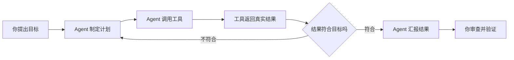
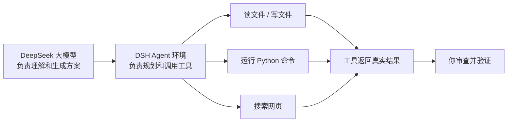
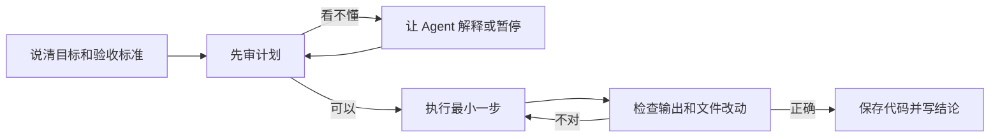
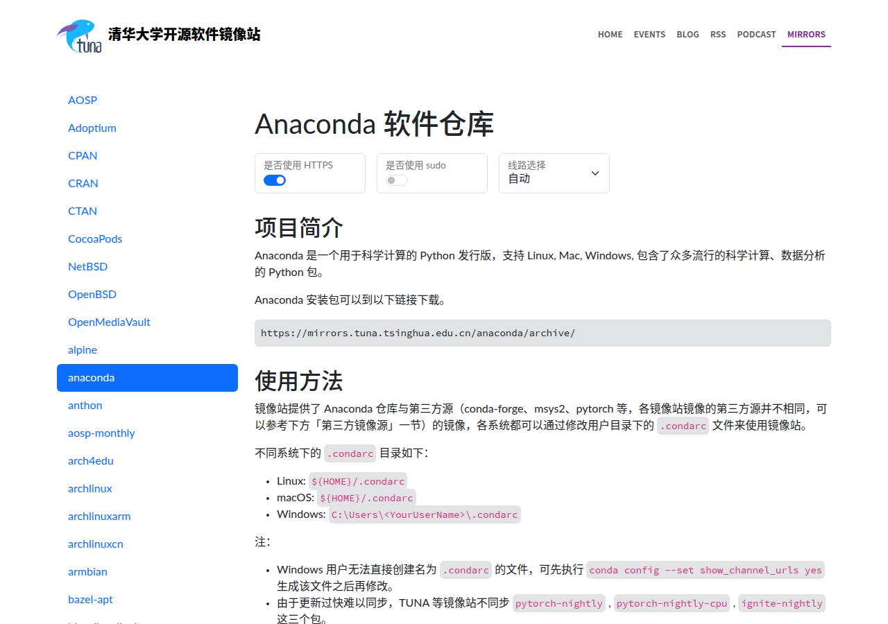
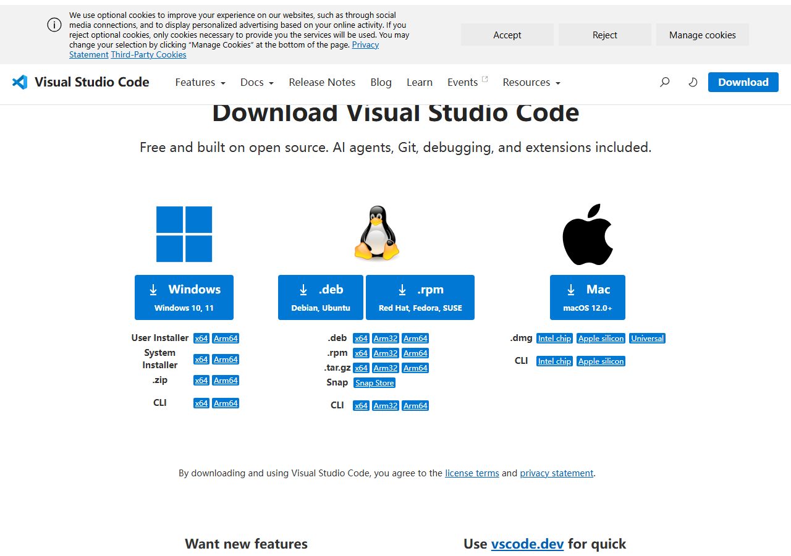
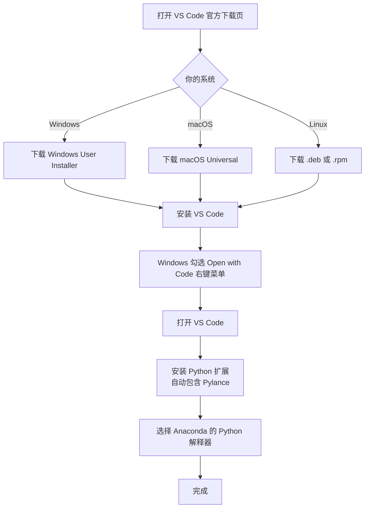
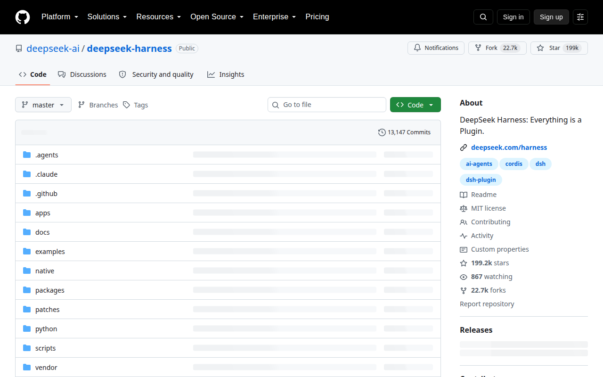
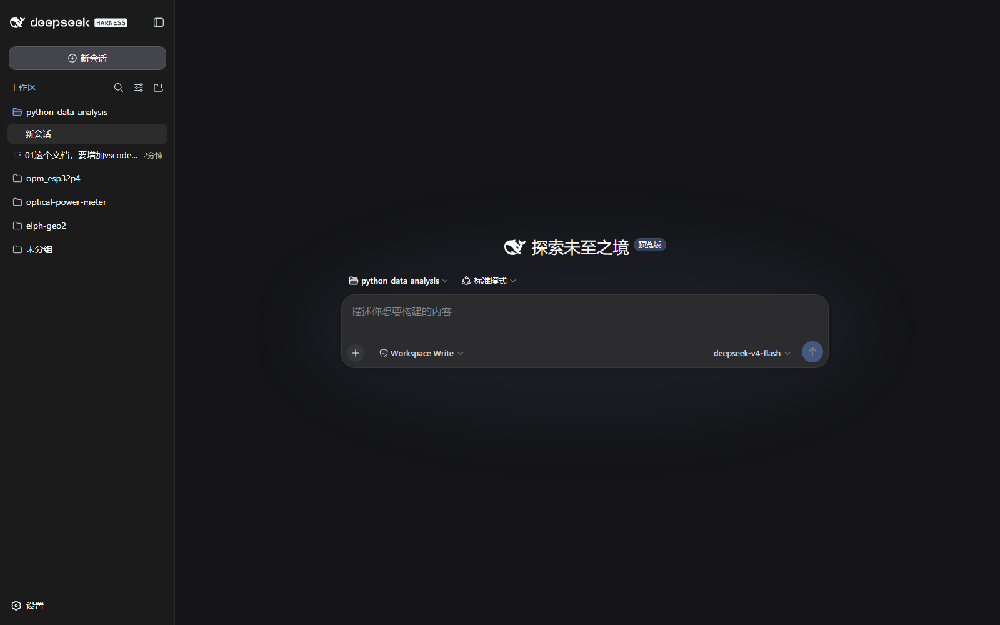

# Week 1：认识 Agent、安全使用 DSH，并完成第一个数据问题

> **本章导读**
> 时长：3 节课，每节 45 分钟
> 数据：`data/01-agent/nyc_airbnb.csv`
> 你将学到：认识 AI Agent、常见 Agent 与大模型，理解 DeepSeek + DSH 的特点和安全使用规则，安装本课程环境，再分别体验传统 Python 编程和 Vibe Coding
> 本周产出：`projects/<姓名>/first_analysis.py`

本周三节课的安排：

1. 第 1 节课：认识 Agent、大模型与安全规则，不安装软件；
2. 第 2 节课：安装 Python/VS Code/Node.js，并完成传统 Python 测试 `hello.py`；
3. 第 3 节课：安装 DSH、配置工作区，并完成第一次 Vibe Coding 数据问题。

## 1. 第 1 节课：认识 Agent、大模型与安全规则（45 分钟）

第一节不急着安装软件，先按这个顺序讲明白：**现在有哪些常见大模型 → 大模型和 Agent 的发展历史 → 什么是 AI Agent → 常见 Agent 有哪些 → 为什么本课程用 DeepSeek + DSH → 怎么安全使用 Agent**。后面的所有操作都建立在这些认知之上。

### 1.1 现在常见的大模型

大模型是 Agent 的“大脑”。先认识模型，再理解 Agent，因为同一个 Agent 环境可以替换不同大模型，但模型能力决定它到底能理解什么、生成什么。

| 大模型 | 厂商 | 特点 | 成本口径 | 开源 |
|---|---|---|---|---|
| GPT-4o / GPT-5 系列 | OpenAI | 综合能力强，多模态，生态和插件丰富 | 订阅或 API 按量，Plus/Pro 与 API 单价都偏高 | 闭源 |
| Claude 系列 | Anthropic | 长文本、代码、Agent 工具调用能力强 | 订阅或 API 按量，较高 | 闭源 |
| Gemini | Google | 多模态、超长上下文，与 Google 搜索和文档整合好 | 有免费额度，付费订阅或 API 按量 | 闭源 |
| DeepSeek | 深度求索 | 中文理解好，推理和代码能力强，API 成本低 | 网页/App 免费，API 按量且价格低，本课程默认 | 部分开源 |
| Qwen（通义千问） | 阿里 | 中文强，开源生态好，适合中文场景 | 开源可自部署；API 按量，价格较低 | 开源 |
| Llama | Meta | 开源权重，可本地部署，适合学习开源生态 | 无统一订阅，自部署需要 GPU 或云服务器 | 开源 |

对数据分析课来说，我们看重三件事：**中文提问能不能听懂、代码和推理准不准、学生自己用起来贵不贵**。DeepSeek 在这三点上比较均衡，所以本课程选它作为默认大模型。

> 价格会随厂商政策变化，上表是课程整理时的参考口径，实际以 ChatGPT、Claude、Gemini、DeepSeek、Qwen、Llama 各自官网为准。课程里不需要背价格，只需要会判断“订阅费、API 费、自部署硬件费”这三类成本。

参考链接：

- [Hannibal046/Awesome-LLM](https://github.com/Hannibal046/Awesome-LLM)：持续更新的大语言模型论文、工具和教程清单。
- [WangRongsheng/awesome-LLM-resources](https://github.com/WangRongsheng/awesome-LLM-resources)：中文友好的 LLM、Agent、多模态与训练推理资料汇总。
- [luban-agi/Awesome-AIGC-Tutorials](https://github.com/luban-agi/Awesome-AIGC-Tutorials)：面向入门学习的 LLM 和 AIGC 教程合集。

### 1.2 大模型的发展历史

大模型的历史：

| 时间 | 节点 | 意义 |
|---|---|---|
| 2017 | Transformer 架构提出 | 成为后续 GPT、BERT 等模型的基础 |
| 2018 | BERT、GPT-1 | 预训练 + 微调成为主流范式 |
| 2019-2020 | GPT-2、GPT-3 | 规模扩大，few-shot 和通用生成能力明显提升 |
| 2022 | ChatGPT 发布 | 大模型从论文走向大众产品，RLHF 让回答更像人 |
| 2023 | GPT-4、Llama、Qwen 等 | 多模态、开源权重、中文模型和推理能力快速发展 |
| 2024-2026 | 推理模型、多模态、工具调用 | 模型越来越适合当作 Agent 的“大脑” |

参考链接：

- [Hannibal046/Awesome-LLM](https://github.com/Hannibal046/Awesome-LLM)：持续更新的大语言模型论文、工具和教程清单。
- [luban-agi/Awesome-AIGC-Tutorials](https://github.com/luban-agi/Awesome-AIGC-Tutorials)：面向入门学习的 LLM 和 AIGC 教程合集。

### 1.3 什么是 AI Agent

AI Agent（智能体）不是普通的聊天机器人。聊天机器人只能“说”，Agent 还能“做”。DeepSeek Harness（DSH）就是一个能读写文件、运行命令、搜索网页、执行长任务的 Agent 工作环境。

一个 Agent 至少由四部分组成：

| 组成部分 | 通俗理解 | DSH 里的例子 |
|---|---|---|
| 大模型 | 大脑，负责理解任务和生成方案 | DeepSeek 大模型 |
| 工具 | 手脚，负责真正执行操作 | 读文件、写文件、运行命令、搜索网页 |
| 记忆 | 工作记录，负责记住上下文和目标 | 当前会话、长期目标 |
| 工作区 | 活动范围，Agent 主要只能动这里 | 本课程仓库目录 |

DSH 的工作方式是一个循环：**理解目标 → 制定计划 → 调用工具 → 看到结果 → 调整计划**。例如你让它“读取 Airbnb 数据”，它先找到文件，再运行 Python 读取，然后把结果贴给你。



**最重要的观念：Agent 是执行者，不是负责人；你是负责人。** Agent 会做的事，是它的工具允许它做的事；它能做到哪一步，取决于你在界面上确认了什么。

### 1.4 常见的 AI Agent

常见的 Agent 可以分成四类，权限从小到大的顺序是：网页助手 → 代码补全 → AI IDE → 本地 Agent。

| Agent | 类型 | 特点 | 会不会直接动本地文件 | 收费参考 |
|---|---|---|---|---|
| ChatGPT | 网页/App 助手 | 通用问答、写作、编程；生态成熟 | 通常不会 | 免费版 + Plus $20/月 + Pro $200/月 |
| Claude | 网页/App + Claude Code | 长文本与代码能力强；Claude Code 可操作本地项目 | Claude Code 会 | 免费版 + Pro $20/月；Claude Code 调用 API 另计 |
| Gemini | 网页/App 助手 | 多模态、长上下文、与 Google 服务整合 | 通常不会 | 免费额度 + Google AI Pro 约 $19.99/月，API 按量 |
| DeepSeek | 网页/App 助手 | 中文与推理能力强、API 成本低 | 通常不会 | 网页/App 免费，API 按量且单价明显低于国际主流 |
| GitHub Copilot | VS Code 补全 | 写代码时补全、解释、生成小段代码 | 只读取当前代码 | Free 有限额度；Pro $10/月；Business $19/用户/月 |
| Cursor / Trae / Qoder | AI IDE | 边看代码边让 AI 修改，集成终端和文件管理 | 会 | Cursor Pro 约 $20/月；Trae/Qoder 有免费与付费档 |
| Claude Code / Codex CLI / DSH | 本地 Agent | 能读写文件、运行命令、联网搜索，适合完整任务 | 会，权限最大 | CLI/DSH 本身通常免费，调用的大模型 API 另计 |

**记住这条规律：Agent 能做的事情越多，风险越大。** 网页助手帮你写答案，出了问题你可以不看；本地 Agent 帮你删文件、改配置、装软件，出了问题会真实发生在你的电脑上。

收费上有两个容易混的点：**产品订阅费和模型 API 费是两回事**。例如 ChatGPT Plus 是订阅 ChatGPT 这个产品；GitHub Copilot 是订阅编辑器里的补全服务；而 Claude Code、Codex CLI、DSH 这类本地 Agent 往往工具本身免费，真正的费用来自你配置的大模型 API。课程选择 DeepSeek + DSH，就是因为订阅成本为零、API 单价低，同时能控制本地权限。

### 1.5 Agent 的发展历史

在理解了什么是 Agent、见过常见 Agent 后，再回看 Agent 是怎么发展过来的，会更容易把产品分类和底层能力对上。

| 时间 | 节点 | 意义 |
|---|---|---|
| 早期 | 专家系统、规则系统 | 能按规则自动决策，但不够通用 |
| 2010 年代 | 强化学习和游戏 AI | Agent 能通过环境反馈学习策略 |
| 2023 | AutoGPT、BabyAGI | 第一次大规模尝试“目标 → 自主规划 → 执行” |
| 2024 | Cursor、Claude Code、Copilot | 编程 Agent 进入日常开发，直接操作本地文件 |
| 2025-2026 | DSH 等本地 Agent 环境 | 把工作区、工具、目标和安全确认组合起来，适合课程项目 |

参考链接：

- [e2b-dev/awesome-ai-agents](https://github.com/e2b-dev/awesome-ai-agents)：AI Agent 框架、论文、工具和项目清单。
- [luo-junyu/Awesome-Agent-Papers](https://github.com/luo-junyu/Awesome-Agent-Papers)：以论文为主的 LLM Agent 综述和进展。
- [Shubhamsaboo/awesome-llm-apps](https://github.com/Shubhamsaboo/awesome-llm-apps)：Agent、RAG 和应用案例合集。

### 1.6 本课程为什么用 DeepSeek + DSH

DeepSeek 提供“大脑”，DSH 提供“手脚”。这一节只讲概念，具体的 DSH 安装、界面和工作区配置在第 3 节课完成。

DeepSeek 的特点：

- 中文自然语言理解好，适合用中文描述分析任务；
- 推理和代码能力适合写 pandas、跑统计、画图；
- API 成本低，适合学生反复尝试；
- 支持长任务和工具调用，适合配合 Agent 使用。

DSH 的特点：

- 有本地工作区：Agent 主要只操作你选定的目录；
- 有真实工具：能读文件、写文件、运行 Python 命令、搜索网页；
- 有任务机制：`plan mode`、长期目标、后台子代理、workflow；
- 有安全边界：执行命令前可能请求确认，学生可以打断；
- 有 Web 界面：浏览器打开 `http://127.0.0.1:3080` 即可使用。



### 1.7 安全使用 Agent

Agent 能做的事情和真人操作电脑一样有后果：删除文件、覆盖文件、安装软件、下载数据、执行命令。如果学生看不懂命令就点击“允许”，一个不小心就可能把课程项目、原数据甚至系统环境弄坏。

本课程的课堂红线，先背下来再动手：

1. **看不懂的命令不执行。** Agent 请求执行命令时，先读命令本身；看不懂就让它解释，解释完仍看不懂就问老师。
2. **只在自己的工作区里干活。** 课程任务只允许修改 `projects/<姓名>/` 和老师指定的目录；原始数据目录只读。
3. **不处理秘密。** 不把 API Key、密码、个人身份信息发给 Agent，也不让它写进文件。
4. **每步都有验证。** Agent 说“完成”不等于完成；必须运行、看输出、检查结果。
5. **发现异常立即喊停。** 看到删除、格式化、上传、安装系统级软件等命令，先停下来。

#### 风险点与应对规则

| 风险 | 为什么会发生 | 课堂规则 |
|---|---|---|
| 误删文件 | 提示词没写清楚，或盲目同意删除命令 | 原始数据只读；删除前先让 Agent 列出“要删什么、为什么”；必要的话先备份 |
| 覆盖已有代码 | Agent 没读旧文件就重写 | 让 Agent 先 `read` 再修改；修改后用 `git diff` 检查 |
| 安装不必要或危险的软件 | Agent 为了“解决眼前问题”直接装包 | 依赖由课程统一清单决定；新增依赖必须老师确认 |
| API Key 泄露 | 为了“方便调试”让 Agent 写进代码或笔记 | Key 只在 DSH 设置里保存；任何文件里出现 Key 都要警惕 |
| 下载不可信数据 | Agent 联网搜索并保存结果 | 先检查来源；课程数据以 `data/` 和老师给的文件为准 |
| 长任务失控 | 让 Agent 连续跑很久，跑偏了还在继续 | 每个里程碑停下来审查；发现跑偏立即打断 |
| 环境污染 | 全局安装软件或修改系统配置 | 课程使用 Anaconda 环境和 `python-course` 目录，不直接动系统 |

#### 安全使用流程

每次使用 DSH 完成任务，都按这个流程走：



#### 本节自测

第 1 节课下课前完成一次快速自测：写出 3 个“绝对不执行”的命令，以及 3 个“执行前必须确认”的操作。写不出来，第 2 节课不许开始安装。

## 2. 第 2 节课：安装环境并完成传统 Python 测试（45 分钟）

第二节课的目标是在 45 分钟内完成三件事：**装好 Python 环境、装好 VS Code、用传统方式运行 `hello.py`**。DSH 不在这节课安装，放到第 3 节课。

> 教师建议：如果教室网络不稳定，课前先下载好 Anaconda、Node.js 和 Python 依赖，放到共享目录或 U 盘；课堂上不要花 45 分钟等下载。

本课程需要安装：**Anaconda（Python 环境）**、**VS Code（编辑器）**、**Node.js（第 3 节课安装 DSH 的运行环境）**。

### 2.1 从 TUNA 镜像下载 Anaconda

Anaconda 不要从官网下载，国内网络直接使用清华 TUNA 镜像更快、更稳定。

TUNA 的 Anaconda 镜像帮助页：

<https://mirrors.tuna.tsinghua.edu.cn/help/anaconda/>



下载目录：

<https://mirrors.tuna.tsinghua.edu.cn/anaconda/archive/>

在目录里选择最新版本，按系统下载对应文件：

| 系统 | 文件名 |
|---|---|
| Windows 64 位 | `Anaconda3-版本号-1-Windows-x86_64.exe` |
| macOS Intel 芯片 | `Anaconda3-版本号-1-MacOSX-x86_64.pkg` |
| macOS Apple 芯片 | `Anaconda3-版本号-1-MacOSX-arm64.pkg` |
| Linux 64 位 | `Anaconda3-版本号-1-Linux-x86_64.sh` |

> 版本号会不断更新，选择目录里最新日期对应的文件即可，不要死记文件名。

### 2.2 安装 Anaconda 并配置 TUNA 镜像

#### Windows

1. 双击下载好的 `.exe` 安装包。
2. 一路 `Next`，到许可协议时点 `I Agree`。
3. 选择 `Just Me`，安装到默认路径。
4. 到 `Advanced Installation Options` 时，勾选 `Add Anaconda3 to my PATH environment variable`。
5. 等待安装完成，不要提前关闭窗口。
6. 打开 `cmd`、PowerShell 或 Anaconda Prompt，运行：

```bash
python --version
conda --version
```

#### macOS

1. 双击下载好的 `.pkg` 安装包，按提示安装。
2. 打开“终端”，运行 `conda init` 让 Anaconda 生效：

```bash
conda init zsh
```

如果默认 shell 是 bash，运行：

```bash
conda init bash
```

3. 关闭终端再重新打开。
4. 验证：

```bash
python --version
conda --version
```

#### Linux

1. 打开终端，进入下载目录：

```bash
cd ~/Downloads
```

2. 运行安装脚本：

```bash
bash Anaconda3-版本号-1-Linux-x86_64.sh
```

3. 按 `Enter` 阅读协议，输入 `yes` 同意。
4. 安装位置保持默认。
5. 提示是否初始化 conda 时输入 `yes`。
6. 让配置生效：

```bash
source ~/.bashrc
```

7. 验证：

```bash
python --version
conda --version
```

三个系统只要能输出版本号即可：

```text
Python 3.12.8
conda 24.11.3
```

版本号不一样也没关系，只要两个命令都能打印版本就行。

#### 配置 TUNA 镜像

先让 conda 生成配置文件：

```bash
conda config --set show_channel_urls yes
```

Windows 配置文件在：

```text
C:\Users\<你的用户名>\.condarc
```

macOS / Linux 配置文件在：

```text
~/.condarc
```

把 `.condarc` 改成 TUNA 镜像：

```yaml
channels:
  - defaults
show_channel_urls: true
default_channels:
  - https://mirrors.tuna.tsinghua.edu.cn/anaconda/pkgs/main
  - https://mirrors.tuna.tsinghua.edu.cn/anaconda/pkgs/r
  - https://mirrors.tuna.tsinghua.edu.cn/anaconda/pkgs/msys2
custom_channels:
  conda-forge: https://mirrors.tuna.tsinghua.edu.cn/anaconda/cloud
  pytorch: https://mirrors.tuna.tsinghua.edu.cn/anaconda/cloud
```

再把 pip 也改成 TUNA 镜像：

```bash
pip config set global.index-url https://mirrors.tuna.tsinghua.edu.cn/pypi/web/simple
```

以后 `conda install` 和 `pip install` 都会自动走 TUNA 镜像。

### 2.3 安装并配置 VS Code

本课程统一使用 **VS Code** 作为编辑器，所有 `.py` 文件都用它创建、编辑和运行。

#### 安装 VS Code

1. 打开 VS Code 官方下载页：

   <https://code.visualstudio.com/download>

   

2. 按自己的系统下载并安装：

   | 系统 | 下载项 |
   |---|---|
   | Windows | `Windows User Installer x64`（或 ARM64） |
   | macOS | `macOS Universal`（Apple 芯片和 Intel 都可用） |
   | Linux | `.deb` 或 `.rpm`，按发行版选择 |

3. Windows 安装时勾选：

   - `Add "Open with Code" action to Windows Explorer file context menu`
   - `Add "Open with Code" action to Windows Explorer directory context menu`

   其余选项保持默认，一路 `Next` 安装。

4. 打开 VS Code，第一次启动时点左侧“扩展”图标（或按 `Ctrl+Shift+X`），搜索并安装：

   | 扩展名 | 发布者 | 作用 |
   |---|---|---|
   | Python | Microsoft | Python 代码提示、运行和调试 |
   | Pylance | Microsoft | Python 代码补全与类型提示 |

5. 安装后确认 VS Code 左下角状态栏显示 Python 版本，例如 `Python 3.12.8`。如果没有显示，点状态栏中的 Python 版本号（或按 `Ctrl+Shift+P` 执行 `Python: Select Interpreter`），选择 Anaconda 安装的 Python 解释器。

安装与配置流程如下：



#### 用 VS Code 打开工作目录

VS Code 只能打开**已经存在**的文件夹，新建文件也是在已打开的文件夹里创建。先记住固定顺序：

1. 先在文件管理器或终端里创建目录，例如 `python-course`。
2. 再让 VS Code 打开这个目录。
3. 最后在打开的目录里新建 `hello.py` 等文件。

各系统的打开方式：

- Windows：在文件夹中右键，选择 `Open with Code`；也可以先打开 VS Code，再用 `文件 → 打开文件夹`。
- macOS：打开 VS Code，按 `Cmd+O` 或使用 `文件 → 打开文件夹`，选择目录。
- Linux：打开 VS Code，按 `Ctrl+O` 或使用 `文件 → 打开文件夹`，选择目录。

#### 打开 VS Code 内置终端

VS Code 打开目录后，在窗口顶部菜单栏点击：

```text
终端（Terminal） → 新建终端（New Terminal）
```

也可以直接按快捷键：

| 系统 | 快捷键 |
|---|---|
| Windows / Linux | `` Ctrl+` `` |
| macOS | `` Control+` `` |

终端会出现在 VS Code 窗口下方，显示为一行可输入命令的黑色（或深色）面板，并自动定位到当前打开的文件夹。以后命令行操作都在这个终端里进行，不需要另外打开 cmd 或“终端”。

如果窗口下方没有看到终端，就重新执行一次“顶部菜单 → 终端 → 新建终端”，或按上面的快捷键。

### 2.4 创建专用目录并打开 VS Code（Windows）

1. 打开“文件资源管理器”，进入 Documents：

```text
C:\Users\<你的用户名>\Documents
```

2. 新建目录 `python-course`。
3. 在文件夹上右键，选择 `Open with Code`。
4. 在 VS Code 里打开内置终端：点顶部 `终端 → 新建终端`，或按 `` Ctrl+` ``。终端会自动定位到这个文件夹。
5. 验证 Python：

```bat
python --version
conda --version
```

能输出版本号即可，例如：

```text
Python 3.12.8
conda 24.11.3
```

### 2.5 创建专用目录并打开 VS Code（macOS）

1. 打开“访达”，进入 `~/Documents`。
2. 新建目录 `python-course`。
3. 打开 VS Code，按 `Cmd+O` 选择 `~/Documents/python-course`。
4. 打开内置终端：点顶部 `终端 → 新建终端`，或按 `` Control+` ``。终端会自动定位到这个文件夹。
5. 验证 Python：

```bash
python --version
conda --version
```

### 2.6 创建专用目录并打开 VS Code（Linux）

1. 先用文件管理器进入 `~/Documents`，新建目录 `python-course`；也可以用终端创建：

```bash
mkdir -p ~/Documents/python-course
```

2. 打开 VS Code，按 `Ctrl+O` 选择 `~/Documents/python-course`，并打开内置终端：点顶部 `终端 → 新建终端`，或按 `` Ctrl+` ``。
3. 验证 Python：

```bash
python --version
conda --version
```

三个系统都完成目录创建和 VS Code 打开后，说明 Python 环境、目录管理和编辑器使用都正常。

### 2.7 安装课程依赖

安装依赖前，先确认 pip 已使用国内镜像，否则默认会从国外 PyPI 下载，速度会很慢，甚至卡住。

1. 查看当前 pip 源：

```bash
pip config list
```

2. 如果输出里没有 `global.index-url`，或网址不是 TUNA 镜像，先配置：

```bash
pip config set global.index-url https://mirrors.tuna.tsinghua.edu.cn/pypi/web/simple
```

3. 配置完成后，进入本仓库根目录，运行：

```bash
pip install -r requirements.txt
```

这里会安装 pandas、numpy、matplotlib、seaborn、scikit-learn、openpyxl、pytest。安装过程中出现黄色提示通常是升级提示，不一定是错误。

### 2.8 安装 Node.js

DeepSeek Harness 是一个 npm 工具，先安装 Node.js：

1. 打开 <https://nodejs.org/en/download>。
2. 下载 `LTS` 版本的 Windows/macOS 安装包。
3. 一路 `Next` 安装，保持默认选项。
4. 打开命令行，验证：

```bash
node --version
npm --version
```

能输出版本号即可，例如：

```text
v20.18.0
10.8.2
```

### 2.9 第一次传统 Python 测试：hello.py

传统 Python 编程是“人写代码、人运行、人调试”：

- 每一行代码都由你亲手输入；
- 运行报错后，由你读报错、改代码；
- 代码的结构、命名、逻辑都由你控制；
- 学得慢，但每一步都更容易理解。

现在在 VS Code 里完成第一次传统编程测试：

1. 在 VS Code 中确认已打开 `python-course` 目录。
2. 点击左侧资源管理器中的“新建文件”图标，输入文件名 `hello.py`，然后写入：

```python
print("Hello, Python!")
print(1 + 2)
```

3. 按 `Ctrl+S`（macOS 为 `Command+S`）保存。
4. 打开 VS Code 内置终端，运行：

Windows：

```bat
python hello.py
```

macOS / Linux：

```bash
python hello.py
```

预期输出：

```text
Hello, Python!
3
```

这一步是“传统方式”：每一行都是你写的，命令是你自己敲的，输出也是你亲眼看到的。请记住这种“我能解释每一行代码”的感觉。

### 2.10 第 2 节课验收

下课前至少完成：

- [ ] `python --version` 和 `conda --version` 能输出版本
- [ ] `node --version` 和 `npm --version` 能输出版本
- [ ] VS Code 已安装 Python、Pylance 扩展，并选择 Anaconda 解释器
- [ ] 已创建 `python-course` 目录，并用 VS Code 打开
- [ ] `python hello.py` 能输出 `Hello, Python!` 和 `3`
- [ ] 第 1 节课的 3+3 安全自测已写出来

如果 Anaconda 或 Node.js 下载超过 10 分钟，先让同学用老师课前准备好的离线安装包，不要原地等待。

## 3. 第 3 节课：安装 DSH 并完成第一次 Vibe Coding（45 分钟）

第三节课把 DSH 装好、配置好，然后完成本周最重要的一步：**让 DSH 读取 `data/01-agent/nyc_airbnb.csv`，生成第一份数据分析脚本**。

### 3.1 安装并启动 DeepSeek Harness

DSH 的官方仓库在：

<https://github.com/deepseek-ai/deepseek-harness>



> 截图来自官方 GitHub 仓库；安装命令以官方 README 为准。

最稳妥的启动方式是使用 `npx`，第一次会自动下载，不需要手动配置路径：

```bash
npx @deepseek-ai/dsh web
```

也可以全局安装一次，之后直接使用 `dsh`：

```bash
npm install -g @deepseek-ai/dsh
dsh web
```

看到下面这些信息，说明 DSH 已经启动：


```text
URL: http://127.0.0.1:3080
```

然后浏览器打开：

<http://127.0.0.1:3080>

### 3.2 配置 DSH

DSH 需要两样配置才能开始工作：**模型 API Key** 和 **工作区**。

先到 DeepSeek 开放平台申请 API Key：

<https://platform.deepseek.com/>

申请后打开 DSH 的 `Settings → Models`，粘贴 API Key 并保存。然后在主界面点击 `Choose workspace`，选择本仓库根目录，例如：

```text
/home/zhong/Documents/python-data-analysis
```

Windows 上类似：

```text
D:\python-data-analysis
```


保存 API Key、选中工作区后，会话输入框才可以使用。注意：**API Key 只保存在本地设置里，不要写进教程、代码、聊天内容或 GitHub。**

### 3.3 DSH 界面介绍

启动 DSH 后，浏览器打开 <http://127.0.0.1:3080>，界面主要分成几块：



| 区域 | 作用 | 常见操作 |
|---|---|---|
| 左侧会话栏 | 新建会话、切换历史会话、查看工作区 | 点“新会话”开始一个干净任务 |
| 中部消息区 | 你与 Agent 的对话记录 | 滚动查看 Agent 的每一步 |
| 底部输入框 | 输入自然语言任务 | 回车发送 |
| 工具行 | 显示 Agent 正在读取、编辑、运行什么 | 点击可查看工具执行详情 |
| 右上角状态 | 当前工作区、模型、安全模式 | 确认工作区是否正确 |
| 设置 | API Key、模型、工作区配置 | 只配置一次，之后不要随意修改 |

在设置里选择工作区时，必须选中本课程仓库根目录。**Agent 主要只在这个目录里活动，选错目录等于把钥匙交给了不认识的人。**

### 3.4 执行前安全检查

配置完成后，第一件事不是发任务，而是先问一句：

```text
请告诉我当前工作区路径。
```

如果 DSH 回答的路径不是本课程仓库，先改回本仓库再继续。本课程的课堂规则是：**DSH 只能修改 `projects/` 和老师明确指定的文件，原始 `data/` 目录只读。**

每次允许 DSH 执行命令前，按第 1 节课的安全流程检查：命令是否看得懂、会不会改原数据、会不会删除文件、是不是安装额外软件。看不懂就让 DSH 解释，解释后仍不懂就找老师。

### 3.5 Vibe Coding 的特点（与传统 Python 对比）

第 2 节课已经体验了传统 Python。Vibe Coding 是“用自然语言描述目标，由 AI Agent 写代码并运行，人负责审查和验证”：

- 你只描述：要读什么数据、回答什么问题、保存到哪里；
- Agent 负责读文件、写代码、运行、看报错、继续修改；
- 你负责审查：命令是否安全、代码是否正确、结论是否来自数据。

优点：

- 从“想法”到“可运行版本”很快；
- 适合探索数据、生成初稿、解释报错；
- 能把精力放在“问题定义”和“结果验证”上。

缺点：

- 可能生成你看不懂的代码；
- 可能把结论编造得像真的；
- 如果不审查，它可能删除文件、安装无关软件、泄露 Key。

| 维度 | 传统 Python | Vibe Coding |
|---|---|---|
| 代码主体 | 自己逐行写 | Agent 生成，你审查 |
| 运行调试 | 自己运行、自己改 | Agent 运行并迭代 |
| 学习重点 | 语法、逻辑、调试 | 目标、口径、审查、验证 |
| 速度 | 慢但可控 | 快但必须验证 |
| 风险 | 风险低，出错是自己改的 | 风险高，可能执行危险命令 |
| 本课程用法 | `hello.py` 建立基础 | DSH 生成分析初稿，学生验证 |

本课程的固定协作循环：

```text
定义问题 → 要求最小版本 → 运行 → 反馈真实结果 → 追问 → 验证
```

不管是传统方式还是 Vibe Coding，结论都必须能在数据或代码里被指出：**哪张表、哪个字段、什么计算、样本量多少**。

### 3.6 第一次 Vibe Coding 测试：DSH 读 Airbnb

发送任务前，先按第 1 节课的流程确认三件事：**当前工作区是课程仓库、只读不修改 `data/`、代码只写入 `projects/<姓名>/`**。在 DSH 里输入：

```text
请先告诉我当前工作区路径，确认后开始。
请读取 data/01-agent/nyc_airbnb.csv，不要修改原文件。
任务：
1. 输出 shape、dtypes、缺失值、前 5 行；
2. 按 room_type 分组，计算 price 的平均值和样本量；
3. 用一句话回答“哪种房型平均价格最高”。
代码保存为 projects/<姓名>/first_analysis.py。
```

本次整理课程时，我按上面的提示词独立跑了一次真实测试，没有使用预估值。DSH 生成的完整脚本如下：

```python
import pandas as pd

df = pd.read_csv("data/01-agent/nyc_airbnb.csv")

print("shape:", df.shape)
print()
print(df.dtypes)
print()
print("缺失值:")
print(df.isna().sum())
print()
pd.set_option("display.max_columns", None)
pd.set_option("display.width", 140)
print(df.head())
print()

summary = (
    df.groupby("room_type")["price"]
    .agg(["mean", "count"])
    .round(2)
)
print(summary)

top = summary["mean"].idxmax()
top_mean = summary.loc[top, "mean"]
top_count = int(summary.loc[top, "count"])
print()
print(f"按平均价格看，{top} 的平均价格最高，为 {top_mean:.2f} 美元/晚，样本量为 {top_count}。")
```

实际运行结果（当前 `data/01-agent/nyc_airbnb.csv` 实测）：

```text
shape: (48895, 16)

id                                  int64
name                               object
host_id                             int64
host_name                          object
neighbourhood_group                object
neighbourhood                      object
latitude                          float64
longitude                         float64
room_type                          object
price                               int64
minimum_nights                      int64
number_of_reviews                   int64
last_review                        object
reviews_per_month                 float64
calculated_host_listings_count      int64
availability_365                    int64
dtype: object

缺失值:
id                                    0
name                                 16
host_id                               0
host_name                            21
neighbourhood_group                   0
neighbourhood                         0
latitude                              0
longitude                             0
room_type                             0
price                                 0
minimum_nights                        0
number_of_reviews                     0
last_review                       10052
reviews_per_month                 10052
calculated_host_listings_count        0
availability_365                      0
dtype: int64

     id                                              name  host_id    host_name neighbourhood_group neighbourhood  latitude  longitude  \
0  2539                Clean & quiet apt home by the park     2787         John            Brooklyn    Kensington  40.64749  -73.97237
1  2595                             Skylit Midtown Castle     2845     Jennifer           Manhattan       Midtown  40.75362  -73.98377
2  3647               THE VILLAGE OF HARLEM....NEW YORK !     4632    Elisabeth           Manhattan        Harlem  40.80902  -73.94190
3  3831                   Cozy Entire Floor of Brownstone     4869  LisaRoxanne            Brooklyn  Clinton Hill  40.68514  -73.95976
4  5022  Entire Apt: Spacious Studio/Loft by central park     7192        Laura           Manhattan   East Harlem  40.79851  -73.94399

         room_type  price  minimum_nights  number_of_reviews last_review  reviews_per_month  calculated_host_listings_count  availability_365
0     Private room    149               1                  9  2018-10-19               0.21                               6               365
1  Entire home/apt    225               1                 45  2019-05-21               0.38                               2               355
2     Private room    150               3                  0         NaN                NaN                               1               365
3  Entire home/apt     89               1                270  2019-07-05               4.64                               1               194
4  Entire home/apt     80              10                  9  2018-11-19               0.10                               1                 0

                   mean  count
room_type
Entire home/apt  211.79  25409
Private room      89.78  22326
Shared room       70.13   1160

按平均价格看，Entire home/apt 的平均价格最高，为 211.79 美元/晚，样本量为 25409。
```

结论：

```text
按平均值看，Entire home/apt 的平均价格最高，为 211.79 美元/晚；
它同时有 25409 个样本，结论比只有几十条数据的表更可靠。
```

**这次请特别注意三件事：**

- Agent 在工具行里显示它读取了 `data/01-agent/nyc_airbnb.csv`，没有修改原文件；
- 它运行了 Python 命令，你要点击工具行看命令内容；
- 它写的代码你要能看懂：`read_csv` 是读数据，`groupby` 是分组，`mean` 是平均。

如果代码看不懂，继续问：

```text
请解释 first_analysis.py 里每一行代码在做什么，不要改代码。
```

### 3.7 自己动手与审查

1. 新建 `projects/<姓名>/first_analysis.py`，把上面的完整流程整理成可运行脚本。
2. 增加一个分组：按 `neighbourhood_group` 计算 `price` 的平均值和样本量，找出平均价格最高的行政区。
3. 让 DSH 审查你的脚本，并给出 2 个你没发现的数据风险。

自己动手时建议用这个提示词：

```text
请审查 projects/<姓名>/first_analysis.py：
1. 是否按“读取 → 审计 → 分组 → 结论”组织；
2. 是否报告每个分组的样本量；
3. 是否注意到缺失值、价格为 0 或超过 1000 的异常；
4. 列出 2 个可能的坑，并给出修改建议。
```

### 3.8 第 3 节课验收

- [ ] `npx @deepseek-ai/dsh web` 能启动，浏览器打开 `http://127.0.0.1:3080`
- [ ] 已保存 DeepSeek API Key，且 Key 没有出现在任何文档或代码里
- [ ] 已选择本仓库作为工作区，会话输入框可输入
- [ ] DSH 能回答当前工作区路径
- [ ] 每次允许 DSH 执行命令前，都能说出“这条命令在做什么”
- [ ] DSH 能读取 `data/01-agent/nyc_airbnb.csv` 并输出 `shape (48895, 16)`
- [ ] `room_type` 分组表包含 `mean` 和 `count`
- [ ] `projects/<姓名>/first_analysis.py` 已保存且可运行

## 4. 本周验证清单

- [ ] 能用一句话说明 Agent 和聊天机器人的区别
- [ ] 能说出至少 4 个常见 Agent，并区分“网页助手”和“本地 Agent”
- [ ] 能说出 DeepSeek 与 GPT/Claude/Gemini 的 2 个区别
- [ ] 能解释传统 Python 编程和 Vibe Coding 各自的 1 个优点、1 个风险
- [ ] 能背出 5 条课堂红线
- [ ] 第 2 节课的 6 项环境验收全部通过
- [ ] 第 3 节课的 8 项 DSH 验收全部通过
- [ ] 每个结论都能指出“用了哪一列、怎么算的”

## 5. 常见错误与坑

| 现象 | 原因 | 处理 |
|---|---|---|
| 官网下载太慢 | 没用国内镜像 | 从 `mirrors.tuna.tsinghua.edu.cn/anaconda/archive/` 下载 |
| Windows 找不到 `.condarc` | 文件还没生成 | 先运行 `conda config --set show_channel_urls yes` |
| `pip install` 仍然很慢 | pip 没有配置 TUNA | 运行 `pip config set global.index-url https://mirrors.tuna.tsinghua.edu.cn/pypi/web/simple` |
| macOS 提示 `conda: command not found` | 终端没有初始化 conda | 运行 `conda init zsh`，关闭终端再重开 |
| Linux 提示 `python: command not found` | conda 环境没生效 | 运行 `source ~/.bashrc`，或使用 `python3` |
| `python` 不是内部或外部命令 | Anaconda 没加入 PATH | 重装时勾选 `Add Anaconda3 to my PATH`，或使用 Anaconda Prompt |
| VS Code 没有代码提示 | 还没安装 Python/Pylance 扩展 | 在扩展面板搜索 `Python` 和 `Pylance`，安装后重启 VS Code |
| VS Code 内置终端找不到 conda 环境 | 终端没初始化或没选解释器 | 在 VS Code 终端运行 `conda init`，重开窗口，再点状态栏 Python 版本号选择解释器 |
| `python hello.py` 提示找不到文件 | 命令行不在文件所在目录 | 先确认 VS Code 已打开 `python-course`，再在终端运行 `python hello.py` |
| `npx` 不是内部或外部命令 | Node.js 没安装或没生效 | 重装 Node.js LTS，重新打开命令行 |
| DSH 页面打不开 | 启动命令还在下载，或端口被占用 | 等命令显示 `URL: http://127.0.0.1:3080` 后再刷新浏览器 |
| 页面能开但不能输入对话 | 没保存 API Key 或没选工作区 | 完成 `Settings → Models` 和 `Choose workspace` |
| DSH 找不到 `data/01-agent/nyc_airbnb.csv` | 工作区不在课程仓库 | 先问“当前工作区路径”，改回本仓库再执行 |
| Agent 改错了文件 | 没有先读原文件就重写 | 让 Agent 先 `read`，再修改；执行后用 `git diff` 检查 |
| Agent 请求执行看不懂的命令 | 学生直接点了“允许” | 让 Agent 逐字解释命令；解释后仍不懂就找老师 |
| Agent 想删除或覆盖文件 | 提示词没说清楚边界 | 明确写“不要修改原文件”，必要时先复制备份 |
| Agent 把 API Key 写进文件 | 为了“调试方便”或没意识到风险 | 删除该文件内容，不要提交；以后 Key 只在设置里保存 |
| 分组结论没有样本量 | 只看平均值 | 分组表必须同时输出 `count` |
| 价格出现 0 或 10000 | 数据里有异常值 | 先审计再决定是否过滤或报告 |
| `last_review` 有缺失 | 没有评价的房源没有最近评价日期 | 报告缺失，不强行填充 |
| 第一版结论太宽泛 | 问题没定义 | 先定义“最高/最低”的指标口径 |

## 6. 作业

1. 用自己的话写 300 字以内的“Agent 使用安全说明”，至少包含：Agent 是什么、5 条课堂红线、3 个绝对不执行的操作、为什么每条结论都要自己验证。保存到 `projects/<姓名>/agent-safety.md`。
2. 写一份 150 字以内的“DeepSeek + DSH 选型说明”，解释为什么本课程用 DeepSeek 而不是 GPT 或 Claude。保存到 `projects/<姓名>/stack-notes.md`。
3. 按自己系统对应的小节完成 Anaconda、VS Code、Node.js 和 DSH 安装，把 `hello.py` 运行结果和验证命令截图保存到 `projects/<姓名>/environment.png`。
4. 让 DSH 按 `neighbourhood_group` 统计 `data/01-agent/nyc_airbnb.csv` 的平均价格和样本量，然后写出 3 个“这份数据能回答、但第一版提示词没有回答”的问题。

示例：

- 不同房型在不同行政区的价格差异有多大？
- 价格最低的 10 个房源有什么共同点？
- 评论数量越多的房源，价格一定更低吗？

## 评分要点

| 项目 | 要求 |
|---|---|
| 认知 | 能区分 Agent 与聊天机器人，能介绍常见 Agent 和大模型 |
| 安全 | 能背出红线；看不懂的命令会停下来解释；`agent-safety.md` 完成 |
| 环境 | `python`、`node`、VS Code、DSH 都能启动，工作区已选择 |
| 传统编程 | `hello.py` 能运行，并能解释每一行 |
| Vibe Coding | DSH 能读取 `data/01-agent/nyc_airbnb.csv` 并生成可运行脚本 |
| 结果 | 分组统计包含 `mean` 和 `count`，结论有依据 |
| AI 协作 | 保留 DSH 修改代码的记录，并说明每处修改为什么安全 |
