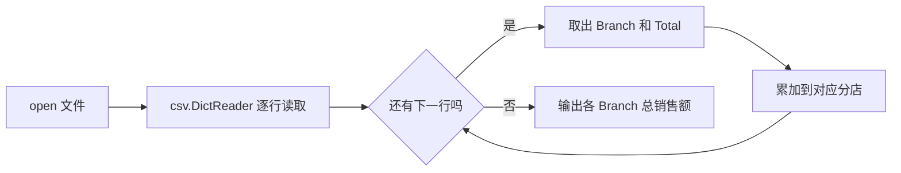

# Week 2 Python 编程基础

> **本章导读**
> 时长：3 节课，每节 45 分钟
> 数据：`data/02-python/stock_price.csv`、`data/02-python/supermarket_sales.csv`、`data/02-python/breast_cancer.csv`
> 你将学到：用 Python 标准库 `csv`、`statistics`、`math` 读取 CSV，掌握变量、容器、条件、循环、函数、异常和调试
> 本周不引入 pandas
> 本周产出：`projects/<姓名>/02-stock.py`、`projects/<姓名>/02-supermarket.py`、`projects/<姓名>/02-breast-cancer.py`

本周三节课不按“先讲完所有语法，再做题目”的顺序。每一节都从一个具体数据问题开始，先引入刚好够用的概念，再用真实数据练习。

```text
看数据问题 → 引入概念 → 最小代码 → 自己试 → 应用到数据 → DSH 审查 → 验收
```

1. 第 1 节课：从一个价格列表开始，统计股票价格；
2. 第 2 节课：从循环到函数和字典，汇总超市分店销售额；
3. 第 3 节课：把脏数据讲清楚，安全处理乳腺癌数据中的异常值。

**本周使用 DSH 的固定顺序：先理解计划，再检查命令，小步执行，验证结果。** DSH 可以生成代码，但你必须能解释每一行。它说“写好了”不等于“做对了”，要看真实输出；它要执行命令时，先读命令本身。本周代码只允许使用标准库，出现 `pandas` 就是红线；原始 `data/` 目录只读，学生代码只写入 `projects/<姓名>/`。

## 1. 第 1 节课 从一个价格列表开始（45 分钟）

建议节奏：`8 分钟演示 → 30 分钟练习 → 7 分钟复盘`。

### 1.1 今天的数据与问题

数据：`data/02-python/stock_price.csv`，252 行 x 2 列，字段 `Date`、`Price`。

问题：读取 `Price` 列，计算平均价格、最高价格、最低价格和上涨天数。

先看计划：


计划里没有“修改原文件”和“安装 pandas”。这两件事本周都不做。

### 1.2 变量和基本类型

变量是给一个值起的名字，不是这个值本身。可以把它想成储物格上的标签：`price` 是标签，`23.02` 是格子里放的东西。Python 中每个值都有类型，类型决定它能做什么运算。

写代码前先记三个工具：`print()` 把结果打印到屏幕；`type()` 返回一个值的类型；`#` 后面的文字是注释，只给人看，Python 不执行。

```python
price = 23.02          # float，小数
days = 252             # int，整数
stock_name = "PF"      # str，文本
is_trading_day = True  # bool，布尔

print(type(price))
print(type(days))
print(type(stock_name))
print(type(is_trading_day))
```

脚本：[01-variable-types.py](https://github.com/zhouxzh/python-data-analysis/blob/main/scripts/02-python/01-variable-types.py)

输出：

```text
<class 'float'>
<class 'int'>
<class 'str'>
<class 'bool'>
```

本周还会用到另外几种容器类型：

| 类型 | 中文名 | 示例 | 特点 |
|---|---|---|---|
| `None` | 空值 | `None` | 表示“没有值”或“转换失败” |
| `list` | 列表 | `[23.02, 23.15]` | 有序，可增删 |
| `tuple` | 元组 | `("2024-01-02", 23.02)` | 有序，创建后不改 |
| `dict` | 字典 | `{"A": 106200.37}` | 按名字找值 |
| `set` | 集合 | `{"A", "B", "C"}` | 不重复 |

四条规则：

- CSV 读进来的内容默认是 `str`，算数前必须转成数字；
- 变量名要说明用途，不要叫 `a`、`b`、`c`；
- 数字和字符串不能直接相加，先看 `type()`，再看报错；
- 容器类型会在具体用到时再展开，不在这一节一次背完。

**自己试 1：** 新建 `quantity = 5` 和 `unit_price = 12.5`，打印 `quantity * unit_price` 和它的 `type()`。先猜类型，再运行。

### 1.3 数字运算和 `round()`

这一节先认识四个运算：`/` 是普通除法，结果可能是小数；`//` 是向下取整；`%` 是取余数；`round(x, 2)` 保留两位小数，用于显示，不改变原来的数据。

```python
print(10 / 3)
print(10 // 3)
print(10 % 3)
print(round(23.969999, 2))
```

脚本：[02-number-operations.py](https://github.com/zhouxzh/python-data-analysis/blob/main/scripts/02-python/02-number-operations.py)

输出：

```text
3.3333333333333335
3
1
23.97
```

- `/` 是普通除法，结果可能是 `float`
- `//` 是向下取整
- `%` 是取余数
- `round(x, 2)` 保留两位小数，用于显示，不改变原来的数据

### 1.4 列表和 `for` 循环

价格是一串有序、可以增删的数字，用 `list`。列表编号从 0 开始，所以第一个元素是 `prices[0]`，最后一个是 `prices[-1]`。`len(列表)` 返回元素个数；`列表.append(值)` 在末尾增加一个元素。

```python
prices = [23.02, 23.15, 23.50]
print(prices[0])
print(prices[-1])
prices.append(23.80)
print(prices)
print(len(prices))
```

脚本：[03-list-basics.py](https://github.com/zhouxzh/python-data-analysis/blob/main/scripts/02-python/03-list-basics.py)

输出：

```text
23.02
23.5
[23.02, 23.15, 23.5, 23.8]
4
```

`for` 循环让程序重复执行同一段代码。`for price in prices:` 的意思是：依次把列表中的每个元素放进变量 `price`，执行缩进块；列表里有几个元素，缩进块就执行几次。`break` 会立即结束整个循环，后面的元素不再处理。

```python
prices = [23.02, 23.15, 23.50]

total = 0
for price in prices:
    total = total + price

print(total)
```

脚本：[04-list-for-sum.py](https://github.com/zhouxzh/python-data-analysis/blob/main/scripts/02-python/04-list-for-sum.py)

输出：

```text
69.67
```

累加前先准备 `total = 0`，这个初始值必须在循环外设置。

**自己试 2：** 写一个循环，只打印大于 `23.1` 的价格。先说出你预期会看到哪几个数，再运行。

### 1.5 用 `statistics` 算均值，用 `min` / `max` 找极值

`import statistics` 把标准库模块 statistics 加载进来，之后用 `statistics.mean(...)` 调用它的平均值函数。`min()` 和 `max()` 是 Python 自带函数。

```python
import statistics

prices = [23.02, 23.15, 23.50]
print(statistics.mean(prices))
print(min(prices))
print(max(prices))
```

脚本：[05-statistics-mean-min-max.py](https://github.com/zhouxzh/python-data-analysis/blob/main/scripts/02-python/05-statistics-mean-min-max.py)

输出：

```text
23.223333333333333
23.02
23.5
```

`mean` 是平均值，`min` / `max` 是最小值、最大值。这些函数都来自标准库，不需要 pandas。

### 1.6 读取 CSV 的 `Price` 列

现在把前面的概念接到真实文件上。这里会用到几个新语法：`import csv` 加载 CSV 模块；`with open(path, encoding="utf-8-sig", newline="") as f:` 打开文件并在结束时自动关闭；`csv.DictReader(f)` 把每行读成以表头为键的字典；`row["Price"]` 按列名取这一行的值；`float(...)` 把文本转成小数。

```python
import csv
import statistics

path = "data/02-python/stock_price.csv"
prices = []

with open(path, encoding="utf-8-sig", newline="") as f:
    reader = csv.DictReader(f)
    for row in reader:
        prices.append(float(row["Price"]))

print("样本量:", len(prices))
print("平均价格:", round(statistics.mean(prices), 2))
print("最高价格:", round(max(prices), 2))
print("最低价格:", round(min(prices), 2))
```

脚本：[06-stock-csv.py](https://github.com/zhouxzh/python-data-analysis/blob/main/scripts/02-python/06-stock-csv.py) ｜ 数据：[stock_price.csv](https://github.com/zhouxzh/python-data-analysis/blob/main/data/02-python/stock_price.csv)

输出：

```text
样本量: 252
平均价格: 19.3
最高价格: 23.97
最低价格: 14.5
```

关键点：

- `csv.DictReader` 把每一行读成字典，表头是键，所以用 `row["Price"]`
- CSV 读出来是字符串，`float(row["Price"])` 把它转成小数
- `encoding="utf-8-sig"` 自动去掉文件开头的 BOM，避免列名变成 `\ufeffPrice`

**自己试 3：** 把代码改成只打印前 3 个价格。用 `break` 在第三次后停止循环。

### 1.7 数上涨天数

上涨天数表示相邻两天比较后、后一天高于前一天的次数。这里需要两个新工具：`range(1, len(prices))` 生成从 1 到 `len(prices) - 1` 的整数序列；`if prices[i] > prices[i - 1]:` 表示条件成立时才执行缩进块，`>` 是比较大小。`up_days += 1` 是 `up_days = up_days + 1` 的简写。

```python
import csv

path = "data/02-python/stock_price.csv"
prices = []

with open(path, encoding="utf-8-sig", newline="") as f:
    reader = csv.DictReader(f)
    for row in reader:
        prices.append(float(row["Price"]))

up_days = 0
for i in range(1, len(prices)):
    if prices[i] > prices[i - 1]:
        up_days += 1

print("上涨天数:", up_days)
```

脚本：[07-stock-up-days.py](https://github.com/zhouxzh/python-data-analysis/blob/main/scripts/02-python/07-stock-up-days.py) ｜ 数据：[stock_price.csv](https://github.com/zhouxzh/python-data-analysis/blob/main/data/02-python/stock_price.csv)

输出：

```text
上涨天数: 122
```

重点解释：

- `range(1, len(prices))`：从第 2 个价格开始，和前一天比较
- `len(prices)` 是 252，所以循环比较 251 次，不是 252 次
- `prices[i - 1]`：紧邻的前一天价格

### 1.8 DSH vibe loop 与验收

把这节课的脚本交给 DSH 审查，问它三个问题：

1. 为什么 `float(row["Price"])` 不能省略？
2. 为什么上涨天数不是 252？
3. 如果 `statistics.mean(prices)` 报错，最可能是什么原因？

DSH 回答后，你必须用自己的话复述一遍，能复述才继续下一步。

- [ ] 能说出 `int`、`float`、`str`、`bool` 的区别
- [ ] 能解释 `list` 为什么适合存价格序列
- [ ] 能用 `for` 循环把列表加总
- [ ] `stock_price.csv` 脚本只用 `csv` 和 `statistics`，没有 pandas
- [ ] 能输出 252 行、平均 19.3、最高 23.97、最低 14.5、上涨天数 122
- [ ] 能解释“上涨天数比较 251 次，不是 252 次”

## 2. 第 2 节课 从循环到函数和字典（45 分钟）

建议节奏：`8 分钟演示 → 30 分钟练习 → 7 分钟复盘`。

### 2.1 今天的数据与问题

数据：`data/02-python/supermarket_sales.csv`，1000 行 x 17 列。主要字段：`Branch`、`City`、`Customer type`、`Product line`、`Unit price`、`Quantity`、`Total`、`Rating`。

问题：写一个函数，计算各 `Branch` 的总销售额。

先看计划：

```text
打开文件 → csv.DictReader 逐行读取 → 取出 Branch 和 Total → Total 转 float → 累加到字典 → 输出 A/B/C 三个分店的总销售额
```

`Total` 读进来是字符串，例如 `'548.9715'`，必须先转成 `float`，否则字典累加会变成字符串拼接。

### 2.2 条件分支

`if` 处理一个条件；`elif` 表示“否则如果”，可以接多个条件；`else` 是以上都不满足时的兜底。判断从上往下，先命中的分支执行，后面的不再检查。比较运算符 `>`、`>=`、`<`、`==` 的结果是 `True` 或 `False`。

```python
rating = 9.1

if rating >= 8.0:
    print("高评分")
elif rating >= 6.0:
    print("中评分")
else:
    print("低评分")
```

脚本：[08-rating-if-elif-else.py](https://github.com/zhouxzh/python-data-analysis/blob/main/scripts/02-python/08-rating-if-elif-else.py)

输出：

```text
高评分
```

**自己试 4：** 把 `rating` 改成 `7.5`，预测会输出什么；再把 `elif rating >= 6.0` 改成 `elif rating >= 7.5`，再看结果。

### 2.3 字典

要保存“分店 → 总销售额”，需要一个能把名字和数值配对的容器，这就是 `dict`。它像查字典：键是“分店名”，值是“累计销售额”。`{"A": 0.0}` 创建一个字典；`branch_totals["A"]` 用键 `A` 取出对应值。

```python
branch_totals = {"A": 0.0, "B": 0.0, "C": 0.0}
branch_totals["A"] += 10.0
print(branch_totals)
print(branch_totals["B"])
```

脚本：[09-dict-basics.py](https://github.com/zhouxzh/python-data-analysis/blob/main/scripts/02-python/09-dict-basics.py)

输出：

```text
{'A': 10.0, 'B': 0.0, 'C': 0.0}
0.0
```

当键第一次出现时，要先用 `get(key, 0.0)` 给默认值，否则直接累加会报 `KeyError`。

### 2.4 `csv.DictReader` 逐行读取

```python
import csv

path = "data/02-python/supermarket_sales.csv"
with open(path, encoding="utf-8-sig", newline="") as f:
    reader = csv.DictReader(f)
    for row in reader:
        print(row["Branch"], row["Total"])
        break
```

脚本：[10-csv-dictreader-first-row.py](https://github.com/zhouxzh/python-data-analysis/blob/main/scripts/02-python/10-csv-dictreader-first-row.py) ｜ 数据：[supermarket_sales.csv](https://github.com/zhouxzh/python-data-analysis/blob/main/data/02-python/supermarket_sales.csv)

输出（只打印第一行，然后停止）：

```text
A 548.9715
```

`csv.DictReader` 会用第一行表头作为键，后面的每一行变成字典。用它逐行处理，先想清楚每一行要做什么。



### 2.5 先写循环版汇总

这里用到三个新语法：`dict.get(key, 0.0)` 在键存在时返回值，不存在时返回默认值 `0.0`；`sorted(字典)` 返回按键排序后的列表；`f"..."` 是 f-string，用大括号插入变量，`:.2f` 表示保留两位小数。

```python
import csv

path = "data/02-python/supermarket_sales.csv"
branch_totals = {}

with open(path, encoding="utf-8-sig", newline="") as f:
    reader = csv.DictReader(f)
    for row in reader:
        branch = row["Branch"]
        total = float(row["Total"])
        branch_totals[branch] = branch_totals.get(branch, 0.0) + total

for branch in sorted(branch_totals):
    print(f"Branch {branch}: {branch_totals[branch]:.2f}")
```

脚本：[11-supermarket-loop-total.py](https://github.com/zhouxzh/python-data-analysis/blob/main/scripts/02-python/11-supermarket-loop-total.py) ｜ 数据：[supermarket_sales.csv](https://github.com/zhouxzh/python-data-analysis/blob/main/data/02-python/supermarket_sales.csv)

输出：

```text
Branch A: 106200.37
Branch B: 106197.67
Branch C: 110568.71
```

### 2.6 封装成函数

函数是把一段可重复使用的逻辑打包，并给它一个明确输入和输出。`def sales_by_branch(path)` 定义了一个函数：输入是文件路径，输出是各分店销售额字典。函数内部只负责计算，`return` 把结果交给调用者；打印应该留在调用处。`result.items()` 返回 `(键, 值)` 组成的序列；`for branch, total in sorted(result.items())` 同时把键和值放进两个变量。

```python
import csv

def sales_by_branch(path):
    totals = {}
    with open(path, encoding="utf-8-sig", newline="") as f:
        reader = csv.DictReader(f)
        for row in reader:
            branch = row["Branch"]
            total = float(row["Total"])
            totals[branch] = totals.get(branch, 0.0) + total
    return totals

result = sales_by_branch("data/02-python/supermarket_sales.csv")
for branch, total in sorted(result.items()):
    print(branch, round(total, 2))
```

脚本：[12-supermarket-function.py](https://github.com/zhouxzh/python-data-analysis/blob/main/scripts/02-python/12-supermarket-function.py) ｜ 数据：[supermarket_sales.csv](https://github.com/zhouxzh/python-data-analysis/blob/main/data/02-python/supermarket_sales.csv)

输出：

```text
A 106200.37
B 106197.67
C 110568.71
```

**自己试 5：** 复制 `sales_by_branch()`，改写成 `sales_by_city()`，把 `Branch` 换成 `City`。先写出你预计的输出，再运行。

### 2.7 `tuple` 和 `set` 什么时候用

本节课主线上只需要 `list` 和 `dict`，但要知道另外两个容器什么时候合适：

```python
one_day = ("2024-01-02", 23.02)   # tuple：一行固定记录
branches = {"A", "B", "C"}        # set：不重复的分店名
```

脚本：[13-tuple-set.py](https://github.com/zhouxzh/python-data-analysis/blob/main/scripts/02-python/13-tuple-set.py)

- `tuple` 适合“日期 + 价格”这种固定组合，创建后不修改
- `set` 适合“有哪些城市”这种去重问题

### 2.8 DSH vibe loop 与验收

先自己写 `sales_by_branch()`，再让 DSH 审查。DSH 给出修改版后，逐行说明它改了什么、为什么改；说不出来，就让它重新解释。

- [ ] 能解释 `if` / `elif` / `else` 的执行顺序
- [ ] 能说明 `dict` 为什么适合“分店 → 总销售额”
- [ ] 能用 `csv.DictReader` 逐行读取 `data/02-python/supermarket_sales.csv`
- [ ] `sales_by_branch()` 返回字典，而不是只在函数里打印
- [ ] 输出 A、B、C 三个分店总销售额，结果与数据一致
- [ ] 能解释 `totals.get(branch, 0.0)` 的作用
- [ ] 全程没有 pandas，DSH 修改过的代码能解释

## 3. 第 3 节课 把脏数据讲清楚（45 分钟）

建议节奏：`8 分钟演示 → 30 分钟练习 → 7 分钟复盘`。

### 3.1 今天的数据与问题

数据：`data/02-python/breast_cancer.csv`，699 行 x 11 列。主要字段：`Id`、`Cl.thickness`、`Cell.size`、`Cell.shape`、`Bare.nuclei`、`Bl.cromatin`、`Normal.nucleoli`、`Mitoses`、`Class`。

问题：`Bare.nuclei` 里有非数字标记，不能直接 `int()`。课程要求识别 `?`；本仓库当前文件把这 16 个缺失写作 `NA`，代码必须两种都处理。

先看计划：

```text
读取文件 → 审计行数、列数、表头 → 找出 Bare.nuclei 的非数字值 → 用 try/except 保护转换 → 统计时先剔除异常值 → 输出描述统计
```

### 3.2 先审计

`reader.fieldnames` 是表头列表；`list(reader)` 把所有行一次读进列表，这样能马上知道总行数。

```python
import csv

path = "data/02-python/breast_cancer.csv"
with open(path, encoding="utf-8-sig", newline="") as f:
    reader = csv.DictReader(f)
    fieldnames = reader.fieldnames
    rows = list(reader)

print("总记录数:", len(rows))
print("列数:", len(fieldnames))
print("列名:", fieldnames)
```

脚本：[14-breast-cancer-audit.py](https://github.com/zhouxzh/python-data-analysis/blob/main/scripts/02-python/14-breast-cancer-audit.py) ｜ 数据：[breast_cancer.csv](https://github.com/zhouxzh/python-data-analysis/blob/main/data/02-python/breast_cancer.csv)

输出：

```text
总记录数: 699
列数: 11
列名: ['Id', 'Cl.thickness', 'Cell.size', 'Cell.shape', 'Marg.adhesion', 'Epith.c.size', 'Bare.nuclei', 'Bl.cromatin', 'Normal.nucleoli', 'Mitoses', 'Class']
```

审计是第一步。没看过表头和行数就做统计，等于没检查材料就开始写结论。

### 3.3 找出 `?` 和 `NA`

`row["Bare.nuclei"].strip()` 去掉首尾空格，避免 `NA` 因带空格而漏判。`值 in 集合` 判断该值是否在集合中。

```python
import csv

path = "data/02-python/breast_cancer.csv"
missing = 0
with open(path, encoding="utf-8-sig", newline="") as f:
    for row in csv.DictReader(f):
        if row["Bare.nuclei"].strip() in {"?", "NA", ""}:
            missing += 1

print("Bare.nuclei 缺失/异常标记:", missing)
```

脚本：[15-breast-cancer-missing.py](https://github.com/zhouxzh/python-data-analysis/blob/main/scripts/02-python/15-breast-cancer-missing.py) ｜ 数据：[breast_cancer.csv](https://github.com/zhouxzh/python-data-analysis/blob/main/data/02-python/breast_cancer.csv)

输出：

```text
Bare.nuclei 缺失/异常标记: 16
```

处理规则：

- 先统计有多少个 `?` / `NA`，再决定怎么处理
- 统计数值时剔除这些行，并在结果里报告样本量
- 不要悄悄把 `?` 当成 0，那是编造数据

### 3.4 用 `try` / `except` 处理转换失败

当 `int("?")` 无法转换时，Python 会抛出 `ValueError`。`try` 先尝试正常执行，`except ValueError` 只捕获这一种预期内的错误。

```python
def to_int(value):
    try:
        return int(value)
    except ValueError:
        return None

print(to_int("5"))
print(to_int("?"))
print(to_int("NA"))
```

脚本：[16-to-int-try-except.py](https://github.com/zhouxzh/python-data-analysis/blob/main/scripts/02-python/16-to-int-try-except.py)

输出：

```text
5
None
None
```

只捕获 `ValueError`，不写空 `except:`。空捕获会连代码本身的 bug 一起藏起来。

### 3.5 `print` 和断点调试

调试是观察程序运行时的状态，不是把报错藏起来。`print` 适合快速查看一个值，`breakpoint()` 适合在复杂循环里暂停并逐步检查。`repr(value)` 显示值的原始表示，能看出普通 `print` 看不到的空格或引号。

先用 `print` 看转换前的内容：

```python
def to_int(value):
    print("转换前:", repr(value))
    try:
        return int(value)
    except ValueError:
        return None
```

脚本：[17-debug-repr.py](https://github.com/zhouxzh/python-data-analysis/blob/main/scripts/02-python/17-debug-repr.py)

如果数据多了，再临时加断点：

```python
def to_int(value):
    breakpoint()   # 调试完成后必须删除
    try:
        return int(value)
    except ValueError:
        return None
```

脚本：[20-debug-breakpoint.py](https://github.com/zhouxzh/python-data-analysis/blob/main/scripts/02-python/20-debug-breakpoint.py)

运行后程序会停在 `breakpoint()`，在 `(Pdb)` 提示符后输入 `value` 看当前值，输入 `n` 执行下一行，输入 `q` 退出。VS Code 里也可以点行号左侧加红点断点，用调试按钮运行。

调试只用于找问题，`print` 和 `breakpoint()` 改完代码后要删掉，不能留进提交文件。

### 3.6 `load_column()` 和基础描述统计

`continue` 表示跳过本轮循环，直接处理下一行；在 `load_column()` 里用它跳过异常值。

```python
import csv
import statistics

def load_column(path, column):
    values = []
    with open(path, encoding="utf-8-sig", newline="") as f:
        reader = csv.DictReader(f)
        for row in reader:
            raw = row[column].strip()
            if raw in {"", "?", "NA"}:
                continue
            try:
                values.append(int(raw))
            except ValueError:
                print("无法转换:", repr(raw))
    return values

columns = ["Cl.thickness", "Cell.size", "Cell.shape", "Bare.nuclei"]
for column in columns:
    values = load_column("data/02-python/breast_cancer.csv", column)
    print(
        column,
        "n=", len(values),
        "mean=", round(statistics.mean(values), 2),
        "min=", min(values),
        "max=", max(values),
    )
```

脚本：[18-load-column-stats.py](https://github.com/zhouxzh/python-data-analysis/blob/main/scripts/02-python/18-load-column-stats.py) ｜ 数据：[breast_cancer.csv](https://github.com/zhouxzh/python-data-analysis/blob/main/data/02-python/breast_cancer.csv)

输出：

```text
Cl.thickness n= 699 mean= 4.42 min= 1 max= 10
Cell.size n= 699 mean= 3.13 min= 1 max= 10
Cell.shape n= 699 mean= 3.21 min= 1 max= 10
Bare.nuclei n= 683 mean= 3.54 min= 1 max= 10
```

注意 `Bare.nuclei` 的 `n=683`，不是 699。16 个 `?` / `NA` 被明确剔除并报告，这才叫处理异常值。

**自己试 6：** 把 `load_column()` 里的 `continue` 删掉，预测会发生什么；只改回一行，再运行验证。

### 3.7 统计 `Class` 样本数

```python
import csv

path = "data/02-python/breast_cancer.csv"
classes = {}
with open(path, encoding="utf-8-sig", newline="") as f:
    for row in csv.DictReader(f):
        key = row["Class"]
        classes[key] = classes.get(key, 0) + 1

print("Class 样本数:", classes)
```

脚本：[19-class-counts.py](https://github.com/zhouxzh/python-data-analysis/blob/main/scripts/02-python/19-class-counts.py) ｜ 数据：[breast_cancer.csv](https://github.com/zhouxzh/python-data-analysis/blob/main/data/02-python/breast_cancer.csv)

输出：

```text
Class 样本数: {'0': 458, '1': 241}
```

这里 `Class` 是字符串 `'0'` 和 `'1'`，所以字典键也是字符串。样本量相加等于 699。

### 3.8 DSH vibe loop 与验收

把脚本交给 DSH 审查，问它：

1. 为什么先识别 `?` / `NA`，再 `int()`？
2. 剔除 16 行数据后，样本量变化对结论有什么影响？
3. 为什么 `except ValueError` 不能改成空 `except:`？

DSH 解释后，你写一句话说明自己的处理口径。

- [ ] 能审计出 699 行、11 列和完整表头
- [ ] 能识别出 `Bare.nuclei` 的 16 个缺失标记（`?` 或 `NA`）
- [ ] 能用 `try` / `except ValueError` 保护转换，且只捕获 `ValueError`
- [ ] 能解释 `print` 调试和断点调试的用途，并知道调试代码要删除
- [ ] 描述统计输出包含样本量 `n`，`Bare.nuclei` 为 683
- [ ] 能输出 `Class` 为 0 和 1 的样本数
- [ ] 全程没有 pandas，能复述 DSH 给出的每行代码

## 4. 本周验证清单

- [ ] 三个脚本保存在 `projects/<姓名>/`：`02-stock.py`、`02-supermarket.py`、`02-breast-cancer.py`
- [ ] 三个脚本都能从仓库根目录直接运行，路径都是 `data/02-python/...`
- [ ] 股票脚本输出 252 行、平均 19.3、最高 23.97、最低 14.5、上涨天数 122
- [ ] 销售脚本输出 A、B、C 三个分店总销售额
- [ ] 癌症脚本审计 699 行、11 列，识别 16 个 `?` / `NA`
- [ ] `Bare.nuclei` 统计时明确报告 `n=683`
- [ ] 三个脚本只使用 `csv`、`statistics`、`math`，没有 pandas
- [ ] 每个脚本的每一行，学生都能解释
- [ ] 使用 DSH 时按“先理解计划 → 检查命令 → 小步执行 → 验证结果”完成
- [ ] `data/` 原始文件没有被修改

## 5. 常见错误与坑

| 现象 | 原因 | 处理 |
|---|---|---|
| `TypeError: can only concatenate str` | 没把 CSV 里的数字转成 float/int | 用 `float(row['Total'])` 后再累加 |
| `ValueError: invalid literal for int()` | 遇到 `?`、`NA` 或空格 | 先识别异常值，再用 `try/except` 保护转换 |
| `KeyError: 'Bare.nuclei'` | 表头有 BOM，或列名写错 | 用 `encoding='utf-8-sig'`，先打印 `fieldnames` |
| 上涨天数写成 252 | 把每个价格都当成上涨起点 | 从 `range(1, len(prices))` 开始，只有 251 次比较 |
| `while` 一直运行 | 忘记更新循环变量 | 每次循环更新 `i`，或改用 `for` |
| 函数没有结果 | 只在函数里 `print`，没有 `return` | 函数返回字典，调用处再打印 |
| 字典报 `KeyError` | 第一次出现键时直接 `totals[branch] += ...` | 用 `totals.get(branch, 0.0)` |
| 把 `?` 当成 0 | 没审计异常值 | 先统计并剔除，报告 `n`，不编造数据 |
| 空 `except:` 吞掉错误 | 想“让它别报错” | 只捕获具体异常，如 `ValueError` |
| 调试代码留在脚本里 | 加了 `print` / `breakpoint()` 后忘记删 | 调试完删除，再运行一次验证 |
| 脚本里出现 pandas | 提示词没限制，或直接让 DSH 自由发挥 | 明确要求只用 `csv`、`statistics`、`math` |
| DSH 说完成就相信 | 没有看命令和输出 | 自己运行、看结果、解释代码后再验收 |
| 结论只有数字没有样本量 | 统计前剔除了数据但没报告 | 每个统计都带 `n`，例如 `Bare.nuclei n=683` |

## 6. 作业

1. 新建 `projects/<姓名>/02-stock.py`：读取 `data/02-python/stock_price.csv`，输出行数、平均价格、最高价格、最低价格、上涨天数；用一句话解释为什么上涨天数比较次数是 251。
2. 新建 `projects/<姓名>/02-supermarket.py`：实现 `sales_by_branch()`，输出各 `Branch` 总销售额；再写一个 `sales_by_city()`，输出各 `City` 总销售额。
3. 新建 `projects/<姓名>/02-breast-cancer.py`：审计 699 行、11 列，统计 `Bare.nuclei` 中 `?` / `NA` 的数量，用 `try/except` 保护转换，输出 `Cl.thickness`、`Cell.size`、`Cell.shape`、`Bare.nuclei` 的 `n`、`mean`、`min`、`max`，以及 `Class` 样本数。
4. 三个脚本都让 DSH 审查一次，但审查后必须逐行解释 DSH 改动的内容；解释不出来，就让 DSH 重新解释，不能直接保存运行。
5. 在三个脚本开头各写一行注释，说明“这个脚本回答什么问题、处理口径是什么”。

## 7. 参考写法

本章借鉴了以下 GitHub 开源英文书的“小步示例 + 立即练习 + 数据应用”结构，未直接复制原文：

- [SoftUni/Programming-Basics-Book-Python-EN](https://github.com/SoftUni/Programming-Basics-Book-Python-EN)
- [AllenDowney/ThinkPython2](https://github.com/AllenDowney/ThinkPython2)
- [ehmatthes/pcc_3e](https://github.com/ehmatthes/pcc_3e)
- [csev/py4e](https://github.com/csev/py4e)

## 评分要点

| 项目 | 要求 |
|---|---|
| 基础语法 | 能区分 int/float/str/bool，能选择 list/dict/tuple/set |
| 文件读取 | 只用标准库 `csv`，路径写 `data/02-python/...`，可运行 |
| 控制流 | 能解释条件分支、for/while，并避免死循环 |
| 函数 | `sales_by_branch()` 返回字典，调用后输出各分店销售额 |
| 异常处理 | 能识别 `?` / `NA`，用 `try/except ValueError` 保护转换 |
| 统计口径 | 描述统计带样本量，明确报告 `Bare.nuclei n=683` |
| AI 协作 | 先理解计划、检查命令、小步执行、验证结果；DSH 生成的代码能解释 |
| 数据安全 | `data/` 未修改，代码只写入 `projects/<姓名>/`，全程无 pandas |
