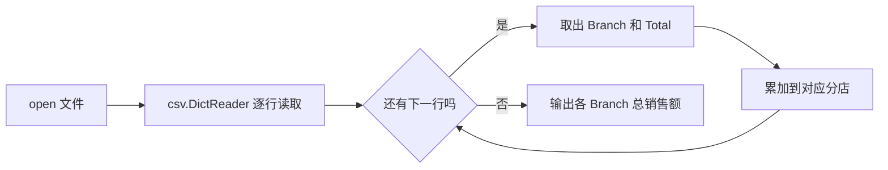

# Week 2：Python 编程基础

> **本章导读**
> 时长：3 节课，每节 45 分钟
> 数据：`data/02-python/stock_price.csv`、`data/02-python/supermarket_sales.csv`、`data/02-python/breast_cancer.csv`
> 你将学到：用 Python 标准库 `csv`、`statistics`、`math` 读取和处理 CSV，掌握变量、容器、条件、循环、函数、异常与调试
> 本周不引入 pandas
> 本周产出：`projects/<姓名>/week02_stock.py`、`projects/<姓名>/week02_sales.py`、`projects/<姓名>/week02_cancer.py`

本周三节课的安排：

1. 第 1 节课：Python 变量、容器与基本运算，统计股票价格；
2. 第 2 节课：条件、循环与函数，汇总超市各分店销售额；
3. 第 3 节课：文件、异常与调试，处理乳腺癌数据中的异常值。

**本周使用 DSH 的固定顺序：先理解计划，再检查命令，小步执行，验证结果。** DSH 可以生成代码，但你必须能解释每一行。它说“写好了”不等于“做对了”，要看真实输出；它要执行命令时，先读命令本身。本周代码只允许使用标准库，出现 `pandas` 就是红线；原始 `data/` 目录只读，学生代码只写入 `projects/<姓名>/`。

## 1. 第 1 节课：Python 变量、容器与基本运算（45 分钟）

建议节奏：前 20 分钟讲概念，后 20 分钟完成股票统计，最后 5 分钟验收。

### 1.1 今天的数据与问题

数据：`data/02-python/stock_price.csv`

规模：252 行 × 2 列，字段 `Date`、`Price`。

问题：读取 `Price` 列，计算平均价格、最高价格、最低价格和上涨天数。

先看计划：

```text
读取文件 → 逐行取出 Price → 转成 float → 用 statistics 算平均 → 用 max/min 找极值 → 相邻两日比较，数上涨天数
```

计划里没有“修改原文件”和“安装 pandas”。这两件事本周都不做。

### 1.2 变量、数字、字符串与布尔

```python
price = 23.02          # float，小数
days = 252             # int，整数
stock_name = "PF"      # str，文本
is_trading_day = True  # bool，布尔

print(type(price))
print(type(days))
print(type(stock_name))
print(type(is_trading_day))
```

预期输出：

```text
<class 'float'>
<class 'int'>
<class 'str'>
<class 'bool'>
```

记住四条规则：

- `int` 是整数，`float` 是小数，`str` 是文本，`bool` 只有 `True` / `False`；
- CSV 读进来的内容默认是 `str`，算数前必须转成数字；
- 变量名要说明用途，不要叫 `a`、`b`、`c`；
- 数字和字符串不能直接相加，先看 `type()`，再看报错。

### 1.3 四种容器：list、tuple、dict、set

```python
prices = [23.02, 23.15, 23.50]          # list：有序、可改
one_day = ("2024-01-02", 23.02)         # tuple：有序、固定
branch_totals = {"A": 0.0, "B": 0.0}    # dict：键值对
branches = {"A", "B", "C"}              # set：不重复

print(prices[0], prices[-1])
print(one_day[0])
branch_totals["A"] += 10.0
print(branch_totals)
print(len(branches))
```

预期输出：

```text
23.02 23.5
2024-01-02
{'A': 10.0, 'B': 0.0}
3
```

选择标准：

- 价格序列用 `list`，因为有序且要追加；
- “日期 + 价格”这种一行记录用 `tuple`；
- “分店 → 总销售额”用 `dict`；
- “有哪些城市”用 `set`，自动去重。

### 1.4 常用数学与 statistics

```python
import math
import statistics

print(math.floor(23.99))
print(math.ceil(23.01))
print(math.sqrt(16))

sample = [23.02, 23.15, 23.50]
print(statistics.mean(sample))
print(statistics.median(sample))
```

预期输出：

```text
23
24
4.0
23.22333333333333
23.15
```

`mean` 是平均值，`median` 是中位数，`min` / `max` 是最小值、最大值。这些函数都来自标准库，不需要 pandas。

### 1.5 读取 Price：平均值、最高、最低、上涨天数

```python
import csv
import statistics

path = 'data/02-python/stock_price.csv'
prices = []

with open(path, encoding='utf-8-sig') as f:
    reader = csv.DictReader(f)
    for row in reader:
        prices.append(float(row['Price']))

print('行数:', len(prices))
print('平均价格:', round(statistics.mean(prices), 2))
print('最高价格:', round(max(prices), 2))
print('最低价格:', round(min(prices), 2))

up_days = 0
for i in range(1, len(prices)):
    if prices[i] > prices[i - 1]:
        up_days += 1

print('上涨天数:', up_days)
```

预期输出：

```text
行数: 252
平均价格: 19.3
最高价格: 23.97
最低价格: 14.5
上涨天数: 122
```

重点解释三处：

- `float(row['Price'])`：把 CSV 里的字符串转成小数；
- `range(1, len(prices))`：从第 2 个价格开始，和前一天比较，所以是 251 次比较，不是 252；
- `prices[i - 1]`：紧邻的前一天价格。

课堂练习：让 DSH 解释 `prices.append`、`statistics.mean` 和 `range(1, len(prices))`。DSH 解释后，你用自己的话复述一遍，能复述才继续下一步。

### 1.6 第 1 节课验收

- [ ] 能说出 `int`、`float`、`str`、`bool` 的区别
- [ ] 能说出 list、tuple、dict、set 各自适合什么数据
- [ ] `data/02-python/stock_price.csv` 脚本只用 `csv` 和 `statistics`，没有 pandas
- [ ] 能输出 252 行、平均价格 19.3、最高 23.97、最低 14.5、上涨天数 122
- [ ] 能解释“上涨天数比较 251 次，不是 252 次”
- [ ] DSH 给出的每一行代码，学生都能用自己的话解释

## 2. 第 2 节课：条件、循环与函数（45 分钟）

建议节奏：前 15 分钟讲语法，后 25 分钟写 `sales_by_branch()`，最后 5 分钟验收。

### 2.1 今天的数据与问题

数据：`data/02-python/supermarket_sales.csv`

规模：1000 行 × 17 列。主要字段：`Branch`、`City`、`Customer type`、`Product line`、`Unit price`、`Quantity`、`Total`、`Rating`。

问题：写一个函数，计算各 `Branch` 的总销售额。

先看计划：

```text
打开文件 → csv.DictReader 逐行读取 → 取出 Branch 和 Total → Total 转 float → 累加到字典 → 输出 A/B/C 三个分店的总销售额
```

`Total` 读进来是字符串，例如 `'548.9715'`，必须先转成 `float`，否则字典累加会变成字符串拼接。

### 2.2 条件分支

```python
rating = 9.1

if rating >= 8.0:
    print('高评分')
elif rating >= 6.0:
    print('中评分')
else:
    print('低评分')
```

预期输出：

```text
高评分
```

条件从上往下检查，先命中的分支执行，后面的不再检查。所以判断顺序要按“最严格”到“最宽”写。

### 2.3 for 与 while

```python
for i in range(3):
    print('第', i + 1, '行')

i = 0
while i < 3:
    print('while:', i)
    i += 1
```

预期输出：

```text
第 1 行
第 2 行
第 3 行
while: 0
while: 1
while: 2
```

读取 CSV 通常用 `for`，因为行数明确。`while` 必须保证条件最终会变成假，否则会无限循环；每次循环都要更新 `i`。

### 2.4 用 csv 模块逐行读取

```python
import csv

path = 'data/02-python/supermarket_sales.csv'
with open(path, encoding='utf-8-sig') as f:
    reader = csv.DictReader(f)
    for row in reader:
        print(row['Branch'], row['Total'])
        break
```

预期输出（只打印第一行，然后停止）：

```text
A 548.9715
```

`csv.DictReader` 会用第一行表头作为键，后面的每一行变成字典。用它逐行处理，不要为了“显得方便”先把 1000 行全部读进内存再算；先想清楚每一行要做什么。



### 2.5 函数封装：sales_by_branch

```python
import csv

def sales_by_branch(path):
    totals = {}
    with open(path, encoding='utf-8-sig') as f:
        reader = csv.DictReader(f)
        for row in reader:
            branch = row['Branch']
            total = float(row['Total'])
            totals[branch] = totals.get(branch, 0.0) + total
    return totals

result = sales_by_branch('data/02-python/supermarket_sales.csv')
for branch, total in sorted(result.items()):
    print(branch, round(total, 2))
```

预期输出：

```text
A 106200.37
B 106197.67
C 110568.71
```

重点解释三处：

- `totals.get(branch, 0.0)`：分店第一次出现时从 0 开始，避免 `KeyError`；
- `return totals`：函数只负责计算，不负责打印结论；打印由调用处决定；
- `sorted(result.items())`：按分店名排序输出，结果可复现。

课堂练习：先自己写 `sales_by_branch()`，再让 DSH 审查。DSH 给出修改版后，逐行说明它改了什么、为什么改；说不出来，就让它重新解释。

### 2.6 第 2 节课验收

- [ ] 能解释 `if` / `elif` / `else` 的执行顺序
- [ ] 能说明 `for` 和 `while` 的适用场景，并避免死循环
- [ ] 能用 `csv.DictReader` 逐行读取 `data/02-python/supermarket_sales.csv`
- [ ] `sales_by_branch()` 返回字典，而不是只在函数里打印
- [ ] 输出 A、B、C 三个分店总销售额，结果与数据一致
- [ ] 能解释 `totals.get(branch, 0.0)` 的作用
- [ ] 全程没有 pandas，DSH 修改过的代码能解释

## 3. 第 3 节课：文件、异常与调试（45 分钟）

建议节奏：前 20 分钟完成读取和异常处理，后 20 分钟完成描述统计，最后 5 分钟验收。

### 3.1 今天的数据与问题

数据：`data/02-python/breast_cancer.csv`

规模：699 行 × 11 列。主要字段：`Id`、`Cl.thickness`、`Cell.size`、`Cell.shape`、`Bare.nuclei`、`Bl.cromatin`、`Normal.nucleoli`、`Mitoses`、`Class`。

问题：`Bare.nuclei` 里有非数字标记，不能直接 `int()`。课程要求识别 `?`；本仓库当前文件把这 16 个缺失写作 `NA`，代码必须两种都处理。

先看计划：

```text
读取文件 → 审计行数、列数、表头 → 找出 Bare.nuclei 的非数字值 → 用 try/except 保护转换 → 统计时先剔除异常值 → 输出描述统计
```

### 3.2 读取并审计

```python
import csv

path = 'data/02-python/breast_cancer.csv'
with open(path, encoding='utf-8-sig') as f:
    reader = csv.DictReader(f)
    rows = list(reader)

print('行数:', len(rows))
print('列数:', len(reader.fieldnames))
print('列名:', reader.fieldnames)
print('第一行:', rows[0])
```

预期输出：

```text
行数: 699
列数: 11
列名: ['Id', 'Cl.thickness', 'Cell.size', 'Cell.shape', 'Marg.adhesion', 'Epith.c.size', 'Bare.nuclei', 'Bl.cromatin', 'Normal.nucleoli', 'Mitoses', 'Class']
第一行: {'Id': '1000025', 'Cl.thickness': '5', 'Cell.size': '1', 'Cell.shape': '1', ..., 'Bare.nuclei': '1', ..., 'Class': '0'}
```

审计是第一步。没看过表头和行数就做统计，等于没检查材料就开始写结论。

### 3.3 识别异常值：? 和 NA

```python
import csv

path = 'data/02-python/breast_cancer.csv'
missing = 0
with open(path, encoding='utf-8-sig') as f:
    for row in csv.DictReader(f):
        if row['Bare.nuclei'] in ('?', 'NA'):
            missing += 1

print('Bare.nuclei 缺失/异常标记:', missing)
```

预期输出：

```text
Bare.nuclei 缺失/异常标记: 16
```

处理规则：

- 先统计有多少个 `?` / `NA`，再决定怎么处理；
- 统计数值时剔除这些行，并在结果里报告样本量；
- 不要悄悄把 `?` 当成 0，那是编造数据。

### 3.4 try/except：转换失败不崩溃

```python
def to_int(value):
    try:
        return int(value)
    except ValueError:
        return None

print(to_int('5'))
print(to_int('?'))
print(to_int('NA'))
```

预期输出：

```text
5
None
None
```

只捕获 `ValueError`，不写空 `except:`。空捕获会连代码本身的 bug 一起藏起来，你只看到“没报错”，却不知道结果为什么错。

### 3.5 print 与断点调试

先用 `print` 看转换前的内容：

```python
def to_int(value):
    print('转换前:', repr(value))
    try:
        return int(value)
    except ValueError:
        return None
```

如果数据多了，再临时加断点：

```python
def to_int(value):
    breakpoint()   # 调试完成后必须删除
    try:
        return int(value)
    except ValueError:
        return None
```

运行后程序会停在 `breakpoint()`，在 `(Pdb)` 提示符后输入 `value` 看当前值，输入 `n` 执行下一行，输入 `q` 退出。VS Code 里也可以点行号左侧加红点断点，用调试按钮运行。

调试只用于找问题，`print` 和 `breakpoint()` 改完代码后要删掉，不能留进提交文件。

### 3.6 基础描述统计

```python
import csv
import statistics

def load_column(path, column):
    values = []
    with open(path, encoding='utf-8-sig') as f:
        reader = csv.DictReader(f)
        for row in reader:
            raw = row[column].strip()
            if raw in ('?', 'NA'):
                continue
            try:
                values.append(int(raw))
            except ValueError:
                print('无法转换:', repr(raw))
    return values

columns = ['Cl.thickness', 'Cell.size', 'Cell.shape', 'Bare.nuclei']
for column in columns:
    values = load_column('data/02-python/breast_cancer.csv', column)
    print(column,
          'n=', len(values),
          'mean=', round(statistics.mean(values), 2),
          'min=', min(values),
          'max=', max(values))

classes = {}
with open('data/02-python/breast_cancer.csv', encoding='utf-8-sig') as f:
    for row in csv.DictReader(f):
        key = row['Class']
        classes[key] = classes.get(key, 0) + 1
print(classes)
```

预期输出：

```text
Cl.thickness n= 699 mean= 4.42 min= 1 max= 10
Cell.size n= 699 mean= 3.13 min= 1 max= 10
Cell.shape n= 699 mean= 3.21 min= 1 max= 10
Bare.nuclei n= 683 mean= 3.54 min= 1 max= 10
{'0': 458, '1': 241}
```

注意 `Bare.nuclei` 的 `n=683`，不是 699。16 个 `?` / `NA` 被明确剔除并报告，这才叫处理异常值。

课堂练习：把脚本交给 DSH 审查，问它：为什么先识别 `?` / `NA`，再 `int()`？剔除 16 行数据后，样本量变化对结论有什么影响？DSH 解释后，你写一句话说明自己的处理口径。

### 3.7 第 3 节课验收

- [ ] 能审计出 699 行、11 列和完整表头
- [ ] 能识别出 `Bare.nuclei` 的 16 个缺失标记（`?` 或 `NA`）
- [ ] 能用 `try` / `except ValueError` 保护转换，且只捕获 `ValueError`
- [ ] 能解释 `print` 调试和断点调试的用途，并知道调试代码要删除
- [ ] 描述统计输出包含样本量 `n`，`Bare.nuclei` 为 683
- [ ] 能输出 `Class` 为 0 和 1 的样本数
- [ ] 全程没有 pandas，能复述 DSH 给出的每行代码

## 4. 本周验证清单

- [ ] 三个脚本保存在 `projects/<姓名>/`：`week02_stock.py`、`week02_sales.py`、`week02_cancer.py`
- [ ] 三个脚本都能从仓库根目录直接运行，路径都是 `data/02-python/...`
- [ ] 股票脚本输出 252 行、平均 19.3、最高 23.97、最低 14.5、上涨天数 122
- [ ] 销售脚本输出 A、B、C 三个分店总销售额
- [ ] 癌症脚本审计 699 行、11 列，识别 16 个 `?` / `NA`
- [ ] `Bare.nuclei` 统计时明确报告 `n=683`
- [ ] 三个脚本只使用 `csv`、`statistics`、`math`，没有 pandas
- [ ] 每个脚本的每一行，学生都能解释
- [ ] 使用 DSH 时按“先理解计划 → 检查命令 → 小步执行 → 验证结果”完成
- [ ] `data/` 原始文件没有被修改

## 5. 常见错误与坑

| 现象 | 原因 | 处理 |
|---|---|---|
| `TypeError: can only concatenate str` | 没把 CSV 里的数字转成 float/int | 用 `float(row['Total'])` 后再累加 |
| `ValueError: invalid literal for int()` | 遇到 `?`、`NA` 或空格 | 先识别异常值，再用 `try/except` 保护转换 |
| `KeyError: 'Bare.nuclei'` | 表头有 BOM，或列名写错 | 用 `encoding='utf-8-sig'`，先打印 `fieldnames` |
| 上涨天数写成 252 | 把每个价格都当成上涨起点 | 从 `range(1, len(prices))` 开始，只有 251 次比较 |
| `while` 一直运行 | 忘记更新循环变量 | 每次循环更新 `i`，或改用 `for` |
| 函数没有结果 | 只在函数里 `print`，没有 `return` | 函数返回字典，调用处再打印 |
| 字典报 `KeyError` | 第一次出现键时直接 `totals[branch] += ...` | 用 `totals.get(branch, 0.0)` |
| 把 `?` 当成 0 | 没审计异常值 | 先统计并剔除，报告 `n`，不编造数据 |
| 空 `except:` 吞掉错误 | 想“让它别报错” | 只捕获具体异常，如 `ValueError` |
| 调试代码留在脚本里 | 加了 `print` / `breakpoint()` 后忘记删 | 调试完删除，再运行一次验证 |
| 脚本里出现 pandas | 提示词没限制，或直接让 DSH 自由发挥 | 明确要求只用 `csv`、`statistics`、`math` |
| DSH 说完成就相信 | 没有看命令和输出 | 自己运行、看结果、解释代码后再验收 |
| 结论只有数字没有样本量 | 统计前剔除了数据但没报告 | 每个统计都带 `n`，例如 `Bare.nuclei n=683` |

## 6. 作业

1. 新建 `projects/<姓名>/week02_stock.py`：读取 `data/02-python/stock_price.csv`，输出行数、平均价格、最高价格、最低价格、上涨天数；用一句话解释为什么上涨天数比较次数是 251。
2. 新建 `projects/<姓名>/week02_sales.py`：实现 `sales_by_branch()`，输出各 `Branch` 总销售额；再写一个 `sales_by_city()`，输出各 `City` 总销售额。
3. 新建 `projects/<姓名>/week02_cancer.py`：审计 699 行、11 列，统计 `Bare.nuclei` 中 `?` / `NA` 的数量，用 `try/except` 保护转换，输出 `Cl.thickness`、`Cell.size`、`Cell.shape`、`Bare.nuclei` 的 `n`、`mean`、`min`、`max`，以及 `Class` 样本数。
4. 三个脚本都让 DSH 审查一次，但审查后必须逐行解释 DSH 改动的内容；解释不出来，就让 DSH 重新解释，不能直接保存运行。
5. 在三个脚本开头各写一行注释，说明“这个脚本回答什么问题、处理口径是什么”。

## 评分要点

| 项目 | 要求 |
|---|---|
| 基础语法 | 能区分 int/float/str/bool，能选择 list/tuple/dict/set |
| 文件读取 | 只用标准库 `csv`，路径写 `data/02-python/...`，可运行 |
| 控制流 | 能解释条件分支、for/while，并避免死循环 |
| 函数 | `sales_by_branch()` 返回字典，调用后输出各分店销售额 |
| 异常处理 | 能识别 `?` / `NA`，用 `try/except ValueError` 保护转换 |
| 统计口径 | 描述统计带样本量，明确报告 `Bare.nuclei n=683` |
| AI 协作 | 先理解计划、检查命令、小步执行、验证结果；DSH 生成的代码能解释 |
| 数据安全 | `data/` 未修改，代码只写入 `projects/<姓名>/`，全程无 pandas |
