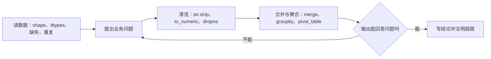

# Week 5 数据清洗与分组聚合

> **本章导读**
> 时长：3 节课，每节 45 分钟
> 数据：`data/04-cleaning/Cars93_miss.csv`、`data/04-cleaning/telco_customer_churn.csv`、`data/06-merge/norway_new_car_sales_by_make.csv`、`data/06-merge/norway_new_car_sales_by_model.csv`、`data/06-merge/MarketArrivals.csv`
> 参考脚本：`scripts/05-cleaning-merge/` 下 7 个文件，与正文代码块一一对应。
> 你将学到：先审计缺失、重复和类型错误，再做字符串转数值与业务一致性检查，最后用 `str.strip()`、`merge`、`groupby`、`pivot_table` 完成清洗与分组汇总
> 本周产出：`projects/<姓名>/week5_cleaning.py` 和 `projects/<姓名>/week5-conclusions.md`

清洗不是把缺失值删掉。正确顺序是：先审计问题出现在哪里、有多少，再判断每类问题能否解释、要不要处理、怎么处理，最后用结果验证判断。本章只用 pandas；`data/` 一律只读，个人输出写到 `projects/<姓名>/`。

每次让 DSH 干活都走同一套流程：先说清目标和验收标准，先审 Agent 计划，看不懂就要求解释或暂停，执行最小一步，检查输出和文件改动，再保存代码并写结论。AI 给的代码要逐行看懂再运行。



三节课安排：

1. 第 1 节课：缺失、重复和类型错误（`Cars93_miss.csv`）
2. 第 2 节课：字符串、日期、业务一致性与分组汇总（`telco_customer_churn.csv`）
3. 第 3 节课：合并、groupby 与 pivot_table（挪威销售两张表、`MarketArrivals.csv`）

---

## 1. 第 1 节课 缺失、重复和类型错误（45 分钟）

**45 分钟**：0–8 演示，8–38 练习，38–45 复盘。

### 1.1 问题

`data/04-cleaning/Cars93_miss.csv` 是 93 行 x 27 列的汽车数据，字段含 `Manufacturer`、`Model`、`Type`、`Price`、`MPG.city`、`MPG.highway`、`AirBags`、`Cylinders`、`Weight`、`Origin`、`Make`。本节课只回答三个问题：

1. 每列各有多少缺失值，缺失最多的是哪几列？
2. 数据里有没有完全重复的行？
3. 哪些列的类型需要修正，删掉所有含缺失的行后还剩多少行？

### 1.2 概念

- `isna()` 返回布尔矩阵，`isna().sum()` 按列统计缺失数。
- `duplicated()` 按整行判断重复，`duplicated().sum()` 是重复行数。
- `dropna()` 默认删除任意一个单元格缺失的行，会显著缩表，必须看删前删后的 `shape`。
- 类型错误：`Cylinders` 是 `object`，因为里面既有数字字符串（`3`、`4`、`5`、`6`、`8`），也有一个 `rotary`（转子发动机）。`pd.to_numeric(..., errors="coerce")` 会把 `rotary` 转成缺失，而不是报错或把它留在字符串列里。

### 1.3 最小代码

```python
import pandas as pd

cars = pd.read_csv("data/04-cleaning/Cars93_miss.csv")
print("shape:", cars.shape)
print("重复行数:", int(cars.duplicated().sum()))
print("删除任意缺失值后的行数:", len(cars.dropna()))

cyl = pd.to_numeric(cars["Cylinders"], errors="coerce")
print("Cylinders 原始缺失:", int(cars["Cylinders"].isna().sum()))
print("Cylinders 强制转数值后缺失:", int(cyl.isna().sum()))
```

脚本：[01-cars93-audit.py](https://github.com/zhouxzh/python-data-analysis/blob/main/scripts/05-cleaning-merge/01-cars93-audit.py) ｜ 数据：[Cars93_miss.csv](https://github.com/zhouxzh/python-data-analysis/blob/main/data/04-cleaning/Cars93_miss.csv)

输出：

```text
shape: (93, 27)
重复行数: 0
删除任意缺失值后的行数: 8
Cylinders 原始缺失: 5
Cylinders 强制转数值后缺失: 6
```

### 1.4 自己试

1. 打印 `cars.isna().sum().sort_values(ascending=False)`，找出缺失最多的三列。
2. 把 `duplicated()` 换成只判断 `Model` 列，比较它和整行判断的结果有什么不同。
3. 运行 `cars.dropna()`，说明为什么 93 行只剩 8 行。

### 1.5 应用到数据

完整脚本是 `scripts/05-cleaning-merge/02-cars93-missing-report.py`：

```python
import pandas as pd

cars = pd.read_csv("data/04-cleaning/Cars93_miss.csv")
print("shape:", cars.shape)
print("重复行数:", int(cars.duplicated().sum()))
missing = cars.isna().sum()
print("每列缺失数:")
print(missing[missing > 0])
print("删除任意缺失值后的 shape:", cars.dropna().shape)
```

脚本：[02-cars93-missing-report.py](https://github.com/zhouxzh/python-data-analysis/blob/main/scripts/05-cleaning-merge/02-cars93-missing-report.py) ｜ 数据：[Cars93_miss.csv](https://github.com/zhouxzh/python-data-analysis/blob/main/data/04-cleaning/Cars93_miss.csv)

实际输出（`results/05-cleaning-merge/02-cars93-missing-report-result.txt`）：

```text
shape: (93, 27)
重复行数: 0
每列缺失数:
Manufacturer           4
Model                  1
Type                   3
Min.Price              7
Price                  2
Max.Price              5
MPG.city               9
MPG.highway            2
AirBags               38
DriveTrain             7
Cylinders              5
EngineSize             2
Horsepower             7
RPM                    3
Rev.per.mile           6
Man.trans.avail        5
Fuel.tank.capacity     8
Passengers             2
Length                 4
Wheelbase              1
Width                  6
Turn.circle            5
Rear.seat.room         4
Luggage.room          19
Weight                 7
Origin                 5
Make                   3
dtype: int64
删除任意缺失值后的 shape: (8, 27)
```

读这份输出：`AirBags` 缺 38 条（93 条里约 41%），`Luggage.room` 缺 19 条，`MPG.city` 缺 9 条。`dropna()` 只保留 27 列全部无缺失的行，所以 93 行缩到 8 行。这个数字说明“直接删缺失”在本数据上代价过大，应当先分列判断。

### 1.6 DSH vibe loop

```text
请读取 data/04-cleaning/Cars93_miss.csv，不要修改原文件。
任务：
1. 输出 shape、每列缺失数、重复行数；
2. 指出缺失最多的三列并报告缺失比例；
3. 检查 Cylinders 的类型，用 pd.to_numeric(..., errors="coerce") 转数值；
4. 报告 dropna() 前后的 shape。
只使用 pandas。运行前先解释 isna、duplicated、dropna、to_numeric 各做什么。
```

### 1.7 验收

- [ ] 能输出 `shape`、每列缺失数和重复行数
- [ ] 能指出缺失最多的列是 `AirBags`（38 条）
- [ ] 能解释 `Cylinders` 是 `object` 的原因（含 `rotary`）
- [ ] 能说出 `dropna()` 把 93 行缩到 8 行的原因
- [ ] 没有修改 `data/04-cleaning/Cars93_miss.csv`

---

## 2. 第 2 节课 字符串、日期、业务一致性与分组汇总（45 分钟）

**45 分钟**：0–8 演示，8–38 练习，38–45 复盘。

### 2.1 问题

`data/04-cleaning/telco_customer_churn.csv` 是 4,225 行 x 52 列的电信客户数据，字段含 `Customer ID`、`Churn`、`Tenure in Months`、`Monthly Charge`、`Total Charges`、`Contract`、`Internet Type`、`Internet Service`。回答三个问题：

1. `Total Charges` 是字符串还是数值，强制转数值后会新增多少缺失？
2. `Customer ID` 有没有重复，`Internet Type` 的 886 条缺失能否从业务上解释？
3. 按 `Contract` 分组的流失率各是多少？

这份数据没有独立的日期列，时间信息只有时长字段 `Tenure in Months`（在网月数）和季度字符串 `Quarter`（本文件全部为 `Q3`）。因此本节不做日期解析，重点放在字符串转数值、缺失的业务解释和分组汇总上。

### 2.2 概念

- `pd.to_numeric(..., errors="coerce")` 把字符串或脏值安全地转成数值，无法转换的单元格变成 `NaN`。
- 业务一致性检查先看主键是否重复，再判断缺失有没有业务含义。`Internet Type` 缺 886 条，正好等于 `Internet Service == 0` 的 886 条：没开通互联网服务的客户自然没有互联网类型，这是结构性缺失，不是随机脏数据。
- `groupby("Contract")["Churn"].mean()`：`Churn` 是 0/1 标签，分组后求均值就是流失率。用 `mean()` 得到比例，便于跨组比较。

### 2.3 最小代码

```python
import pandas as pd

telco = pd.read_csv("data/04-cleaning/telco_customer_churn.csv")
telco["Total Charges"] = pd.to_numeric(telco["Total Charges"], errors="coerce")

print("shape:", telco.shape)
print("重复 Customer ID 数:", int(telco["Customer ID"].duplicated().sum()))
print("Internet Type 缺失数:", int(telco["Internet Type"].isna().sum()))
print(telco.groupby("Contract")["Churn"].mean().round(4))
```

脚本：[03-telco-churn-rate.py](https://github.com/zhouxzh/python-data-analysis/blob/main/scripts/05-cleaning-merge/03-telco-churn-rate.py) ｜ 数据：[telco_customer_churn.csv](https://github.com/zhouxzh/python-data-analysis/blob/main/data/04-cleaning/telco_customer_churn.csv)

输出：

```text
shape: (4225, 52)
重复 Customer ID 数: 0
Internet Type 缺失数: 886
Contract
Month-to-Month    0.4546
One Year          0.1073
Two Year          0.0239
Name: Churn, dtype: float64
```

### 2.4 自己试

1. 打印 `telco["Churn"].value_counts()`，报告流失与未流失的样本量。
2. 用 `telco.groupby("Internet Service")["Internet Type"].apply(lambda s: int(s.isna().sum()))`，验证缺失只出现在 `Internet Service == 0` 的客户里。
3. 比较 `Total Charges` 和 `Monthly Charge * Tenure in Months`，说明两者为什么不等。

第 3 题的观察结果是：`Total Charges` 与 `Monthly Charge * Tenure in Months` 的最大差是 370.85，并不完全相等。`Total Charges` 是累计账单口径，包含退款、折扣或其他调整，不能当作“月费乘在网月数”的精确乘积。

### 2.5 应用到数据

完整脚本是 `scripts/05-cleaning-merge/04-telco-churn-audit.py`：

```python
import pandas as pd

telco = pd.read_csv("data/04-cleaning/telco_customer_churn.csv")
print("shape:", telco.shape)
print("重复 Customer ID 数:", int(telco["Customer ID"].duplicated().sum()))
print("总缺失值:", int(telco.isna().sum().sum()))

telco["Total Charges"] = pd.to_numeric(
    telco["Total Charges"], errors="coerce"
)
print("Total Charges 转换后新增缺失:", int(telco["Total Charges"].isna().sum()))
print("Internet Type 缺失数:", int(telco["Internet Type"].isna().sum()))
print("Churn 分布:")
print(telco["Churn"].value_counts())
print("按 Contract 的流失率:")
print(telco.groupby("Contract")["Churn"].mean().round(4))
```

脚本：[04-telco-churn-audit.py](https://github.com/zhouxzh/python-data-analysis/blob/main/scripts/05-cleaning-merge/04-telco-churn-audit.py) ｜ 数据：[telco_customer_churn.csv](https://github.com/zhouxzh/python-data-analysis/blob/main/data/04-cleaning/telco_customer_churn.csv)

实际输出（`results/05-cleaning-merge/04-telco-churn-audit-result.txt`）：

```text
shape: (4225, 52)
重复 Customer ID 数: 0
总缺失值: 9418
Total Charges 转换后新增缺失: 0
Internet Type 缺失数: 886
Churn 分布:
Churn
0    3104
1    1121
Name: count, dtype: int64
按 Contract 的流失率:
Contract
Month-to-Month    0.4546
One Year          0.1073
Two Year          0.0239
Name: Churn, dtype: float64
```

读这份输出：`Churn` 里 0 有 3,104 条、1 有 1,121 条。`Total Charges` 转数值后新增缺失 0，因为该列读入时已经是 `float64`，转换是防御性习惯而不是本次必需。月付（Month-to-Month）客户流失率 45.46%，远高于一年期 10.73% 和两年期 2.39%，但这是描述性结果，不说明合同类型是原因。

### 2.6 DSH vibe loop

```text
请读取 data/04-cleaning/telco_customer_churn.csv，不要修改原文件。
任务：
1. 输出 shape、总缺失值、重复 Customer ID 数；
2. 用 pd.to_numeric(..., errors="coerce") 转换 Total Charges；
3. 解释 Internet Type 缺失和 Internet Service 的关系；
4. 用 groupby("Contract")["Churn"].mean() 计算流失率。
只使用 pandas，先报告缺失再解释，不要直接填充。
```

### 2.7 验收

- [ ] 能输出 `shape`、总缺失值、重复 `Customer ID` 数
- [ ] 能解释 `Internet Type` 的 886 条缺失对应 `Internet Service == 0`
- [ ] 能用 `groupby("Contract")["Churn"].mean()` 得到三个合同的流失率
- [ ] 能说明月付客户流失率最高只是描述性观察
- [ ] 没有用 `fillna(0)` 掩盖缺失

---

## 3. 第 3 节课 合并、groupby 与 pivot_table（45 分钟）

**45 分钟**：0–8 演示，8–38 练习，38–45 复盘。

### 3.1 问题

两张汽车销售表都在 `data/06-merge/`：

- `norway_new_car_sales_by_make.csv`：4,377 行 x 5 列，品牌级销量，字段 `Year`、`Month`、`Make`、`Quantity`、`Pct`。
- `norway_new_car_sales_by_model.csv`：2,694 行 x 6 列，车型级销量，多一个 `Model` 字段。

`data/06-merge/MarketArrivals.csv` 是 10,227 行 x 10 列的到货数据，字段含 `market`、`month`、`year`、`quantity`、`state`、`city`。回答三个问题：

1. 两张汽车表能否以 `Year`、`Month`、`Make` 为键安全合并，不清理空白会怎样？
2. 车型表按品牌汇总后，和品牌表的 `Quantity` 差多少？
3. 用 `groupby` 和 `pivot_table` 汇总 `MarketArrivals.csv`，哪个州到货量最高，月份乘年份的矩阵是什么形状？

### 3.2 概念

- `str.strip()` 去掉首尾空白，也包括不间断空格 `\xa0`。车型表 2,694 行全部带尾随空格，其中 1 行还是 `'\xa0Mercedes-Benz '`，不清理就无法和品牌表对齐。
- `merge` 按连接键对齐两张表，键值必须逐字节相等。`"Volkswagen" != "Volkswagen "`，所以不清理直接 `merge` 匹配 0 行。
- `groupby(...).agg(["sum", "mean", "count"])` 一次算出多个汇总指标。
- `pivot_table(index, columns, values, aggfunc)` 把长表转成“行乘列”的矩阵，便于按两个维度比较。

### 3.3 最小代码

```python
import pandas as pd

make = pd.read_csv("data/06-merge/norway_new_car_sales_by_make.csv")
model = pd.read_csv("data/06-merge/norway_new_car_sales_by_model.csv")

print("不 strip 直接合并行数:",
      len(pd.merge(model, make, on=["Year", "Month", "Make"], how="inner")))

model["Make"] = model["Make"].str.strip()
print("strip 后合并行数:",
      len(pd.merge(model, make, on=["Year", "Month", "Make"], how="inner")))

market = pd.read_csv("data/06-merge/MarketArrivals.csv")
print(market.groupby("state")["quantity"].sum().sort_values(ascending=False).head(3))
print(market.pivot_table(index="month", columns="year", values="quantity", aggfunc="sum").shape)
```

脚本：[05-norway-merge-demo.py](https://github.com/zhouxzh/python-data-analysis/blob/main/scripts/05-cleaning-merge/05-norway-merge-demo.py) ｜ 数据：[norway_new_car_sales_by_make.csv](https://github.com/zhouxzh/python-data-analysis/blob/main/data/06-merge/norway_new_car_sales_by_make.csv)、[norway_new_car_sales_by_model.csv](https://github.com/zhouxzh/python-data-analysis/blob/main/data/06-merge/norway_new_car_sales_by_model.csv)、[MarketArrivals.csv](https://github.com/zhouxzh/python-data-analysis/blob/main/data/06-merge/MarketArrivals.csv)

输出：

```text
不 strip 直接合并行数: 0
strip 后合并行数: 2694
state
MS     411438840
KNT    104266318
GUJ     85626739
Name: quantity, dtype: int64
(12, 21)
```

### 3.4 自己试

1. 找出车型表里带 `\xa0` 的那条记录，打印清理前后的 `repr`，结果应为 `'\xa0Mercedes-Benz '` 和 `'Mercedes-Benz'`。
2. 用 `make["Make"].nunique()` 和 `model["Make"].str.strip().nunique()`，说明品牌表和车型表的品牌覆盖范围差多少。
3. 把 `pivot_table` 的 `aggfunc` 从 `"sum"` 改成 `"mean"`，说明它回答的问题有什么不同。

### 3.5 应用到数据

两个脚本分别处理合并和透视。

`scripts/05-cleaning-merge/06-norway-merge-report.py`：

```python
import pandas as pd

make = pd.read_csv("data/06-merge/norway_new_car_sales_by_make.csv")
model = pd.read_csv("data/06-merge/norway_new_car_sales_by_model.csv")

for frame in (make, model):
    frame["Make"] = frame["Make"].astype(str).str.strip()

merged = model.merge(
    make,
    on=["Year", "Month", "Make"],
    suffixes=("_model", "_make"),
    how="left",
)
print("model shape:", model.shape, "make shape:", make.shape)
print("merged shape:", merged.shape)

make_total = make.groupby("Make")["Quantity"].sum().sort_values(ascending=False)
model_total = model.groupby("Make")["Quantity"].sum().sort_values(ascending=False)
compare = pd.DataFrame({"by_make": make_total, "by_model": model_total}).round(2)
print("按品牌汇总对比前 5:")
print(compare.head())
```

脚本：[06-norway-merge-report.py](https://github.com/zhouxzh/python-data-analysis/blob/main/scripts/05-cleaning-merge/06-norway-merge-report.py) ｜ 数据：[norway_new_car_sales_by_make.csv](https://github.com/zhouxzh/python-data-analysis/blob/main/data/06-merge/norway_new_car_sales_by_make.csv)、[norway_new_car_sales_by_model.csv](https://github.com/zhouxzh/python-data-analysis/blob/main/data/06-merge/norway_new_car_sales_by_model.csv)

实际输出（`results/05-cleaning-merge/06-norway-merge-report-result.txt`）：

```text
model shape: (2694, 6) make shape: (4377, 5)
merged shape: (2694, 8)
按品牌汇总对比前 5:
              by_make  by_model
Make
Alfa Romeo       1881       NaN
Aston Martin       48       NaN
Audi            70475   28691.0
BMW             73315   22965.0
Bentley            13       NaN
```

`scripts/05-cleaning-merge/07-market-arrivals.py`：

```python
import pandas as pd

market = pd.read_csv("data/06-merge/MarketArrivals.csv")
by_state = (
    market.groupby("state")["quantity"]
    .agg(["sum", "mean", "count"])
    .round(2)
    .sort_values("sum", ascending=False)
)
print("各州到货量汇总前 5:")
print(by_state.head())

pivot = market.pivot_table(
    index="month",
    columns="year",
    values="quantity",
    aggfunc="sum",
)
print("月份 x 年份到货量透视表:")
print(pivot)
```

脚本：[07-market-arrivals.py](https://github.com/zhouxzh/python-data-analysis/blob/main/scripts/05-cleaning-merge/07-market-arrivals.py) ｜ 数据：[MarketArrivals.csv](https://github.com/zhouxzh/python-data-analysis/blob/main/data/06-merge/MarketArrivals.csv)

实际输出（`results/05-cleaning-merge/07-market-arrivals-result.txt`）：

```text
各州到货量汇总前 5:
             sum       mean  count
state
MS     411438840   94496.75   4354
KNT    104266318  108837.49    958
GUJ     85626739   92170.87    929
DEL     46305615  293073.51    158
WB      31321878  167496.67    187
月份 x 年份到货量透视表:
year           1996      1997       1998  ...       2014       2015       2016
month                                     ...
April      192592.0  223608.0   640217.0  ...  5662840.0  7289830.0        NaN
August     173892.0  469167.0   278021.0  ...  3549119.0  3528035.0        NaN
December   240615.0  234061.0   556132.0  ...  8240154.0  8404299.0        NaN
February   196164.0  229550.0   522536.0  ...  7436586.0  7693723.0  6453355.0
January    225063.0  241225.0   344177.0  ...  8114257.0  8586582.0  9307923.0
July       156282.0  510105.0   357947.0  ...  3595982.0  4447048.0        NaN
June       175308.0  138178.0   639260.0  ...  3847455.0  5025525.0        NaN
March      178992.0  130885.0  1133036.0  ...  7186148.0  6533768.0        NaN
May        237574.0  251132.0   742766.0  ...  5281876.0  6281240.0        NaN
November    96295.0  284424.0   138178.0  ...  6787546.0  7528039.0        NaN
October    149113.0  359860.0    65268.0  ...  4862926.0  6271641.0        NaN
September  138648.0  518025.0   221175.0  ...  5232858.0  3830286.0        NaN

[12 rows x 21 columns]
```

读这两份输出：

- 车型表清理后能和品牌表逐行对应，`left` 合并保持车型表 2,694 行，结果 8 列。两边重复的 `Quantity`、`Pct` 加了 `_model`、`_make` 后缀。
- 品牌表有 65 个品牌，车型表清理后只有 22 个品牌。`by_model` 里 `Alfa Romeo`、`Aston Martin`、`Bentley` 是 `NaN`，说明车型表没收录这些品牌；`Audi` 车型汇总 28,691 对品牌表 70,475，`BMW` 22,965 对 73,315，说明车型表只覆盖部分车型，不是品牌的完整拆分。合并后的差距应写“覆盖不完整”，避免写成“数据错误”。
- 到货量最高的州是 `MS`（sum 411,438,840，count 4,354）。前 5 州里 `DEL` 的单笔均值最高（mean 293,073.51）但记录数只有 158，读均值要同时看 `count`。
- 透视表是 12 个月 x 21 年（1996–2016）。2016 年只有 January 和 February 有值，其余月份是 `NaN`，说明 2016 是部分年份数据，不是整年。

### 3.6 DSH vibe loop

```text
请读取 data/06-merge/norway_new_car_sales_by_make.csv、
data/06-merge/norway_new_car_sales_by_model.csv 和 data/06-merge/MarketArrivals.csv，不要修改原文件。
任务：
1. 审计两张汽车表的 Make 缺失数和唯一值数；
2. 合并前用 str.strip() 清理 Make，报告清理前后 inner 合并行数；
3. 按品牌汇总两张表并对比差异；
4. 对 MarketArrivals.csv 用 groupby 汇总各州 sum/mean/count，再用 pivot_table 做月份乘年份矩阵。
只使用 pandas。
```

### 3.7 验收

- [ ] 能解释不 `str.strip()` 直接 `merge` 匹配 0 行的原因
- [ ] 能找出车型表里含 `\xa0` 的记录并打印清理前后的 `repr`
- [ ] 能说明车型表只覆盖 22 个品牌，且覆盖品牌内销量小于品牌表
- [ ] 能用 `groupby(...).agg(["sum", "mean", "count"])` 汇总到货量
- [ ] 能用 `pivot_table` 得到 12 x 21 的月份乘年份矩阵
- [ ] 没有修改 `data/06-merge/` 下的任何文件

---

## 4. 本周验证清单

- [ ] 三节课都先审计 `shape`、`dtypes`、缺失、重复，再下结论
- [ ] 缺失值先报告数量和业务含义，不直接 `dropna()` 或 `fillna(0)`
- [ ] `Total Charges` 用 `pd.to_numeric(..., errors="coerce")` 转换
- [ ] 流失率用 `groupby("Contract")["Churn"].mean()` 计算并解释
- [ ] 合并前对连接键做 `str.strip()`，能说明不清理会匹配 0 行
- [ ] 车型表和品牌表的差异写“覆盖不完整”
- [ ] `pivot_table` 的 `index`、`columns`、`values`、`aggfunc` 选得正确
- [ ] 代码只使用 pandas，`data/` 只读，输出写入 `projects/<姓名>/`
- [ ] 使用 DSH 前先审计划，执行前能解释命令，运行后验证输出
- [ ] 第 1、2、3 节课验收清单全部通过

## 5. 常见错误与坑

| 现象 | 原因 | 处理 |
|---|---|---|
| `dropna()` 后只剩几行 | 任意一列缺失就删整行 | 先分列看缺失，再决定按列处理还是按行处理 |
| 只用整行 `duplicated()` | 可能漏掉关键字段重复 | 关键数据用 `df["id"].duplicated()` 单独查 |
| `to_numeric` 不写 `errors="coerce"` | 遇到脏值直接抛异常 | 用 `pd.to_numeric(..., errors="coerce")` 再核对新增缺失 |
| 把 `Internet Type` 缺失当随机错误 | 缺失对应没开通互联网的客户 | 先交叉 `Internet Service`，确认是结构性缺失 |
| 把 `Total Charges` 当成月费乘月数 | 累计账单含退款折扣 | 只描述观察，不假设公式成立 |
| 用 `astype(str).str.strip()` 清空白 | 把 `NaN` 变成字符串 `"nan"` | 用 `df["col"].str.strip()`，保留缺失 |
| 不清理空白直接 `merge` | `"A " != "A"`，键不相等 | 合并前 `str.strip()`，再核对匹配行数 |
| 把车型汇总等于品牌销量 | 车型表只覆盖部分车型 | 对比覆盖品牌数和销量差异，写“覆盖不完整” |
| `pivot_table` 用错 `aggfunc` | `sum` 和 `mean` 回答不同问题 | 先说要“总量”还是“均值”，再选聚合函数 |
| 看到月付流失率高就说因果 | 合同类型和流失只是相关 | 结论写“观察到”，并说明还缺哪些变量 |
| 把清洗结果写回 `data/` | 忘记目录边界 | `data/` 只读，个人输出写到 `projects/<姓名>/` |

## 6. 作业

1. 把三节课代码整理成一个可运行脚本 `projects/<姓名>/week5_cleaning.py`，从 `data/` 读数据，输出三节课的审计结果和汇总表，脚本只使用 pandas。
2. 写 `projects/<姓名>/week5-conclusions.md`，给出 3 条结论。每条写清：数据文件、字段、样本量、使用的方法（`dropna`、`to_numeric`、`groupby`、`merge`、`pivot_table`），以及这条结论不能支持什么。
3. 让 DSH 审查脚本，专门检查“缺失先报告、`to_numeric(errors="coerce")`、合并前 `str.strip()`、`groupby` 与 `pivot_table` 的聚合口径、`data/` 只读”，记录第一版代码和修改后代码，并说明每处修改为什么必要。

## 7. 参考写法

- [Python for Data Analysis, 3rd Edition](https://github.com/wesm/pydata-book)：pandas 作者 Wes McKinney 的教材，覆盖缺失处理、类型转换、合并和分组聚合的规范写法。
- [Python Data Science Handbook](https://github.com/jakevdp/PythonDataScienceHandbook)：Jake VanderPlas 的教材，`Pandas` 一章讲解 `merge`、`groupby`、`pivot_table` 的原理和示例。
- [Data School pandas videos](https://github.com/justmarkham/pandas-videos)：Kevin Markham 的 pandas 视频与配套代码，适合对照最短可运行示例。
- [pandas 官方仓库](https://github.com/pandas-dev/pandas)：API 文档与源码，用于查 `str.strip`、`merge`、`groupby`、`pivot_table` 的准确参数和边界行为。

## 评分要点

| 项目 | 要求 |
|---|---|
| 缺失与重复 | 能输出 `shape`、每列缺失数、重复行数，并解释 `dropna()` 的影响 |
| 类型处理 | 能识别 `Cylinders` 的 `rotary`，正确使用 `pd.to_numeric(errors="coerce")` |
| 业务一致性 | 能解释 `Internet Type` 缺失与 `Internet Service` 的关系 |
| 分组汇总 | 能用 `groupby("Contract")["Churn"].mean()` 计算并解释流失率 |
| 合并安全 | 合并前 `str.strip()`，能说明不清理会匹配 0 行，能解释车型覆盖不完整 |
| 透视表 | 能正确设置 `index`、`columns`、`values`、`aggfunc` 并读懂矩阵 |
| DSH 安全 | 先审计划、小步执行、逐行看懂代码、运行后验证输出 |
| 结论 | 每条结论写清数据、字段、方法、样本量和局限 |
