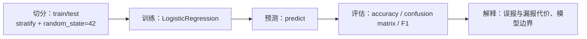

# Week 6：第一个预测模型（分类）

> **本章导读**
> 时长：3 节课，每节 45 分钟
> 数据：`data/07-modeling/GermanCredit.csv`（德国信贷）、`data/07-modeling/Churn_Modelling.csv`（银行客户流失）
> 你将学到：把分类问题拆成特征与标签；用 `train_test_split` 切分训练/测试集；用 `LogisticRegression` 训练；用准确率、混淆矩阵、precision/recall/F1 评估；最后把指标翻译成误报/漏报代价，并写清模型能支持什么决策、不能支持什么决策
> 本周产出：`projects/<姓名>/week6_classification.py`，包含三节课的可运行脚本和输出

建模不是“把准确率调高”。本周先建立三条硬规则：`data/` 只读，代码只写入 `projects/<姓名>/`；先切分训练/测试集，测试集绝不参与训练；每个结论必须带评估指标和样本量，不能只说“准确率不错”。所有随机操作统一 `random_state=42`。

三节课安排：

1. 第 1 节课：用 `GermanCredit.csv` 学特征/标签、训练/测试切分、`LogisticRegression`、准确率和混淆矩阵；
2. 第 2 节课：用 `Churn_Modelling.csv` 学类别不平衡、precision/recall/F1 和分类报告；
3. 第 3 节课：比较 LogisticRegression 与 DecisionTree，把指标翻译成误报/漏报代价，写清模型边界。

每节课都按固定流程走：**先说清目标和验收标准 → 先审 DSH 计划 → 看不懂就解释或暂停 → 执行最小一步 → 检查输出和文件改动 → 保存代码并写结论**。



## 1. 第 1 节课：特征、标签与第一个 LogisticRegression（45 分钟）

### 1.1 节奏

8 分钟演示：读数据、核对标签含义、构造 X/y、切分、缩放、训练、打印准确率和混淆矩阵。中间 30 分钟：学生改 `test_size`、向 DSH 追问每个参数，并用测试集标签手工核对矩阵格子。最后 7 分钟：按验收清单逐项确认。

### 1.2 数据与问题

数据 `data/07-modeling/GermanCredit.csv`：1000 行，21 列，没有缺失。目标列是 `credit_risk`，取值分布是 `1` 有 700 人、`0` 有 300 人。特征里既有数值列（`duration`、`amount`、`age`、`number_credits` 等），也有分类字符串（`credit_history`、`purpose`、`housing`、`status` 等）。

**先核对 `0/1` 含义，不要默认 `1` 一定是“好”或“阳性”。**

```python
import pandas as pd

german = pd.read_csv('data/07-modeling/GermanCredit.csv')
print(german.shape)
print(german['credit_risk'].value_counts())
print(pd.crosstab(german['credit_history'], german['credit_risk']))
```

看交叉表：`critical account/other credits existing`（坏账历史）的 293 人里，有 243 人是 `credit_risk == 1`；而 `no credits taken`（无信贷记录，较好）的 40 人里只有 15 人是 `1`。因此本数据中 `1` 表示高风险，`0` 表示低风险。本节课把 `credit_risk == 1`（高风险）当作阳性。

本节课问题：**用已知特征训练一个模型，在没见过的测试集上判断风险，准确率和混淆矩阵分别是多少？**

### 1.3 DSH vibe loop

```text
定义问题 → 要求最小版本 → 运行 → 反馈 → 追问 → 验证

1. 定义问题：只用 GermanCredit 预测 credit_risk，目标是打印准确率和混淆矩阵的最小脚本。
2. 要求最小版本：先让 DSH 只读文件，输出 shape、dtypes、credit_risk 的 value_counts，
   并用 credit_history 与 credit_risk 的交叉表确认 0/1 含义，不训练、不写文件。
3. 运行：DSH 给出真实输出（1000 行、21 列、1 有 700、0 有 300）。
4. 反馈：确认没有修改 data/，再让 DSH 给出建模代码。
5. 追问：让 DSH 逐行解释 train_test_split 的 stratify 和 StandardScaler 为什么只在训练集上 fit。
6. 验证：跑出准确率与混淆矩阵，用测试集标签手工核对几个格子。
```

### 1.4 核心代码

```python
import pandas as pd
from sklearn.model_selection import train_test_split
from sklearn.linear_model import LogisticRegression
from sklearn.preprocessing import StandardScaler
from sklearn.metrics import accuracy_score, confusion_matrix

german = pd.read_csv('data/07-modeling/GermanCredit.csv')

cat_cols = german.drop(columns=['credit_risk']).select_dtypes(include='object').columns.tolist()
X = pd.get_dummies(german.drop(columns=['credit_risk']), columns=cat_cols, drop_first=True)
y = german['credit_risk']

X_train, X_test, y_train, y_test = train_test_split(
    X, y, test_size=0.3, random_state=42, stratify=y
)

scaler = StandardScaler().fit(X_train)
X_train_scaled = scaler.transform(X_train)
X_test_scaled = scaler.transform(X_test)

model = LogisticRegression(max_iter=1000, random_state=42)
model.fit(X_train_scaled, y_train)
pred = model.predict(X_test_scaled)

print('X shape:', X.shape)
print('train/test:', X_train.shape, X_test.shape)
print('accuracy:', round(accuracy_score(y_test, pred), 4))
print('confusion matrix (rows=actual, cols=predicted):')
print(confusion_matrix(y_test, pred))
```

### 1.5 实际输出

```text
(1000, 21)
credit_risk
1    700
0    300
X shape: (1000, 48)
train/test: (700, 48) (300, 48)
accuracy: 0.7367
confusion matrix (rows=actual, cols=predicted):
[[ 44  46]
 [ 33 177]]
```

上面 `(1000, 21)` 和标签分布来自 `1.2` 的审计代码；后半部分是建模输出。

### 1.6 重点解释

- **特征 X 与标签 y**：`X` 是模型看到的输入，`y` 是要预测的目标。构造 `X` 时必须 `drop(columns=['credit_risk'])`，否则标签混进特征，准确率会虚高到接近 1。
- **切分**：`test_size=0.3` 把 30% 数据留作测试；`stratify=y` 让测试集里 0/1 比例和全量一致，避免测试集碰巧少了某类。`random_state=42` 保证每次切分一样。
- **数据泄漏**：`StandardScaler().fit(X_train)` 只从训练集学均值和标准差，再 `transform` 两边。绝不能先对全量数据 `fit`，那等于让测试集“偷看”训练集信息。
- **独热编码**：`pd.get_dummies(..., drop_first=True)` 把分类字符串变成 0/1 列；`drop_first=True` 丢掉每组第一个类别作参照，避免完全共线性。
- **准确率**：对角线之和除以总数，`(44 + 177) / 300 = 0.7367`。它只回答“猜对多少”，不回答“哪类猜错”。

把 `credit_risk == 1`（高风险）当作阳性，矩阵逐格解释：

| 格子 | 数值 | 含义 |
|---|---|---|
| 右下 | 177 | TP：高风险被判为高风险 |
| 右上 | 33 | FN：高风险被漏判为低风险（漏报，放贷会亏） |
| 左下 | 46 | FP：低风险被误判为高风险（误报，拒绝好客户） |
| 左上 | 44 | TN：低风险被判为低风险 |

测试集里有 210 个高风险样本，只抓到 177 个，召回率 `177 / 210 ≈ 0.843`。准确率 0.7367 掩盖了“漏掉 33 个高风险”这件事，这正是第 2 节课要解决的问题。

### 1.7 课堂练习

1. 把 `test_size` 改成 0.2 重跑，观察准确率变化，并说明为什么不能只用一次切分下结论。
2. 让 DSH 解释 `stratify=y` 和 `random_state=42` 各自的作用，并逐行读代码。
3. 回答：如果银行最怕“把坏账放出去”，最该看混淆矩阵里哪个格子？为什么准确率不够用？

### 1.8 验收清单

- [ ] 能说清特征与标签的区别，`y` 没有混进 `X`
- [ ] `train_test_split` 用了 `random_state=42`、`test_size=0.3` 和 `stratify=y`
- [ ] `StandardScaler` 只在训练集上 `fit`，没有对全量数据 `fit`
- [ ] 分类字符串已用 `pd.get_dummies` 转成数值列
- [ ] 能报出准确率 0.7367，并带测试集样本量 300
- [ ] 能逐格解释混淆矩阵，并指出“漏报高风险”在哪个格
- [ ] 原始数据未修改，脚本保存在 `projects/<姓名>/`

## 2. 第 2 节课：类别不平衡与 precision/recall/F1（45 分钟）

### 2.1 节奏

8 分钟演示：删除标识列、编码分类变量、跑“永远猜多数类”的基线，再对比默认模型与 `class_weight='balanced'` 模型。中间 30 分钟：学生手工从混淆矩阵计算 precision/recall，并向 DSH 追问为什么准确率高还会漏报。最后 7 分钟复盘验收。

### 2.2 数据与问题

数据 `data/07-modeling/Churn_Modelling.csv`：10000 行，14 列，没有缺失。目标列 `Exited`：`0` = 未流失（7963 人，79.63%），`1` = 已流失（2037 人，20.37%）。

`RowNumber`、`CustomerId`、`Surname` 是无关标识列，必须删除；`Geography`、`Gender` 是分类变量，要用 `pd.get_dummies` 编码。

本节课问题：**如果模型“永远猜 0”，准确率是多少？默认 LogisticRegression 和 balanced 版本在 precision/recall/F1 上差多少？**

### 2.3 DSH vibe loop

```text
定义问题 → 要求最小版本 → 运行 → 反馈 → 追问 → 验证

1. 定义问题：预测客户流失 Exited，目标是一个能对比基线与两个模型的脚本。
2. 要求最小版本：让 DSH 先算“永远猜 0”的基线准确率，再跑默认模型，
   不要让它直接说“准确率不错”，必须给混淆矩阵和分类报告。
3. 运行：DSH 输出真实指标。
4. 反馈：指出默认模型 recall 太低，要求用 class_weight='balanced' 再跑一次。
5. 追问：让 DSH 解释 precision、recall、F1 分别怎么算，为什么 F1 用调和平均。
6. 验证：从混淆矩阵手工算 precision 和 recall，和分类报告对一遍。
```

### 2.4 核心代码

```python
import pandas as pd
from sklearn.model_selection import train_test_split
from sklearn.linear_model import LogisticRegression
from sklearn.preprocessing import StandardScaler
from sklearn.metrics import accuracy_score, confusion_matrix, classification_report
from sklearn.dummy import DummyClassifier

churn = pd.read_csv('data/07-modeling/Churn_Modelling.csv')
churn = churn.drop(columns=['RowNumber', 'CustomerId', 'Surname'])

print(churn.shape)
print(churn['Exited'].value_counts(normalize=True).round(4).to_string())

X = pd.get_dummies(
    churn.drop(columns=['Exited']),
    columns=['Geography', 'Gender'],
    drop_first=True
)
y = churn['Exited']

X_train, X_test, y_train, y_test = train_test_split(
    X, y, test_size=0.3, random_state=42, stratify=y
)

scaler = StandardScaler().fit(X_train)
X_train_scaled = scaler.transform(X_train)
X_test_scaled = scaler.transform(X_test)

# 基线：永远预测多数类 0（不流失），不看任何特征
dummy = DummyClassifier(strategy='most_frequent', random_state=42)
dummy.fit(X_train, y_train)
dummy_pred = dummy.predict(X_test)
print('dummy accuracy:', round(accuracy_score(y_test, dummy_pred), 4))

# 默认逻辑回归
model = LogisticRegression(max_iter=1000, random_state=42)
model.fit(X_train_scaled, y_train)
pred = model.predict(X_test_scaled)

print('X shape:', X.shape)
print('train/test:', X_train.shape, X_test.shape)
print('accuracy:', round(accuracy_score(y_test, pred), 4))
print(confusion_matrix(y_test, pred))
print(classification_report(y_test, pred, digits=4))

# 处理类别不平衡：给少数类更大权重
balanced = LogisticRegression(max_iter=1000, random_state=42, class_weight='balanced')
balanced.fit(X_train_scaled, y_train)
pred_bal = balanced.predict(X_test_scaled)

print('balanced accuracy:', round(accuracy_score(y_test, pred_bal), 4))
print(confusion_matrix(y_test, pred_bal))
print(classification_report(y_test, pred_bal, digits=4))
```

### 2.5 实际输出

```text
(10000, 11)
Exited
0    0.7963
1    0.2037
dummy accuracy: 0.7963
X shape: (10000, 11)
train/test: (7000, 11) (3000, 11)
accuracy: 0.8127
[[2318   71]
 [ 491  120]]
              precision    recall  f1-score   support

           0     0.8252    0.9703    0.8919      2389
           1     0.6283    0.1964    0.2993       611

    accuracy                         0.8127      3000
   macro avg     0.7267    0.5833    0.5956      3000
weighted avg     0.7851    0.8127    0.7712      3000

balanced accuracy: 0.719
[[1712  677]
 [ 166  445]]
              precision    recall  f1-score   support

           0     0.9116    0.7166    0.8024      2389
           1     0.3966    0.7283    0.5136       611

    accuracy                         0.7190      3000
   macro avg     0.6541    0.7225    0.6580      3000
weighted avg     0.8067    0.7190    0.7436      3000
```

### 2.6 重点解释

- **类别不平衡**：流失只占 20.37%。永远猜 0 的基线准确率就是 0.7963，它没有预测能力，却“看起来不错”。
- **默认模型的陷阱**：准确率 0.8127 只比基线高一点，而且只抓到 120 个真流失者，召回率 `120 / 611 = 0.1964`。准确率高，不代表少数类抓得到。
- **precision（精确率）**：`TP / (TP + FP)`，预测为流失的人里有多少真流失。默认模型是 0.6283，balanced 降到 0.3966。
- **recall（召回率）**：`TP / (TP + FN)`，真流失的人里被抓到多少。默认模型是 0.1964，balanced 升到 0.7283。
- **F1**：precision 和 recall 的调和平均，`2 * P * R / (P + R)`。balanced 的 F1 是 0.5136，明显高于默认的 0.2993。
- **`class_weight='balanced'`**：让模型给少数类更大权重。它通常提高 recall、降低 precision，因为模型会“多标”一些人，误报也随之增加。
- **标识列必须删**：`RowNumber`、`CustomerId` 是序号，`Surname` 是姓名，它们不是预测信息，还会被误当特征。`Geography`、`Gender` 用 `pd.get_dummies(..., drop_first=True)` 编码。

### 2.7 课堂练习

1. 从 balanced 混淆矩阵手工计算 precision `445 / (445 + 677)` 和 recall `445 / 611`，与分类报告核对。
2. 把 `class_weight='balanced'` 去掉再跑，观察 recall 和 precision 的变化方向。
3. 让 DSH 解释 F1 为什么用调和平均而不是算术平均。
4. 回答：如果挽留动作很便宜、漏掉流失客户代价很高，应该优先保 precision 还是 recall？

### 2.8 验收清单

- [ ] 能说出 Churn 的类别比例（79.63% / 20.37%），并解释“永远猜 0”基线
- [ ] 已删除 `RowNumber`、`CustomerId`、`Surname`
- [ ] `Geography`、`Gender` 已用 `pd.get_dummies` 编码
- [ ] 训练/测试切分用了 `random_state=42` 和 `stratify=y`
- [ ] 能报出默认模型与 balanced 模型的 precision/recall/F1，并带测试集样本量 3000
- [ ] 能解释 `class_weight='balanced'` 让 recall 上升、precision 下降
- [ ] 原始数据未修改

## 3. 第 3 节课：模型比较与业务解释（45 分钟）

### 3.1 节奏

8 分钟演示：用 `cross_val_score` 比较 Dummy、LogisticRegression、DecisionTree 三个模型的 F1 和 ROC AUC。中间 30 分钟：学生把混淆矩阵翻译成误报/漏报数量，并向 DSH 追问模型边界。最后 7 分钟复盘验收。

### 3.2 数据与问题

沿用 `data/07-modeling/Churn_Modelling.csv`。问题：**三个模型在“流失类 F1”和 ROC AUC 上分别多少？选定一个模型后，怎样向业务方说明 677 个误报和 166 个漏报的代价？**

### 3.3 DSH vibe loop

```text
定义问题 → 要求最小版本 → 运行 → 反馈 → 追问 → 验证

1. 定义问题：比较三个模型，得到一个带样本量的指标表，并写出业务解释。
2. 要求最小版本：让 DSH 只输出每个模型的 f1 和 roc_auc 均值，不画图、不写文件。
3. 运行：DSH 给出真实输出。
4. 反馈：指出“AUC 更高”不等于“一定更好”，要求解释指标冲突。
5. 追问：让 DSH 从 balanced 混淆矩阵数出误报和漏报，并解释各自代价。
6. 验证：确认 n_samples=10000，能写清模型不能支持什么决策。
```

### 3.4 核心代码

```python
import pandas as pd
from sklearn.model_selection import cross_val_score
from sklearn.linear_model import LogisticRegression
from sklearn.preprocessing import StandardScaler
from sklearn.tree import DecisionTreeClassifier
from sklearn.dummy import DummyClassifier
from sklearn.pipeline import make_pipeline

churn = pd.read_csv('data/07-modeling/Churn_Modelling.csv')
churn = churn.drop(columns=['RowNumber', 'CustomerId', 'Surname'])
X = pd.get_dummies(
    churn.drop(columns=['Exited']),
    columns=['Geography', 'Gender'],
    drop_first=True
)
y = churn['Exited']

models = {
    'Dummy': DummyClassifier(strategy='most_frequent', random_state=42),
    'LogisticRegression': make_pipeline(
        StandardScaler(),
        LogisticRegression(max_iter=1000, random_state=42, class_weight='balanced')
    ),
    'DecisionTree': DecisionTreeClassifier(max_depth=4, random_state=42),
}

print('n_samples:', len(y))
for name, model in models.items():
    f1 = cross_val_score(model, X, y, cv=5, scoring='f1')
    auc = cross_val_score(model, X, y, cv=5, scoring='roc_auc')
    print(name, 'f1_mean:', round(f1.mean(), 4), 'auc_mean:', round(auc.mean(), 4))
```

### 3.5 实际输出

```text
n_samples: 10000
Dummy f1_mean: 0.0 auc_mean: 0.5
LogisticRegression f1_mean: 0.4954 auc_mean: 0.7691
DecisionTree f1_mean: 0.4881 auc_mean: 0.8134
```

### 3.6 重点解释

- **交叉验证**：`cv=5` 把数据分成 5 折，轮流用 4 折训练、1 折验证，取 5 个分数的平均。它比单次 train/test 切分更稳，但仍要报告样本量（10000）。
- **`scoring='f1'`** 默认算少数类（`Exited == 1`）的 F1；`scoring='roc_auc'` 衡量模型把流失者排在未流失者前面的能力。Dummy 的 F1 是 0、AUC 是 0.5，是随机基线。
- **指标会冲突**：DecisionTree 的 AUC 更高（0.8134），但流失 F1 略低（0.4881）。不能说“哪个一定更好”，要看业务更关心哪个指标。
- **Pipeline 防泄漏**：`make_pipeline(StandardScaler(), LogisticRegression(...))` 保证每一折内先缩放再训练，缩放器只在当前折的训练集上 `fit`。

用第 2 节课 balanced 模型的混淆矩阵 `[[1712, 677], [166, 445]]` 翻译成业务代价：

- 测试集有 611 个真流失者，balanced 模型抓到 445 个，漏掉 166 个（漏报）。
- 模型共标出 1122 人会流失（`445 + 677`），其中 677 个是误报，precision 只有 `445 / 1122 ≈ 0.397`。
- 如果挽留一个客户要花成本 C，漏掉一个真流失客户损失收益 V，那么“要不要多标一些人”由 C 和 V 决定。模型给出概率和阈值，不能替你拍板。

**模型不能支持什么决策**：

- 不能证明因果：模型发现“某特征和流失相关”，不等于“改变该特征就能阻止流失”。
- 不能单独决定对某个人采取行动：它只输出概率，要结合成本、预算和政策。
- 不能承诺个别客户一定流失：precision/recall 是整体统计，不是对单个人的保证。
- 用 `Gender` 这类受保护属性做真实业务决策，需要合规和公平性审查；本课只用于教学。

### 3.7 课堂练习

1. 把 DecisionTree 的 `max_depth` 改成 8 或 20，观察 AUC 和 F1 是否变化，说明过拟合风险。
2. 让 DSH 写一段 80 字以内的业务话术，向非技术同事解释“recall 0.73、precision 0.40”是什么意思。
3. 回答：如果挽留券每张 5 元、每位流失客户价值 200 元，当前阈值下“多联系 677 个误报”是否划算？写清你的假设。

### 3.8 验收清单

- [ ] 能报出三个模型的 F1 和 ROC AUC，并带样本量 n=10000
- [ ] 能解释 `cross_val_score` 的 5 折含义
- [ ] 能说清 DecisionTree AUC 更高但 F1 更低意味着“指标选择很重要”
- [ ] 能从混淆矩阵数出 166 个漏报、677 个误报，并说明各自代价
- [ ] 能写出至少 2 条“模型不能支持的决策”
- [ ] 原始数据未修改，脚本保存在 `projects/<姓名>/`

## 4. 本周验证清单

- [ ] 三节课验收全部通过
- [ ] 所有随机操作都有 `random_state=42`
- [ ] 每次切分都有 `stratify=y`，测试集没有参与训练
- [ ] `StandardScaler` 只在训练集上 `fit`
- [ ] 分类变量已编码，无关标识列已删除
- [ ] 每个结论带评估指标和样本量
- [ ] 能逐格读混淆矩阵，能说出误报和漏报
- [ ] 能说明准确率为什么不能单独作结论
- [ ] 原始 `data/` 未修改，代码只写入 `projects/<姓名>/`

## 5. 常见错误与坑

| 现象 | 原因 | 处理 |
|---|---|---|
| 准确率虚高到接近 1 | 标签列混进了特征 X | 构造 X 时 `drop(columns=['credit_risk'])` 或 `drop(columns=['Exited'])` |
| 测试集“偷看”训练集 | 先对全量数据 `fit` StandardScaler | 缩放器只 `fit(X_train)`，再 transform 两边 |
| 用准确率评估不平衡数据 | 类别 8:2 时“全猜 0”也有 80% | 同时看混淆矩阵、precision/recall/F1 |
| 把 CustomerId/Surname 交给模型 | 标识符被当特征，Surname 生成海量哑变量 | 先删 `RowNumber`、`CustomerId`、`Surname` |
| 分类字符串直接 fit 报错 | 模型不能吃字符串 | `pd.get_dummies` 编码 |
| 独热编码没 drop_first | 完全共线性 | `drop_first=True` |
| 忘记 random_state | 每次切分不同，结果不可复现 | `random_state=42` |
| 只说“准确率不错” | 没有样本量和少数类指标 | 报指标 + 测试集样本量 |
| 只看 recall 或只看 precision | 误报/漏报代价失衡 | 用 F1 和业务代价一起看 |
| 让模型决定“这个人一定流失” | 模型只给概率和整体统计 | 结合阈值、成本、合规再做决策 |
| 原始数据被覆盖 | 工作区选错或提示词没写边界 | 数据目录只读，代码写 `projects/<姓名>/` |

## 6. 作业

1. 在 `projects/<姓名>/week6_classification.py` 里完成三节课脚本，从仓库根目录一次跑通；脚本注释写清每步为什么这么做。
2. 保存三份输出：GermanCredit 的准确率与混淆矩阵、Churn 的默认 vs balanced 分类报告、三模型 F1/AUC 对比。
3. 从 balanced 混淆矩阵数出 TP/FP/FN/TN，并写一句“如果漏掉流失客户代价更高，应优先看哪个指标”。
4. 写 100 字以内回答：分类模型能支持什么决策、不能支持什么决策？

## 评分要点

| 项目 | 要求 |
|---|---|
| 特征/标签与切分 | 标签未混入特征；`random_state=42`；`stratify=y`；测试集 30% |
| 编码与防泄漏 | 分类变量已编码，标识列已删，缩放器只 `fit` 训练集 |
| 评估指标 | 准确率、混淆矩阵、precision/recall/F1 都带样本量 |
| 类别不平衡 | 能解释基线，能对比默认与 balanced 模型 |
| 模型比较 | 三模型 F1/AUC 对比，能说清指标选择的依据 |
| 业务解释 | 能数出误报/漏报并说明代价，能写出模型边界 |
| 安全 | 原始数据未修改，脚本可复现，无数据泄漏 |
