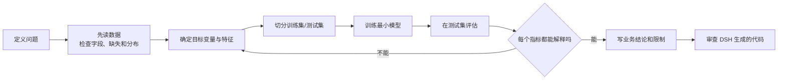

# Week 7：第一个预测模型

> **本章导读**
> 时长：3 节课，每节 45 分钟
> 数据：`data/07-modeling/GermanCredit.csv`、`data/07-modeling/BostonHousing.csv`、`data/07-modeling/Churn_Modelling.csv`
> 你将学到：从分类和回归两个方向建立第一个可解释的模型；本周重点不是调参，而是理解目标变量、切分训练测试集和评估指标
> 本周产出：`projects/<姓名>/week7_models.py`、`projects/<姓名>/week7_interpretation.md`

本周三节课的安排：

1. 第 1 节课：信贷风险分类，学习 `train_test_split`、逻辑回归和分类指标；
2. 第 2 节课：波士顿房价回归，学习线性回归、MAE、RMSE、R² 和均值基线；
3. 第 3 节课：银行客户流失分类，学习分类报告、类别不平衡、特征选择和业务解释。

本周围绕同一个建模流程，任何一节课都必须按顺序走：



**使用 DSH 的课堂规则：先让 DSH 给出计划和命令；命令看不懂就不执行；一次只做一小步；每运行一步都必须核对输出。** DSH 生成建模代码后，必须要求它逐行解释每个指标。解释不出来，代码就不算完成。

## 1. 第 1 节课：信贷风险分类（45 分钟）

这一节的目标是：用一份 1000 条记录的信贷数据，建立第一个分类模型，并且能解释准确率、精确率、召回率和混淆矩阵。

数据：`data/07-modeling/GermanCredit.csv`，共 1000 行、21 列，目标变量是 `credit_risk`；主要字段包括 `duration`、`amount`、`age`、`credit_history`、`savings`、`housing`。

### 1.1 先定义问题

先把业务问题写清楚：

```text
利用贷款申请时的资料，预测这笔贷款是否属于高风险/违约类别。
```

这里的“预测”不是算命。模型只能根据已有字段给出一个类别判断，不能证明“这个人的道德”或“这家银行一定会亏钱”。**模型不等于事实，模型等于一个有误差的统计判断。**

### 1.2 用 DSH 的第一步：只读数据，不要建模

在 DSH 里输入：

```text
请读取 data/07-modeling/GermanCredit.csv，先不要建模。
输出：
1. shape、dtypes、缺失数；
2. credit_risk 的 value_counts；
3. duration、amount、age、credit_history、savings、housing 的样例。
```

先让 DSH 给计划，确认它只读不写。对应代码：

```python
import pandas as pd

df = pd.read_csv('data/07-modeling/GermanCredit.csv')
print(df.shape)
print(df['credit_risk'].value_counts())
print(df.isna().sum().sum())
```

预期输出：

```text
(1000, 21)
credit_risk
1    700
0    300
Name: count, dtype: int64
0
```

这里必须先确认两件事：样本量是 1000，缺失值是 0；`credit_risk` 的类别比例大约为 7:3。**先搞清楚目标变量长什么样，再动手建模。**

`credit_risk=1` 在本演示中作为需要重点识别的风险类。如果学生下载到的版本含义不同，先看数据说明或问老师，不要假设。

### 1.3 为什么要切分训练集和测试集

训练集用来拟合模型，测试集用来模拟“没见过的新数据”。如果先让模型看过全部数据再测试，分数会虚高，这叫数据泄漏。

这一节课先记住三句话：

1. **先切分，再编码和缩放。**
2. **测试集只能用于最终评估，不能用于训练。**
3. **所有随机步骤都要设 `random_state`，否则结果不可复现。**

分类任务里建议加 `stratify=y`，让训练集和测试集都保持 7:3 的目标比例。

### 1.4 第一版最小分类模型

```python
import pandas as pd
from sklearn.model_selection import train_test_split
from sklearn.linear_model import LogisticRegression
from sklearn.preprocessing import StandardScaler
from sklearn.pipeline import make_pipeline
from sklearn.metrics import accuracy_score, precision_score, recall_score, confusion_matrix

df = pd.read_csv('data/07-modeling/GermanCredit.csv')

features = ['duration', 'amount', 'age', 'credit_history', 'savings', 'housing']
X = df[features]
y = df['credit_risk']

X_train, X_test, y_train, y_test = train_test_split(
    X, y, test_size=0.2, random_state=42, stratify=y
)

# 先拆分，再对类别字段做 one-hot 编码，并用训练集的列对齐测试集。
X_train = pd.get_dummies(X_train, drop_first=True)
X_test = pd.get_dummies(X_test, drop_first=True)
X_test = X_test.reindex(columns=X_train.columns, fill_value=0)

# StandardScaler 放在 Pipeline 里，只会用训练集的均值/标准差。
model = make_pipeline(
    StandardScaler(),
    LogisticRegression(random_state=42, max_iter=1000)
)
model.fit(X_train, y_train)
pred = model.predict(X_test)

print('准确率:', round(accuracy_score(y_test, pred), 4))
print('精确率:', round(precision_score(y_test, pred, pos_label=1, zero_division=0), 4))
print('召回率:', round(recall_score(y_test, pred, pos_label=1, zero_division=0), 4))
print(confusion_matrix(y_test, pred))
```

预期输出：

```text
准确率: 0.73
精确率: 0.756
召回率: 0.9071
[[ 19  41]
 [ 13 127]]
```

### 1.5 把每个指标讲清楚

混淆矩阵的默认含义是：行是真实类别，列是模型预测的类别。

| 指标 | 含义 | 本例 |
|---|---|---|
| 准确率 | 全部 200 条测试记录中，猜对的比例 | 0.73 |
| 精确率 | 模型标记为“风险 1”的记录中，确实有风险的比例 | 127 / (41 + 127) = 0.756 |
| 召回率 | 真实有风险的记录中，模型找回来的比例 | 127 / (13 + 127) = 0.9071 |

还有一个必须先比较的基准：**永远预测多数类**。这里多数类是 `1`，永远猜 `1` 的准确率是 0.7。模型 0.73 只比这个基准好一点，所以不能只看准确率就说“模型很厉害”。

业务上要问的问题是：

- 把好客户误判成坏客户，代价是什么？
- 把坏客户漏过去，代价是什么？
- 精确率和召回率哪个更重要，取决于银行怎么使用这个结果。

### 1.6 让 DSH 解释并审查

自己动手后，用这个提示词让 DSH 审查：

```text
请审查我的信贷风险分类模型：
1. 是否先切分，再编码和缩放；
2. 是否所有随机步骤都设置 random_state；
3. 是否在训练完成前碰过测试集；
4. 能否逐行解释准确率、精确率、召回率和混淆矩阵；
5. 不要调参，只指出问题和修改建议。
```

**DSH 生成的建模代码必须能解释每个指标。** 如果它只说“模型准确率 0.73”，却不解释 0.73 怎么算、0.73 对业务意味着什么，这个答案不合格。

### 1.7 第 1 节课验收

- [ ] 能说出 `credit_risk` 是目标变量，样本量是 1000
- [ ] DSH 先给计划，命令逐条审查后再执行
- [ ] 先读数据，确认缺失值为 0、目标比例为 700:300
- [ ] 训练集 800 条、测试集 200 条，`random_state=42`，使用 `stratify=y`
- [ ] 能运行逻辑回归，并输出准确率、精确率、召回率和混淆矩阵
- [ ] 能解释混淆矩阵四个格子的含义
- [ ] 能说清模型 0.73 的准确率只比“永远猜多数类”的 0.7 略好
- [ ] 能写出一句“模型能支持什么、不能支持什么”

## 2. 第 2 节课：波士顿房价回归（45 分钟）

这一节把预测目标从“是或不是”换成“值是多少”，学习回归模型和三个关键指标：MAE、RMSE、R²。

数据：`data/07-modeling/BostonHousing.csv`，共 506 行、14 列，目标变量是 `medv`（房价中位数）；主要字段包括 `crim`、`rm`、`lstat`、`ptratio`、`nox`、`age`。

### 2.1 先定义问题

```text
利用社区特征，预测房屋价格中位数 medv。
```

这是历史教学数据，不是今天的实时房价，也不代表每个小区都适用。**模型输出是估计值，不是成交价。**

### 2.2 DSH 第一步：只读数据

在 DSH 里输入：

```text
请读取 data/07-modeling/BostonHousing.csv，先不要建模。
输出 shape、缺失数，以及 crim、rm、lstat、ptratio、nox、age、medv 的描述统计。
```

对应代码：

```python
import pandas as pd

df = pd.read_csv('data/07-modeling/BostonHousing.csv')
print(df.shape)
print(df.isna().sum().sum())
print(df[['crim', 'rm', 'lstat', 'ptratio', 'nox', 'age', 'medv']].describe())
```

预期开头：

```text
(506, 14)
0
```

缺失为 0，样本量为 506。建模前先看一眼每个字段的范围，尤其是 `medv` 的均值和标准差。

### 2.3 第一版最小回归模型

```python
import numpy as np
import pandas as pd
from sklearn.model_selection import train_test_split
from sklearn.linear_model import LinearRegression
from sklearn.metrics import mean_absolute_error, mean_squared_error, r2_score

df = pd.read_csv('data/07-modeling/BostonHousing.csv')

features = ['crim', 'rm', 'lstat', 'ptratio', 'nox', 'age']
X = df[features]
y = df['medv']

X_train, X_test, y_train, y_test = train_test_split(
    X, y, test_size=0.2, random_state=42
)

model = LinearRegression()
model.fit(X_train, y_train)

train_pred = model.predict(X_train)
test_pred = model.predict(X_test)
baseline = [y_test.mean()] * len(y_test)

print('train R2:', round(r2_score(y_train, train_pred), 4))
print('test R2:', round(r2_score(y_test, test_pred), 4))
print('test MAE:', round(mean_absolute_error(y_test, test_pred), 4))
print('test RMSE:', round(np.sqrt(mean_squared_error(y_test, test_pred)), 4))
print('baseline MAE:', round(mean_absolute_error(y_test, baseline), 4))
print('baseline RMSE:', round(np.sqrt(mean_squared_error(y_test, baseline)), 4))
print('测试集 medv 均值:', round(y_test.mean(), 4))
```

预期输出：

```text
train R2: 0.6961
test R2: 0.6226
test MAE: 3.3659
test RMSE: 5.2607
baseline MAE: 5.9349
baseline RMSE: 8.5635
测试集 medv 均值: 21.4882
```

### 2.4 把每个指标讲清楚

| 指标 | 含义 | 本例 |
|---|---|---|
| MAE | 平均绝对误差，每个预测平均差多少 | 约 3.37，单位是千美元 |
| RMSE | 大误差会被放大，因为先平方再开方 | 约 5.26，比 MAE 大 |
| R² | 相对“永远猜均值”的改进程度 | 测试集约 0.62 |
| 均值基线 | 永远用测试集平均值当预测 | MAE 约 5.93，RMSE 约 8.56 |

比较结论：

- 模型 MAE 3.37 比基线 MAE 5.93 好，说明这些特征确实带来一些预测能力。
- RMSE 大于 MAE，说明存在一些误差较大的样本。
- R² 约 0.62，说明 62% 的房价波动被这 6 个特征解释，仍有约 38% 没有被解释。
- 报告时不能只说 R²，业务上还要知道平均差多少美元。

**报告模型时，必须同时报告误差指标、R² 和一个简单基准。** 只说“R² 0.62”不够。

### 2.5 DSH 审查提示词

```text
请审查我的波士顿房价回归模型：
1. 是否先拆分，再训练；
2. 是否报告 MAE、RMSE、R2 和均值基线；
3. 是否说明每个指标的单位；
4. 是否把模型预测说成真实成交价；
5. 不要调参，只指出问题和修改建议。
```

### 2.6 第 2 节课验收

- [ ] 能说出 `medv` 是目标变量，样本量为 506
- [ ] DSH 先读数据并确认缺失为 0
- [ ] 训练集 404 条、测试集 102 条，`random_state=42`
- [ ] 能运行线性回归，输出 MAE、RMSE、R²
- [ ] 能和“永远猜测试集均值”的基线比较
- [ ] 能解释 MAE 和 RMSE 的单位及差异
- [ ] 能写出一句“模型预测不等于真实成交价”

## 3. 第 3 节课：银行客户流失分类（45 分钟）

这一节把分类问题放到更大的样本和更严重的类别不平衡里，学习分类报告、特征选择、简单标准化，以及从业务代价解释模型。

数据：`data/07-modeling/Churn_Modelling.csv`，共 10000 行、14 列，目标变量是 `Exited`；主要字段包括 `CreditScore`、`Geography`、`Gender`、`Age`、`Tenure`、`Balance`、`NumOfProducts`、`IsActiveMember`、`EstimatedSalary`。

### 3.1 先定义问题

```text
用银行客户资料，预测客户是否会流失（Exited = 1）。
```

这个问题的关键不是“谁留在银行”，而是“谁可能离开”。类别不平衡会让准确率看起来很高，但真正想找的流失客户可能大量漏掉。

### 3.2 DSH 第一步：先看类别比例

在 DSH 里输入：

```text
请读取 data/07-modeling/Churn_Modelling.csv，先不要建模。
输出 shape、缺失数、Exited 的 value_counts(normalize=True)，
以及 Geography、Gender 的取值分布。
```

对应代码：

```python
import pandas as pd

df = pd.read_csv('data/07-modeling/Churn_Modelling.csv')
print(df.shape)
print(df.isna().sum().sum())
print(df['Exited'].value_counts(normalize=True).round(4))
```

预期输出：

```text
(10000, 14)
0
Exited
0    0.7963
1    0.2037
Name: proportion, dtype: float64
```

这说明 79.63% 的客户没流失，20.37% 的客户流失。**“永远猜 0”的准确率就是 0.7963。** 模型准确率必须和这个基准比较，否则没有意义。

### 3.3 特征选择与简单标准化

先删掉 `RowNumber`、`CustomerId`、`Surname`：行号是数据序号，客户 ID 是标识，姓名与流失预测无关，还可能让模型记住某个客户。

特征选择原则：优先选在业务发生前就能拿到的资料。这里选择 `CreditScore`、`Geography`、`Gender`、`Age`、`Tenure`、`Balance`、`NumOfProducts`、`IsActiveMember`、`EstimatedSalary`。

由于这些数值字段的量纲差别很大，逻辑回归使用 `StandardScaler` 做简单标准化。**标准化必须放在 Pipeline 里，或先拆分再用训练集 fit，不能先对整个数据集缩放再拆分。**

### 3.4 分类报告与混淆矩阵

```python
import pandas as pd
from sklearn.model_selection import train_test_split
from sklearn.linear_model import LogisticRegression
from sklearn.preprocessing import StandardScaler
from sklearn.pipeline import make_pipeline
from sklearn.metrics import classification_report, confusion_matrix

df = pd.read_csv('data/07-modeling/Churn_Modelling.csv')
df = df.drop(columns=['RowNumber', 'CustomerId', 'Surname'])

features = [
    'CreditScore', 'Geography', 'Gender', 'Age', 'Tenure',
    'Balance', 'NumOfProducts', 'IsActiveMember', 'EstimatedSalary'
]
X = df[features]
y = df['Exited']

X_train, X_test, y_train, y_test = train_test_split(
    X, y, test_size=0.2, random_state=42, stratify=y
)

X_train = pd.get_dummies(X_train, drop_first=True)
X_test = pd.get_dummies(X_test, drop_first=True)
X_test = X_test.reindex(columns=X_train.columns, fill_value=0)

model = make_pipeline(
    StandardScaler(),
    LogisticRegression(random_state=42, max_iter=1000)
)
model.fit(X_train, y_train)
pred = model.predict(X_test)

print(classification_report(y_test, pred, zero_division=0))
print(confusion_matrix(y_test, pred))
```

预期输出：

```text
              precision    recall  f1-score   support

           0       0.82      0.97      0.89      1593
           1       0.60      0.19      0.29       407

    accuracy                           0.81      2000
   macro avg       0.71      0.58      0.59      2000
weighted avg       0.78      0.81      0.77      2000

[[1541   52]
 [ 330   77]]
```

### 3.5 从业务角度解释

- 准确率 0.81，只比“永远猜 0”的 0.7963 高一点。
- 流失客户召回率只有 0.19：测试集中 407 个真实流失客户，只找到 77 个。如果直接拿这个模型做挽留，会漏掉绝大多数可能流失的客户。
- 流失客户精确率是 0.60：被标记为流失的客户里，约 60% 真的流失，其余 40% 是被误伤。
- 如果“漏掉一个流失客户”的损失更大，业务上应该优先提高召回率；如果“打扰一个不会流失的客户”的代价更大，应该优先提高精确率。

**模型不等于事实。** 这个模型只说明这些字段与流失之间存在统计关系，不能证明“工资高所以流失”或“某国客户一定流失”。数据里没有客服记录、活动记录、渠道和满意度，模型不能解释完整原因。

### 3.6 DSH 审查提示词

```text
请审查我的银行客户流失模型：
1. 是否删除 RowNumber、CustomerId、Surname；
2. 是否先拆分，再把标准化放进 Pipeline；
3. 是否输出 classification_report 和混淆矩阵；
4. 是否和“永远猜多数类”的准确率 0.7963 比较；
5. 能否解释类别不平衡下为什么不能只看准确率；
6. 不要调参，只给出业务解释和风险。
```

### 3.7 第 3 节课验收

- [ ] 能说出 `Exited` 是目标变量，样本量为 10000
- [ ] 能说出类别比例：79.63% 未流失、20.37% 流失
- [ ] 删除了 `RowNumber`、`CustomerId`、`Surname`
- [ ] 训练集 8000 条、测试集 2000 条，`random_state=42`，使用 `stratify=y`
- [ ] 能运行逻辑回归，输出分类报告和混淆矩阵
- [ ] 能解释类别不平衡和“永远猜多数类”的基线
- [ ] 能根据业务代价说明精确率和召回率如何取舍
- [ ] 能写出模型不能回答的业务问题

## 4. 本周验证清单

- [ ] 三个数据路径都使用 `data/07-modeling/...`
- [ ] 每个模型的随机步骤都设置 `random_state`
- [ ] 先切分训练集/测试集，再编码或缩放
- [ ] 测试集只用于最终评估，不用于训练
- [ ] 分类模型能解释准确率、精确率、召回率和混淆矩阵
- [ ] 回归模型能解释 MAE、RMSE、R² 和均值基线
- [ ] 客户流失模型能和“永远猜多数类”基线比较
- [ ] 每个指标都能说明单位、计算口径和业务含义
- [ ] DSH 生成的建模代码能逐行解释每个指标
- [ ] 结论区分“统计结果”和“业务事实”

## 5. 常见错误与坑

| 现象 | 原因 | 处理 |
|---|---|---|
| 全数据标准化或编码后再切分 | 测试集信息进入训练过程 | 先拆分；或把编码/缩放放进 Pipeline |
| 用测试集反复试模型 | 测试集被“训练”了 | 最终指标只做一次，诊断用训练集或重新划分 |
| 不设 `random_state` | 每次切分结果不同 | 所有随机步骤都设固定种子 |
| 只看准确率 | 类别不平衡时准确率会虚高 | 同时看精确率、召回率、混淆矩阵 |
| 把 R² 当成“准确率” | 混淆回归和分类指标 | R² 是解释力，MAE/RMSE 才是误差 |
| 只报 R²，不报误差 | 业务不知道实际偏差多少 | 加 MAE、RMSE、单位和基线 |
| 把 MAE 当成每一套房都差这么多 | MAE 是平均误差 | 结合 RMSE 和测试集分布看 |
| 把模型预测说成事实 | 统计模型有误差和假设 | 写成“估计值/判断”，写清限制 |
| 把 `RowNumber`、`CustomerId` 当特征 | 标识列会记住个案 | 删除或先说明为何不使用 |
| 认为高分数等于可上线 | 没考虑业务代价和分布变化 | 测试集模拟，不代表真实未来 |
| DSH 说“完成”就相信 | 没有验证代码和输出 | 要求逐行解释，并亲自核对运行结果 |

## 6. 作业

1. 把三个模型整理成 `projects/<姓名>/week7_models.py`。要求：路径全部写 `data/07-modeling/...`；每个模型都固定 `random_state`；先拆分，再编码/标准化。
2. 写 `projects/<姓名>/week7_interpretation.md`，用中文解释每个模型的目标变量、训练/测试样本量、所有评估指标和所用基线。
3. 写 300 字以内：信贷风险模型和银行流失模型分别“能支持什么决策、不能支持什么决策”，至少各写一个业务代价和一个数据限制。
4. 让 DSH 审查 `week7_models.py`，审查重点是：是否有数据泄漏、是否解释了每个指标、是否把预测说成事实。保留 DSH 修改记录。

## 评分要点

| 项目 | 要求 |
|---|---|
| 数据理解 | 能指出三个数据集的目标变量、特征和样本量 |
| 数据拆分 | 先切分、固定随机种子、分类任务保持类别比例 |
| 分类评估 | 能解释准确率、精确率、召回率、混淆矩阵和多数类基线 |
| 回归评估 | 能解释 MAE、RMSE、R²，并与均值基线比较 |
| 不平衡处理 | 客户流失案例能指出准确率虚高和业务代价 |
| 防泄漏 | 编码、标准化都在拆分后完成，或放入 Pipeline |
| 可解释性 | DSH 生成的建模代码能解释每个指标 |
| 表达 | 结论区分“统计结果”与“业务建议”，写明模型限制 |
