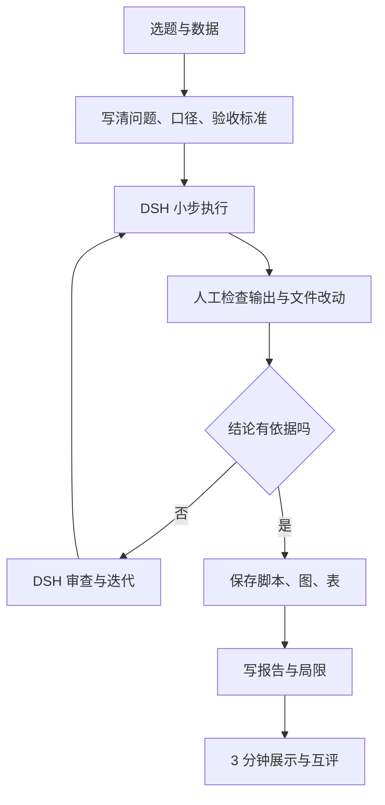

# Week 8 结课项目与展示

> **本章导读**
> 时长：3 节课，每节 45 分钟
> 数据：从前 7 周 `data/` 中选主数据集，可沿用 `data/08-final/README.md` 里的项目提示
> 参考脚本：`scripts/08-final-project/01-project-skeleton.py`，与正文代码块一一对应。
> 交付：`projects/<姓名>/` 下可复现的脚本、输出、迭代记录、报告，加 3 分钟口头展示
> 你将学到：把兴趣收敛成可回答的问题，用 DSH 做执行、审查和反方意见，独立走完“问题 → 数据 → 方法 → 结果 → 验证 → 局限”

结课项目由你做，不由 DSH 替你做。DSH 负责读文件、跑代码、检查代码、提出反方意见；你负责定义问题、确认口径、检查命令、验证结果、解释结论。

本项目的安全底线：

1. **只在课程仓库工作区操作。** DSH 工作区必须指向本仓库根目录。
2. **`data/` 只读。** 不删除、不覆盖、不重写原始数据，任何对 `data/` 的写操作都拒绝。
3. **所有输出写入 `projects/<姓名>/`。** 脚本、图、表、报告、迭代记录都在这里。
4. **先理解计划，再检查命令，再小步执行，最后验证结果。** 看不懂就停下来让 DSH 解释，仍不懂就找老师。

最终报告必须写清这 6 项，缺一不可：

1. 问题：一句话说清要回答什么。
2. 数据来源：文件路径、字段口径、来源说明。
3. 样本量：清洗前后各多少行，分组后每组多少条。
4. 方法：用了什么统计、可视化或模型，关键参数是什么。
5. 图表或模型结果：1 张核心图或 1 张核心表，或模型指标与基线。
6. 结论与不确定项：我验证了什么，还有哪些不能下结论。

项目流程：



## 1. 第 1 节课 选题与验收标准（45 分钟）

时间分配：8 分钟演示，30 分钟练习，7 分钟复盘。第一节课不写正式分析代码，只做三件事：选题、数据加载、写清验收标准。

### 1.1 可选数据与默认方向

默认从前 7 周 `data/` 里选主数据集；`data/08-final/README.md` 给了推荐选题，可以参考，但不能代替你自己的问题定义。

| 周 | 数据路径 | 可回答的问题方向 |
|---|---|---|
| 01 | `data/01-agent/nyc_airbnb.csv` | 房型、行政区、评论数、可订天数与价格的关系 |
| 02 | `data/02-python/supermarket_sales.csv` | 分店、产品线、日期、支付方式对销售额或毛利的影响 |
| 03 | `data/03-pandas/olist_orders_45d.csv` | 订单状态、商品类别、价格、运费与配送时长的关系 |
| 04 | `data/04-cleaning/telco_customer_churn.csv` | 合同、套餐、缴费方式与流失的关系 |
| 05 | `data/05-eda-viz/diamonds.csv` | 克拉、切工、颜色、净度与价格的关系 |
| 06 | `data/06-merge/norway_new_car_sales_by_make.csv` 与 `..._by_model.csv` | 合并后看品牌与车型销量结构、电动化趋势 |
| 07 | `data/07-modeling/GermanCredit.csv`、`BostonHousing.csv`、`Churn_Modelling.csv` | 违约、房价、流失的影响因素或预测 |

`data/legacy/` 只能作为补充数据，不能当主数据集；使用前写清来源和口径。

### 1.2 把兴趣写成可回答的问题

先回答三句话：

```text
1. 我对什么现象感兴趣？
2. 这份数据里有哪一列能代表这个现象？
3. 我能用哪个计算，得到一个可比较、可验证的答案？
```

判断题目能不能做，用这 5 条：

1. 问题里的概念都能对应到具体字段；
2. 指标能写出计算公式，例如平均值、中位数、比例、相关系数、AUC；
3. 数据范围足够回答这个问题，不是只有一组里几条数据；
4. 输出可以验证：能画图、能跑表、能指出样本量和计算依据；
5. 结论有边界：能说明什么情况下成立、什么情况下不成立。

不推荐的题目：

- “分析纽约 Airbnb 市场”
- “预测所有银行客户是否流失”
- “研究汽车行业趋势”
- “分析钻石价格”

推荐改成的小题目：

- “在 `data/01-agent/nyc_airbnb.csv` 中，不同房型的平均价格差多少，样本量是否支持结论？”
- “在 `data/04-cleaning/telco_customer_churn.csv` 中，合同类型不同的客户流失比例是否明显不同？”
- “在 `data/06-merge/` 两张表中，挪威纯电动车销量占比发生了什么变化？”
- “在 `data/07-modeling/GermanCredit.csv` 中，哪些字段对违约预测最重要，加入后比只猜多数类好多少？”

### 1.3 数据加载与只读检查

先把选题写进 `projects/<姓名>/project_proposal.md`，固定结构：

```text
项目题目：
主数据路径：
问题（一句话）：
指标/口径：
所需字段：
预期输出（图和表）：
局限/不确定：
```

然后让 DSH 只做只读检查，不创建、不修改项目代码：

```text
请先不要创建或修改任何文件。
请读取 data/05-eda-viz/diamonds.csv，只输出：
1. shape、字段名、dtypes、缺失值；
2. 每个数值字段的 min、max、中位数；
3. 哪些字段能回答“克拉对价格的影响有多大”；
4. 哪些字段存在明显异常或缺失。
不要修改 data/ 和 projects/ 下的任何文件。
```

允许任何命令前，必须检查三点：命令是否会写文件、是否会删除文件、路径是否在课程仓库内。`data/` 只读是硬规定，第一节课就要验证 DSH 没有修改原数据。

### 1.4 写清验收标准

验收标准不是“做完就行”，要能回答“怎么算做对”。每条标准至少包含：用什么字段、怎么计算、样本量多少、输出写到哪、什么算通过。示例：

```text
通过标准：
- 字段：carat、cut、price；
- 指标：按 cut 分组求 price 的 count、mean、median；
- 输出：projects/<姓名>/output/price_by_cut.csv；
- 通过：每组样本量 > 50，且组间均值差异能在图上读出。
```

### 1.5 DSH vibe loop

第 1 节的 vibe loop 只做“选题 + 数据加载”，不进入正式分析：

```text
定义问题 → 要求最小版本 → 运行 → 反馈 → 追问 → 验证

1. 定义问题：只想知道“不同房型平均价格差多少”，不做全量分析。
2. 要求最小版本：让 DSH 只读文件，输出 shape、字段、dtypes、缺失，不建脚本。
3. 运行：DSH 给出真实输出。
4. 反馈：把与预期不符的字段或数值告诉 DSH。
5. 追问：让 DSH 解释每个字段口径。
6. 验证：确认 data/ 未变，选题能落到具体字段。
```

### 1.6 第 1 节课验收

- [ ] 已从 Week 1-7 数据中选定一个主数据集，路径写进 `project_proposal.md`
- [ ] 题目能改写为“哪一列、用什么计算、回答什么问题”
- [ ] 指标写清了计算公式或判断标准
- [ ] 已写出至少 1 条“当前数据不能直接回答”的局限
- [ ] DSH 完成一次只读检查，并确认没有修改 `data/`
- [ ] 没有创建正式分析脚本，没有让 DSH 一次性完成整个项目

## 2. 第 2 节课 中期审查与迭代（45 分钟）

时间分配：8 分钟演示，30 分钟练习，7 分钟复盘。这节课把项目变成“可运行、可验证、可迭代”的脚本，重点是 DSH 审查、反方意见和迭代记录。

### 2.1 先搭一个可运行骨架

先创建 `projects/<姓名>/project.py`，让它能从仓库根目录跑通，再做增量修改。下面是可运行框架示例，不是完整项目；你只需要替换 `analysis()` 里的逻辑：

```python
from pathlib import Path

import pandas as pd

PROJECT_DIR = Path(__file__).resolve().parent
OUTPUT_DIR = PROJECT_DIR / "output"
# 仓库根目录是 PROJECT_DIR 向上两级：projects/<姓名>/ -> projects/ -> 仓库根目录
DATA_PATH = PROJECT_DIR.parents[1] / "data" / "05-eda-viz" / "diamonds.csv"


def load_data(path):
    """只读原始数据，不做任何修改。"""
    return pd.read_csv(path)


def inspect_data(df):
    print("shape:", df.shape)
    print("columns:", list(df.columns))
    print("dtypes:")
    print(df.dtypes)
    print("missing:")
    print(df.isna().sum())


def analysis(df):
    # TODO: 替换成你自己的分析。这里只演示一个最小可验证结果。
    if "cut" in df.columns and "price" in df.columns:
        return df.groupby("cut")["price"].agg(["count", "mean", "median"])
    return df.describe()


def save_outputs(result):
    OUTPUT_DIR.mkdir(parents=True, exist_ok=True)
    result.to_csv(OUTPUT_DIR / "summary.csv")
    print("saved:", OUTPUT_DIR / "summary.csv")


def main():
    df = load_data(DATA_PATH)
    inspect_data(df)
    result = analysis(df)
    print(result)
    save_outputs(result)


if __name__ == "__main__":
    main()
```

脚本：[01-project-skeleton.py](https://github.com/zhouxzh/python-data-analysis/blob/main/scripts/08-final-project/01-project-skeleton.py) ｜ 数据示例：[diamonds.csv](https://github.com/zhouxzh/python-data-analysis/blob/main/data/05-eda-viz/diamonds.csv)

运行方式：

```bash
python projects/<姓名>/project.py
```

规则：`data/` 只读，脚本只往 `OUTPUT_DIR` 写；不要在脚本里写 `rm`、`del`、`shutil.rmtree` 或覆盖 `data/` 的操作。

### 2.2 小步执行，不要一次做完

不要发“帮我完成整个项目”。每一步限定范围、限定输出位置、限定验收方式。可拆成：

```text
1. 读取数据，输出 shape、dtypes、缺失值；
2. 按已定口径清洗，输出清洗前后样本量；
3. 生成核心表和核心图；
4. 计算指标，输出可验证的数值；
5. 建模类题目才加：训练/测试切分、基线对比。
```

每一步的 DSH 提示词都要包含四部分：

```text
请只完成第 1 步：
1. 读取 data/01-agent/nyc_airbnb.csv；
2. 输出 shape、dtypes、缺失值，并解释每列含义；
3. 把脚本保存到 projects/<姓名>/scripts/01_load.py；
4. 不要修改 data/，不要删除文件，不要安装新依赖。
```

执行前检查命令，执行后检查输出和文件改动。DSH 说“完成了”不算完成，必须看到真实输出。

### 2.3 DSH 审查与反方意见

每完成一步，让 DSH 以反方立场审查你的脚本和结果：

```text
请以反方立场审查 projects/<姓名>/scripts/03_eda.py：
1. 结论是否真的来自数据，还是来自假设；
2. 分组和过滤是否改变了样本量；
3. 异常值是否被偷偷删除或忽略；
4. 图是否容易让人误读；
5. 指标是否缺少样本量或单位；
6. 只给问题和修改建议，不要替我做结论。
```

你也要自己做人工审查。每个结论都必须能指出：用的是哪个字段、怎么计算的、样本量多少、有没有经过异常值处理。

### 2.4 记录报错和修改

在 `projects/<姓名>/iterations.md` 里记录每一次真实迭代，不要只写“AI 帮我改好了”。建议格式：

| 时间 | 步骤 | 报错/问题 | DSH 的修改 | 你的验证 |
|---|---|---|---|---|
| 第 2 节 | 03_eda | 图里出现价格 0 | 先输出异常值数量，不自动删除 | 确认 0 值只有 5 条，未删除原数据 |
| 第 2 节 | 05_model | 准确率比“全猜多数类”低 | 改为报告混淆矩阵和基线 | 确认指标口径一致，结论修正 |

至少记录 2 次“发现问题 → 修改 → 验证”。这份记录是学习过程证据，不是可选项。

### 2.5 DSH vibe loop

第 2 节的 vibe loop 围绕“审查 → 反方意见 → 迭代”：

```text
定义问题 → 要求最小版本 → 运行 → 反馈 → 追问 → 验证

1. 定义问题：这一步要验证哪个指标，验收标准是什么。
2. 要求最小版本：只改一个函数或一张图，不扩范围。
3. 运行：看真实输出，不看“成功”两个字。
4. 反馈：把报错或可疑结果原样告诉 DSH。
5. 追问：让 DSH 做反方审查，逐条给修改建议。
6. 验证：核对样本量、路径、data/ 是否未变，写进 iterations.md。
```

### 2.6 第 2 节课验收

- [ ] `projects/<姓名>/project.py` 或 `scripts/` 下脚本能在仓库根目录运行
- [ ] 每一步都有真实输出，不是只有“成功”两个字
- [ ] `iterations.md` 记录了至少 2 次问题、修改和验证
- [ ] 每次执行命令前都说明“这条命令在做什么”
- [ ] 已确认原始 `data/` 文件未被修改
- [ ] 所有图和表输出到 `projects/<姓名>/output/`
- [ ] 至少完成 1 次反方审查，并把修改理由写入迭代记录

## 3. 第 3 节课 最终展示与复盘（45 分钟）

时间分配：8 分钟演示，30 分钟展示与互评，7 分钟复盘。这节课不再写新分析，只做三件事：3 分钟展示、互评质疑、写复盘。

### 3.1 3 分钟展示结构

不要念代码、不要贴提示词、不要读报告全文。按下面结构讲：

| 时间 | 内容 | 必须说清楚 |
|---|---|---|
| 30 秒 | 问题与数据 | 数据路径、一句话问题、为什么值得做 |
| 30 秒 | 口径与方法 | 用什么字段、什么指标、清洗了什么 |
| 60 秒 | 核心发现 | 1 张图或 1 张表，讲坐标、样本量和结论 |
| 30 秒 | 验证 | 我验证了什么，结论依据在哪 |
| 30 秒 | 局限与下一步 | 哪些不能下结论，重做会改什么 |

示例：

```text
我选了 data/05-eda-viz/diamonds.csv，问题是克拉对价格的影响有多大。
我用 carat 和 price 做散点图，并计算相关系数，样本量以实际读入为准。
结果显示……；我不能证明因果关系，因为数据里没有切割成本和市场因素。
```

### 3.2 解释图表和指标

每张图都要能回答四个问题：

1. x 轴是什么，单位是什么；
2. y 轴是什么，单位是什么；
3. 样本量是多少；
4. 从图里能得出哪一条有依据的结论。

指标不要只说“准确率 80%”，要说清：

- 这个指标怎么算；
- 是训练集还是测试集；
- 和什么基线比；
- 样本量是否足够；
- 是否区分了“描述”和“预测”。

图表必须来自你自己的 `projects/<姓名>/output/`，课堂上只讨论你真正运行出来的结果。

### 3.3 互评与回答质疑

互评围绕三件事打分：问题是否清楚、结论是否有依据、局限是否诚实。同学和老师可能问：

- 为什么选这个指标？
- 异常值怎么处理的？去掉后结论变了吗？
- 样本量是多少？结论能推广到其他人群吗？
- 这是相关关系还是因果关系？
- 换一个分组或换一个阈值，结论还成立吗？

回答时先说证据，再说局限。可以这样开头：

```text
我验证过的是：在当前数据、当前口径下，结果是……。
我还不能确定的是：……。
```

### 3.4 写复盘

下课前把复盘写进 `projects/<姓名>/reflection.md`，至少写：

```text
我验证了什么：
1. 数据和指标口径；
2. 核心结果及计算依据；
3. 哪些异常或边界情况处理过。

还有哪些不确定：
1. 数据来源或字段定义的局限；
2. 没有验证的假设；
3. 如果重做，我会改什么。
```

### 3.5 DSH vibe loop

第 3 节的 vibe loop 用于展示前演练和复盘，不生成新分析：

```text
定义问题 → 要求最小版本 → 运行 → 反馈 → 追问 → 验证

1. 定义问题：3 分钟讲清一个结论，而不是讲完整项目。
2. 要求最小版本：只放 1 张核心图或 1 张核心表。
3. 运行：照着展示结构完整讲一遍。
4. 反馈：把同学质疑或自己卡壳的地方记下来。
5. 追问：让 DSH 只解释口径和局限，不替你下结论。
6. 验证：把“我验证了什么、还有哪些不确定”写进 reflection.md。
```

### 3.6 第 3 节课验收

- [ ] 完成 3 分钟口头展示，没有念代码
- [ ] 展示中包含 1 张核心图或 1 张核心表
- [ ] 能说明 x 轴、y 轴、指标计算方式和样本量
- [ ] 至少回答 2 个质疑，并说明证据来源
- [ ] `reflection.md` 写清了“我验证了什么、还有哪些不确定”
- [ ] 展示中所有结论都能对应到 `projects/` 中的脚本或输出

## 4. 本周验证清单

- [ ] 项目从 Week 1-7 数据中选题，主数据路径写清
- [ ] 最终报告写清问题、数据来源、样本量、方法、图表或模型结果、结论与不确定项
- [ ] 脚本保存在 `projects/<姓名>/` 下，可从仓库根目录复现运行
- [ ] 图和表保存在 `projects/<姓名>/output/`
- [ ] `iterations.md` 记录了报错、修改和验证
- [ ] 已确认原始 `data/` 未被删除或修改
- [ ] 每次 DSH 执行命令前都先检查命令、路径和影响范围
- [ ] 报告区分“已验证事实 / 待验证推断 / 局限”
- [ ] 完成 3 分钟展示，并回答至少 2 个质疑
- [ ] `reflection.md` 写清“我验证了什么、还有哪些不确定”

## 5. 常见错误与坑

| 现象 | 原因 | 处理 |
|---|---|---|
| 题目太大 | 想“全面分析”，没落到字段和指标 | 收敛到 1 个可验证问题，写清计算口径 |
| 数据路径写错 | 使用旧路径或猜文件名 | 以本文档和各周 `README.md` 为准 |
| 让 DSH 一次做完 | 提示词没拆步骤 | 每次只做一步，要求输出真实结果 |
| 结论没有依据 | 只看“AI 说” | 每个结论指出字段、计算、样本量 |
| 不记录报错 | 觉得失败不值得写 | 报错、修改、验证都写进 `iterations.md` |
| 原始数据被覆盖 | 同意了对 `data/` 的写操作 | `data/` 只读，任何删除、覆盖都先停下 |
| 输出写到项目外 | 没限定保存路径 | 所有文件写入 `projects/<姓名>/` |
| 图表没有坐标和样本量 | 只贴图不解释 | 展示前写出 x、y、单位、样本量 |
| 建模只看准确率 | 没和基线、类别分布比较 | 同时报告混淆矩阵、基线和不平衡问题 |
| 展示念代码 | 没按问题组织内容 | 用“问题 → 口径 → 发现 → 验证 → 局限” |
| 回避局限 | 怕被扣分 | 明确写“我验证了什么、还有哪些不确定” |

## 6. 作业

提交目录：

```text
projects/<姓名>/
  project_proposal.md
  project.py 或 scripts/
  output/
  iterations.md
  report.md
  reflection.md
```

作业要求：

1. 完成一个可复现的数据分析或建模项目，主数据来自 Week 1-7 的 `data/`。
2. `report.md` 必须写清 6 项：问题、数据来源、样本量、方法、图表或模型结果、结论与不确定项。
3. `iterations.md` 至少记录 2 次“发现问题 → 修改 → 验证”，并保留 DSH 的反方审查建议。
4. 至少 1 张核心图或 1 张核心表，放在 `output/`，展示时能讲清坐标、单位和样本量。
5. 提交前确认：原始 `data/` 未被修改，脚本从仓库根目录可运行，报告里的每个结论都能在代码或输出中找到证据。

## 评分要点

| 项目 | 权重 | 要求 |
|---|---|---|
| 问题与口径 | 20% | 问题清楚，指标可计算，数据路径正确 |
| 数据与安全 | 15% | 只读原数据，输出均在 `projects/`，命令经过检查 |
| 可复现 | 20% | 脚本可运行，有真实输出，迭代记录完整 |
| 分析与验证 | 25% | 有依据、有样本量、区分事实与推断 |
| 结论与局限 | 10% | 写清“我验证了什么、还有哪些不确定” |
| 展示与复盘 | 10% | 3 分钟讲清问题、方法、发现、验证和局限 |
