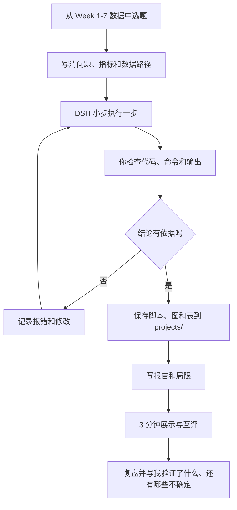

# Week 8：结课项目与展示

> **本章导读**
> 时长：3 节课，每节 45 分钟
> 数据：从第 01-07 周数据中选择一个主数据集，可以合并第 06 周的两张汽车销量表，不新增下载数据
> 交付：`projects/<姓名>/` 下可复现的项目脚本、输出、迭代记录、报告 + 3 分钟口头展示
> 你将学到：把兴趣变成可回答的数据问题，用 DSH 辅助执行和审查，独立完成一次分析或建模，并完成“问题 → 数据 → 方法 → 结果 → 验证 → 局限”的闭环

结课项目由你做，不由 DSH 替你做。DSH 负责读文件、跑代码、检查代码和提出反方意见；你负责定义问题、确认口径、检查命令、验证结果和解释结论。

本项目的安全底线不变：

1. **只在本仓库工作区操作。** DSH 的工作区必须指向本仓库根目录。
2. **不删除、不修改原始数据。** `data/` 目录只读，任何涉及 `data/` 的删除、覆盖、重写都必须拒绝。
3. **所有输出写入 `projects/<姓名>/`。** 脚本、图、表、报告、迭代记录都放在这里。
4. **先理解计划，再检查命令，再小步执行，最后验证结果。** 看不懂的命令先让 DSH 解释，解释后仍看不懂就找老师。

结课项目整体流程：



## 1. 第 1 节课：选题、目标与数据（45 分钟）

第一节课不急着写代码。先用 10 分钟看数据清单，再用 20 分钟把“我感兴趣的事”写成“这份数据能回答的问题”，最后 15 分钟用 DSH 做只读检查并完成选题验收。

### 1.1 可选数据与默认选题方向

默认只能从下面这些 Week 1-7 数据中选择主数据集：

| 周 | 数据路径 | 可回答的问题方向 |
|---|---|---|
| 01 | `data/01-agent/nyc_airbnb.csv` | 房型、行政区、评论数、可订天数与价格的关系 |
| 02 | `data/02-python/supermarket_sales.csv` | 分店、产品线、日期、支付方式对销售额或毛利的影响 |
| 03 | `data/03-pandas/olist_orders_45d.csv` | 订单状态、商品类别、价格、运费与配送时长的关系 |
| 04 | `data/04-cleaning/telco_customer_churn.csv` | 流失客户在套餐、合同、缴费方式、使用行为上的差异 |
| 05 | `data/05-eda-viz/diamonds.csv` | 克拉、切工、颜色、净度与价格的关系，价格异常值 |
| 06 | `data/06-merge/norway_new_car_sales_by_make.csv` | 品牌销量、车型销量、电动化趋势 |
| 06 | `data/06-merge/norway_new_car_sales_by_model.csv` | 与品牌表合并后，分析品牌与车型的销量结构 |
| 07 | `data/07-modeling/GermanCredit.csv` | 信贷违约与年龄、金额、目的、信用历史的关系，建立违约预测 |
| 07 | `data/07-modeling/BostonHousing.csv` | 房价受哪些因素影响，建立一个可解释的回归模型 |
| 07 | `data/07-modeling/Churn_Modelling.csv` | 银行客户流失的影响因素，建立流失预测并评估代价 |

`data/legacy/` 里的旧数据只能作为补充，不能作为默认主数据集；使用前必须说明来源和口径。

### 1.2 把兴趣变成可回答的数据问题

写题目时，先问自己三句话：

```text
1. 我对什么现象感兴趣？
2. 这份数据里有哪一列能代表这个现象？
3. 我能用哪个计算，得到一个可比较、可验证的答案？
```

判断题目能不能做，用这 5 条：

1. 问题中涉及的概念都能对应到具体字段；
2. 指标能写出计算公式，例如平均值、中位数、比例、相关系数、AUC；
3. 数据范围足够回答这个问题，不是只有一个分组里几条数据；
4. 输出可以验证：能画出图、能跑出表、能指出样本量和计算依据；
5. 结论有边界：能说明“什么情况下成立、什么情况下不成立”。

不推荐的大题目：

- “分析纽约 Airbnb 市场”
- “预测所有银行客户是否流失”
- “研究汽车行业趋势”
- “分析钻石价格”

推荐改成的小题目：

- “在 `data/01-agent/nyc_airbnb.csv` 中，不同房型的平均价格差异有多大，样本量是否足够支持结论？”
- “在 `data/04-cleaning/telco_customer_churn.csv` 中，合同类型不同的客户流失比例是否明显不同？”
- “在 `data/06-merge/` 两张表中，2020 年前后挪威纯电动车销量占比发生了什么变化？”
- “在 `data/07-modeling/GermanCredit.csv` 中，哪些字段对违约预测最重要，加入模型后性能比只猜多数类好多少？”

### 1.3 写项目提案并让 DSH 做只读检查

先把选题写进 `projects/<姓名>/project_proposal.md`，固定结构如下：

```text
项目题目：
主数据路径：
问题（一句话）：
指标/口径：
所需字段：
预期输出（图和表）：
局限/不确定：
```

然后让 DSH 只做只读检查，不创建、不修改项目代码：

```text
请先不要创建或修改任何文件。
请读取 data/05-eda-viz/diamonds.csv，只输出：
1. shape、字段名、dtypes、缺失值；
2. 每个数值字段的 min、max、中位数；
3. 哪些字段可以回答“克拉对价格的影响有多大”；
4. 哪些字段存在明显异常或缺失。
不要修改 data/ 和 projects/ 下的任何文件。
```

在允许任何命令前，必须检查三点：命令是否会写文件、是否会删除文件、路径是否在课程仓库内。`data/` 只读是硬规定，第一节课就要验证 DSH 确实没有修改原数据。

### 1.4 第 1 节课验收

- [ ] 已从 Week 1-7 数据中选定一个主数据集，路径写进 `project_proposal.md`
- [ ] 题目可以改写为“哪一列、用什么计算、回答什么问题”
- [ ] 指标写清了计算公式或判断标准
- [ ] 至少写出 1 个“当前数据不能直接回答”的局限
- [ ] DSH 已完成一次只读检查，并确认没有修改 `data/`
- [ ] 没有创建任何正式分析脚本，没有让 DSH 一次性完成整个项目

## 2. 第 2 节课：执行、验证与迭代（45 分钟）

第二节课的目标是完成“可运行、可验证、可迭代”的项目脚本。全部写入 `projects/<姓名>/scripts/`，图写入 `projects/<姓名>/output/`，不要写回 `data/`。

### 2.1 DSH 辅助执行，但每次只做一小步

不要发“帮我完成整个项目”这样的提示词。每一步都限定范围、限定输出位置、限定验收方式。

建议按这个顺序拆：

```text
01_load.py         读取数据，输出 shape、dtypes、缺失值
02_clean.py        按已写好的口径清洗，输出清洗前后样本量
03_eda.py          生成核心表和核心图
04_analysis.py     计算指标，输出可验证的数值
05_model.py        建模类题目才需要，输出基线对比
```

每一步的 DSH 提示词都要包含四部分：

```text
请只完成第 1 步：
1. 读取 data/01-agent/nyc_airbnb.csv；
2. 输出 shape、dtypes、缺失值，并解释每列含义；
3. 把脚本保存到 projects/<姓名>/scripts/01_load.py；
4. 不要修改 data/，不要删除文件，不要安装新依赖。
```

执行前检查命令；执行后检查输出和文件改动。DSH 说“完成了”不算完成，必须看到真实输出。

### 2.2 反方审查

每完成一步，让 DSH 以反方立场审查你的脚本和结果：

```text
请以反方立场审查 projects/<姓名>/scripts/03_eda.py：
1. 结论是否真的来自数据，还是来自假设；
2. 分组和过滤是否改变了样本量；
3. 异常值是否被偷偷删除或忽略；
4. 图是否容易让人误读；
5. 指标是否缺少样本量或单位；
6. 只给问题和修改建议，不要替我做结论。
```

你也要自己做人工审查。每个结论都必须能指出：用的是哪个字段、怎么计算的、样本量是多少、有没有经过异常值处理。

### 2.3 记录报错和修改

在 `projects/<姓名>/iterations.md` 中记录每一次真实迭代，不要只写“AI 帮我改好了”。

建议格式：

| 时间 | 步骤 | 报错/问题 | DSH 的修改 | 你的验证 |
|---|---|---|---|---|
| 第 2 节 | 03_eda | 图里出现价格 0 | 先输出异常值数量，不自动删除 | 确认 0 值只有 5 条，未删除原数据 |
| 第 2 节 | 05_model | 模型准确率比“全猜多数类”低 | 改为报告混淆矩阵和基线对比 | 确认指标口径一致，结论修正 |

至少要记录 2 次“报错或发现问题 → 修改 → 验证”。这份记录是学习过程证据，不是可选项。

### 2.4 检查代码和数据路径

每次运行前后都检查：

1. 所有代码路径都指向课程仓库内的相对路径，例如 `data/05-eda-viz/diamonds.csv`；
2. 原始 `data/` 文件没有被覆盖、重命名、删除；
3. 脚本和输出都位于 `projects/<姓名>/scripts/`、`projects/<姓名>/output/`；
4. 不出现删除命令、全盘搜索、全局安装软件等操作；
5. 修改文件前，DSH 先读取原文件，而不是直接重写。

如果 DSH 请求执行 `rm`、`del`、`git clean`、`shutil.rmtree` 等命令，先停下来，让它说明要删什么、为什么，再由老师确认。

### 2.5 第 2 节课验收

- [ ] 项目脚本已保存到 `projects/<姓名>/scripts/`，并能在仓库根目录按顺序运行
- [ ] 每一步都有真实输出，不是只有“成功”两个字
- [ ] `iterations.md` 中记录了至少 2 次报错/问题、修改和验证
- [ ] 每次执行命令前都说明“这条命令在做什么”
- [ ] 已确认原始 `data/` 文件未被修改
- [ ] 所有图和表输出到 `projects/<姓名>/output/`
- [ ] 至少完成 1 次反方审查，并把修改理由写入迭代记录

## 3. 第 3 节课：展示、互评与复盘（45 分钟）

第三节课不再写新分析，只做三件事：把项目讲成 3 分钟、回答同学和老师的质疑、写下“我验证了什么、还有哪些不确定”。

### 3.1 3 分钟展示结构

不要念代码，不要贴提示词，不要读报告全文。按下面结构讲：

| 时间 | 内容 | 必须说清楚 |
|---|---|---|
| 30 秒 | 问题与数据 | 数据路径、一句话问题、为什么值得做 |
| 30 秒 | 口径与方法 | 用什么字段、什么指标、清洗了什么 |
| 60 秒 | 核心发现 | 1 张图或 1 张表，讲坐标、样本量和结论 |
| 30 秒 | 验证 | 我验证了什么，结论依据在哪 |
| 30 秒 | 局限与下一步 | 哪些不能下结论，重做会改什么 |

示例：

```text
我选了 data/05-eda-viz/diamonds.csv，问题是克拉对价格的影响有多大。
我用 carat 和 price 做散点图，样本 53940，并计算相关系数。
结果显示……；我不能证明因果关系，因为数据里没有切割成本和市场因素。
```

### 3.2 解释图表和指标

展示时，每张图都要能回答四个问题：

1. x 轴是什么，单位是什么；
2. y 轴是什么，单位是什么；
3. 样本量是多少；
4. 从图里能得出哪一条有依据的结论。

指标不要只说“准确率 80%”，要说清：

- 这个指标怎么算；
- 是训练集还是测试集；
- 和什么基线比；
- 样本量是否足够；
- 是否区分了“描述”和“预测”。

图表必须来自你自己的 `projects/<姓名>/output/`。课堂上只讨论你真正运行出来的结果。

### 3.3 回答质疑与复盘

同学和老师可能问这些问题，你要能回答：

- 为什么选这个指标？
- 异常值怎么处理的？去掉后结论变了吗？
- 样本量是多少？结论能推广到其他人群吗？
- 这是相关关系还是因果关系？
- 换一个分组或换一个阈值，结论还成立吗？

回答时先说证据，再说局限。可以这样开头：

```text
我验证过的是：在当前数据、当前口径下，结果是……。
我还不能确定的是：……。
```

下课前把复盘写进 `projects/<姓名>/reflection.md`，至少写：

```text
我验证了什么：
1. 数据和指标口径；
2. 核心结果及计算依据；
3. 哪些异常或边界情况处理过。

还有哪些不确定：
1. 数据来源或字段定义的局限；
2. 没有验证的假设；
3. 如果重做，我会改什么。
```

### 3.4 第 3 节课验收

- [ ] 完成 3 分钟口头展示，没有念代码
- [ ] 展示中包含 1 张核心图或 1 张核心表
- [ ] 能说明 x 轴、y 轴、指标计算方式和样本量
- [ ] 至少回答 2 个质疑，并说明证据来源
- [ ] `reflection.md` 写清了“我验证了什么、还有哪些不确定”
- [ ] 展示中所有结论都能对应到 `projects/` 中的脚本或输出

## 4. 本周验证清单

- [ ] 项目从 Week 1-7 数据中选题，主数据路径写清
- [ ] 问题可回答，指标有定义，局限已写出
- [ ] 脚本保存在 `projects/<姓名>/scripts/`，可复现运行
- [ ] 图和表保存在 `projects/<姓名>/output/`
- [ ] `iterations.md` 记录了报错、修改和验证
- [ ] 已确认原始 `data/` 未被删除或修改
- [ ] 每次 DSH 执行命令前都先检查命令、路径和影响范围
- [ ] 报告区分“已验证事实 / 待验证推断 / 局限”
- [ ] 完成 3 分钟展示，并回答至少 2 个质疑
- [ ] `reflection.md` 写清“我验证了什么、还有哪些不确定”

## 5. 常见错误与坑

| 现象 | 原因 | 处理 |
|---|---|---|
| 题目太大 | 想“全面分析”，没有落到字段和指标 | 收敛到 1 个可验证问题，并写明计算口径 |
| 数据路径写错 | 使用了旧路径或猜测文件名 | 以本文档和第 01-07 周 README 为准 |
| 让 DSH 一次做完 | 提示词没有拆步骤 | 每次只做一步，要求输出真实结果 |
| 结论没有依据 | 只看“AI 说” | 每个结论指出字段、计算、样本量 |
| 不记录报错 | 觉得失败不值得写 | 报错、修改、验证都写进 `iterations.md` |
| 原始数据被覆盖 | 同意了对 `data/` 的写操作 | `data/` 只读；任何删除、覆盖都先停下来 |
| 输出写到项目外 | 没限定保存路径 | 所有文件写入 `projects/<姓名>/` |
| 图表没有坐标和样本量 | 只贴图不解释 | 展示前写出 x、y、单位、样本量 |
| 建模只看准确率 | 没有和基线、类别分布比较 | 同时报告混淆矩阵、基线和不平衡问题 |
| 展示念代码 | 没有按问题组织内容 | 用“问题 → 口径 → 发现 → 验证 → 局限” |
| 回避局限 | 怕被扣分 | 明确写“我验证了什么、还有哪些不确定” |

## 6. 提交要求

提交目录：

```text
projects/<姓名>/
  project_proposal.md
  scripts/
  output/
  iterations.md
  report.md
  reflection.md
```

`report.md` 必须是你审查过、能复现的最终报告，建议结构：

1. 题目与摘要；
2. 数据来源与字段说明；
3. 清洗与口径；
4. 关键发现（带依据）；
5. 验证与局限；
6. 数据伦理声明；
7. 附录：DSH 提示词与迭代记录。

提交前最后检查：原始 `data/` 没有被修改，所有输出都在 `projects/<姓名>/`，脚本从仓库根目录可运行，报告里的每个结论都能在代码或输出中找到证据。

## 评分要点

| 项目 | 权重 | 要求 |
|---|---|---|
| 问题与口径 | 20% | 问题清楚，指标可计算，数据路径正确 |
| 数据与安全 | 15% | 只读原数据，输出均在 `projects/`，命令经过检查 |
| 可复现 | 20% | 脚本可运行，有真实输出，迭代记录完整 |
| 分析与验证 | 25% | 有依据、有样本量、区分事实与推断 |
| 结论与局限 | 10% | 写清“我验证了什么、还有哪些不确定” |
| 展示与复盘 | 10% | 3 分钟讲清问题、方法、发现、验证和局限 |
