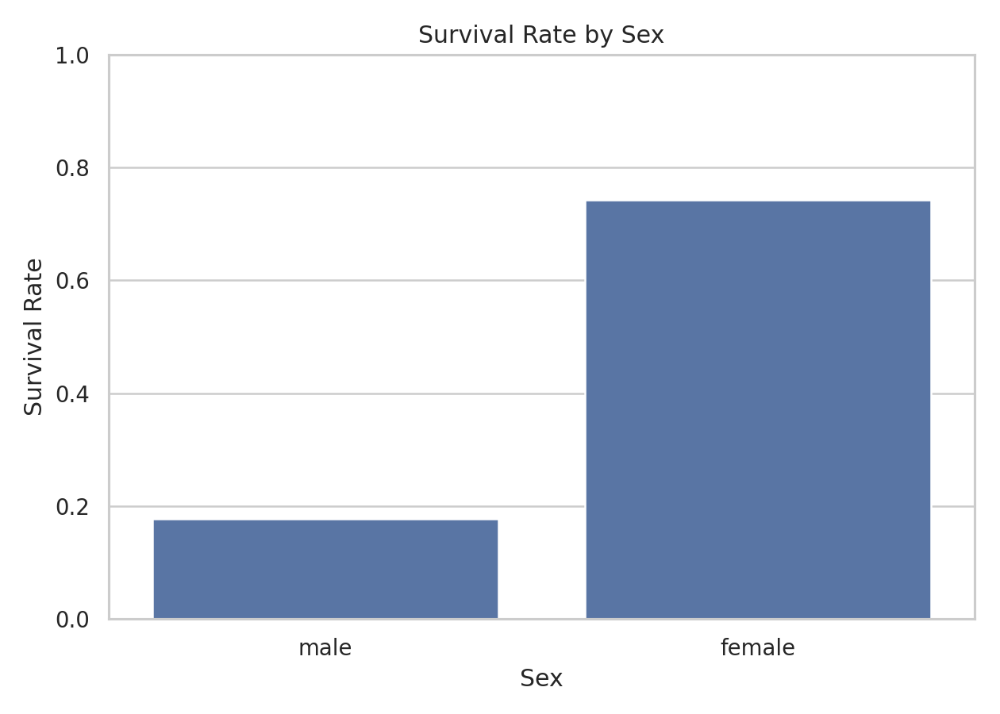
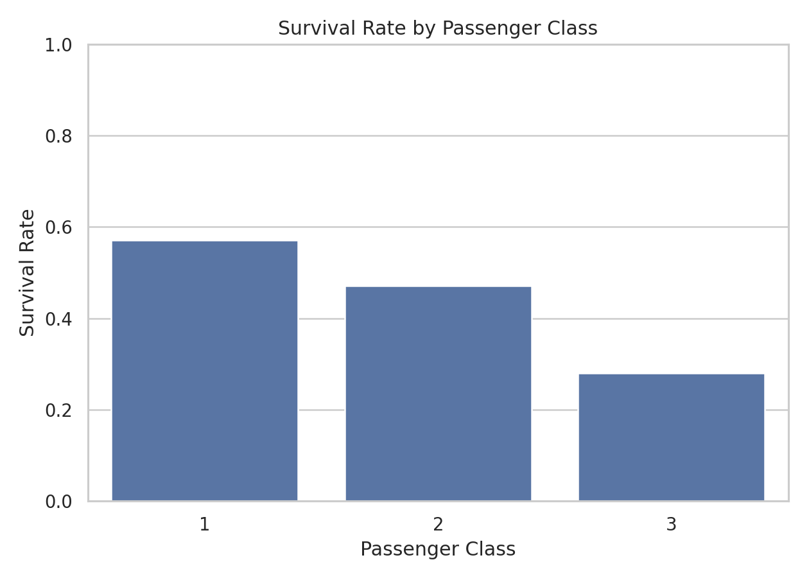
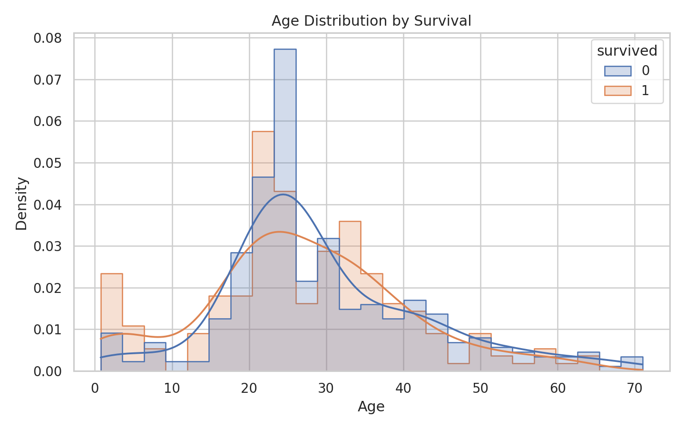
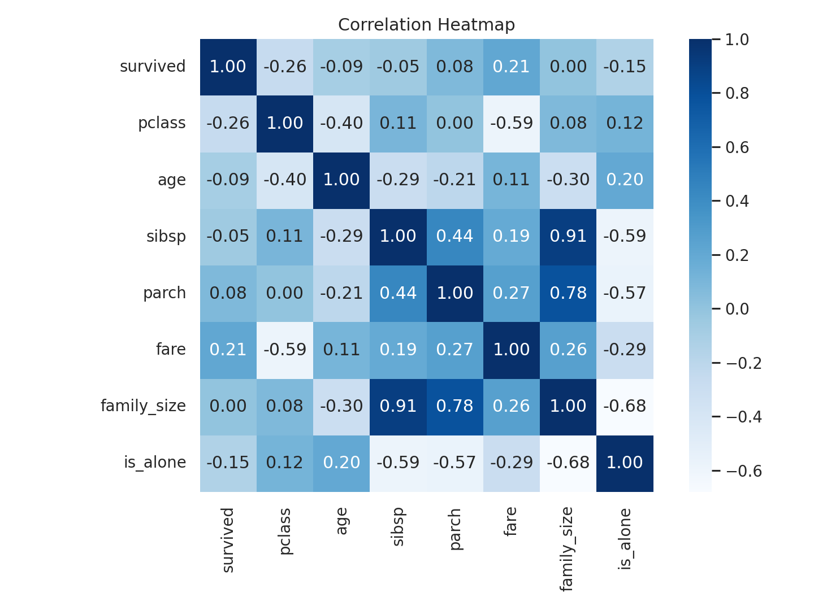
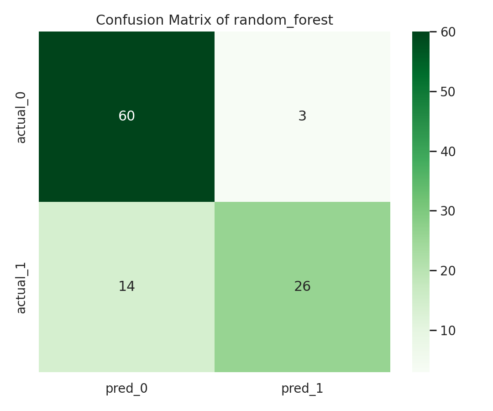

# 泰坦尼克号乘客生存预测分析

姓名：周贤中

## 1. 课题背景

泰坦尼克号沉船事件是数据分析和机器学习入门中最常见的案例之一。该数据集同时包含数值型特征、分类型特征以及缺失值问题，适合用于演示完整的数据分析流程：数据获取、数据清洗、探索性分析、特征工程、分类建模和结果解释。

本报告围绕“哪些因素会影响乘客生存，以及能否基于乘客信息预测其是否生还”这一问题展开，最终完成了可复现的 Python 分析脚本，并输出可视化图表和分类模型评估结果。

## 2. 研究目标

本次课程报告的目标如下：

1. 对泰坦尼克号乘客数据进行清洗和整理。
2. 从性别、舱位等级、年龄等角度分析生存率差异。
3. 构建乘客生存预测模型，并评估模型效果。
4. 形成一份可复现、可运行、可解释的 Python 数据分析报告。

## 3. 数据来源与字段说明

- 数据来源：seaborn Titanic 公开数据集，已缓存到 report/data/titanic.csv。
- 样本量：511 条乘客记录。
- 目标变量：survived，1 表示生还，0 表示未生还。
- 主要特征：

| 字段 | 含义 |
| --- | --- |
| pclass | 舱位等级，1 为头等舱，3 为三等舱 |
| sex | 性别 |
| age | 年龄 |
| sibsp | 同行兄弟姐妹或配偶数量 |
| parch | 同行父母或子女数量 |
| fare | 船票价格 |
| embarked | 登船港口 |

在原始字段基础上，脚本额外构造了两个特征：

- family_size = sibsp + parch + 1
- is_alone：是否独自出行

## 4. 分析环境

- Python 3.12
- pandas
- matplotlib
- seaborn
- scikit-learn

完整可运行代码见 report/titanic_analysis.py。

## 5. 数据清洗与特征工程

清洗阶段主要完成了以下工作：

1. 保留建模需要的核心字段。
2. 按性别和舱位等级对年龄缺失值进行分组中位数填补。
3. 用众数填补 embarked，用中位数填补 fare。
4. 构造 family_size 和 is_alone 两个衍生特征。
5. 使用年龄分段，便于后续探索分析。

关键代码如下：

```python
def clean_and_engineer(df: pd.DataFrame) -> pd.DataFrame:
    cleaned = df.copy()

    age_group_median = cleaned.groupby(["sex", "pclass"])["age"].transform("median")
    cleaned["age"] = cleaned["age"].fillna(age_group_median)
    cleaned["age"] = cleaned["age"].fillna(cleaned["age"].median())
    cleaned["embarked"] = cleaned["embarked"].fillna(cleaned["embarked"].mode().iloc[0])
    cleaned["fare"] = cleaned["fare"].fillna(cleaned["fare"].median())

    cleaned["family_size"] = cleaned["sibsp"] + cleaned["parch"] + 1
    cleaned["is_alone"] = (cleaned["family_size"] == 1).astype(int)
    return cleaned
```

这种处理方式兼顾了数据完整性与可解释性。相比直接删除缺失值，分组填补更适合本案例中年龄受舱位和性别共同影响的特点。

## 6. 探索性分析

### 6.1 总体生存情况

- 总体生存率：38.75%
- 女性生存率：74.21%
- 男性生存率：17.76%
- 头等舱生存率：57.14%
- 三等舱生存率：27.97%

从整体数据看，生存者并非多数，说明这是一个类别分布并不完全均衡的二分类任务。

### 6.2 性别对生存率的影响



图中可以明显看出，女性生存率远高于男性。结合历史背景，这与当时“妇女和儿童优先”的救援原则一致。性别是本数据中最显著的解释变量之一。

### 6.3 舱位等级对生存率的影响



头等舱乘客的生存率明显高于三等舱乘客，说明社会地位、舱位位置和获得救援机会之间可能存在较强关联。舱位等级越高，生存概率越高。

### 6.4 年龄分布与生存情况



年龄分布显示，儿童和年轻乘客的生存概率相对更高，中老年乘客生存优势不明显。根据脚本统计，青年组生存率为 38.16%，成年组为 35.09%，说明年龄确实有一定影响，但影响程度低于性别和舱位等级。

### 6.5 数值变量相关性



相关性热力图表明：

1. pclass 与 survived 呈负相关，说明舱位等级数字越大，生存率越低。
2. fare 与 survived 呈正相关，船票价格更高的乘客往往更容易生还。
3. family_size 与是否独自出行之间存在明显关系，说明家庭同行情况可能影响逃生机会。

## 7. 建模方法

本报告将问题定义为二分类任务，并比较了两种常见模型：

1. 逻辑回归：作为基线模型，优点是结构简单、解释性较强。
2. 随机森林：能够处理非线性关系和特征交互，适合提高预测表现。

建模流程如下：

1. 选择特征 pclass、sex、age、sibsp、parch、fare、embarked、family_size、is_alone。
2. 将数值变量做缺失填补和标准化。
3. 将分类变量做众数填补和独热编码。
4. 按 8:2 划分训练集与测试集。
5. 以准确率、精确率、召回率、F1 和 ROC AUC 对模型进行评估。

关键建模代码如下：

```python
preprocessor = ColumnTransformer(
    transformers=[
        (
            "num",
            Pipeline([
                ("imputer", SimpleImputer(strategy="median")),
                ("scaler", StandardScaler()),
            ]),
            numeric_features,
        ),
        (
            "cat",
            Pipeline([
                ("imputer", SimpleImputer(strategy="most_frequent")),
                ("onehot", OneHotEncoder(handle_unknown="ignore")),
            ]),
            categorical_features,
        ),
    ]
)

model_specs = {
    "logistic_regression": LogisticRegression(max_iter=1000, random_state=42),
    "random_forest": RandomForestClassifier(
        n_estimators=300,
        max_depth=6,
        min_samples_leaf=4,
        random_state=42,
    ),
}
```

## 8. 模型结果与分析

模型评估结果如下：

| 模型 | Accuracy | Precision | Recall | F1 | ROC AUC |
| --- | ---: | ---: | ---: | ---: | ---: |
| Random Forest | 0.8350 | 0.8966 | 0.6500 | 0.7536 | 0.8200 |
| Logistic Regression | 0.8155 | 0.8182 | 0.6750 | 0.7397 | 0.7851 |

从结果看，随机森林的综合表现最好，尤其在准确率和 ROC AUC 上优于逻辑回归，因此本报告选择随机森林作为最终模型。

### 8.1 混淆矩阵分析

随机森林的混淆矩阵如下：

| 实际值\\预测值 | Pred 0 | Pred 1 |
| --- | ---: | ---: |
| Actual 0 | 60 | 3 |
| Actual 1 | 14 | 26 |



可以看出：

1. 模型对未生还乘客的识别较好，误判为生还的只有 3 人。
2. 模型对生还乘客的识别仍有遗漏，14 名实际生还者被预测为未生还。
3. 这也解释了为什么模型精确率较高，但召回率还有提升空间。

换言之，该模型在“预测某人会生还”时较为谨慎，因此预测为生还的样本通常较可信，但会漏掉一部分真实生还者。

## 9. 结论

通过本次分析，可以得到以下结论：

1. 性别是影响生存率的关键因素，女性生存率显著高于男性。
2. 舱位等级对生存有明显影响，头等舱乘客生存率高，三等舱乘客风险更大。
3. 年龄存在一定影响，但作用强度弱于性别和舱位等级。
4. 基于乘客基本信息构建的分类模型可以实现较好的预测效果，其中随机森林模型在测试集上达到 0.8350 的准确率和 0.8200 的 ROC AUC。

整体而言，泰坦尼克号乘客的生存并不是随机事件，而是与社会身份、资源条件和个体属性存在显著关联。

## 10. 局限性与改进方向

本报告仍存在以下局限：

1. 当前使用的特征较少，未加入船舱位置、票号分组等更细粒度信息。
2. 模型只做了基础参数设置，尚未进行系统调参。
3. 数据规模有限，模型结论更适合作为教学案例，不宜过度外推。

后续可以从以下方向改进：

1. 增加更多衍生特征，例如票价分层、家庭身份标签等。
2. 使用交叉验证和网格搜索进一步优化模型参数。
3. 增加特征重要性分析，提高模型解释性。

## 11. 复现方式

在项目根目录执行以下命令即可重新生成图表和模型结果：

```bash
/mnt/d/Github/python-data-analysis/.venv/bin/python report/titanic_analysis.py
```

脚本运行后会自动生成以下内容：

- report/data/titanic.csv
- report/figures/*.png
- report/output/*.csv
- report/output/analysis_summary.md

## 12. 附录

- 分析脚本：report/titanic_analysis.py
- 数据文件：report/data/titanic.csv
- 结果汇总：report/output/analysis_summary.md

本报告完成了一个完整的 Python 数据分析闭环，体现了从数据获取到模型评估再到结论表达的全过程，满足课程报告对 Markdown 主体与独立 Python 代码文件的要求。