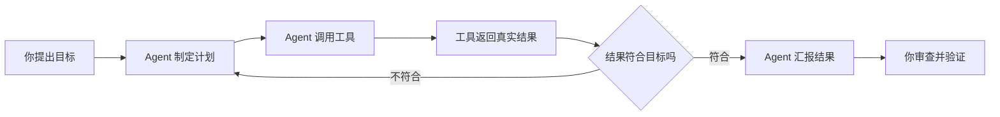
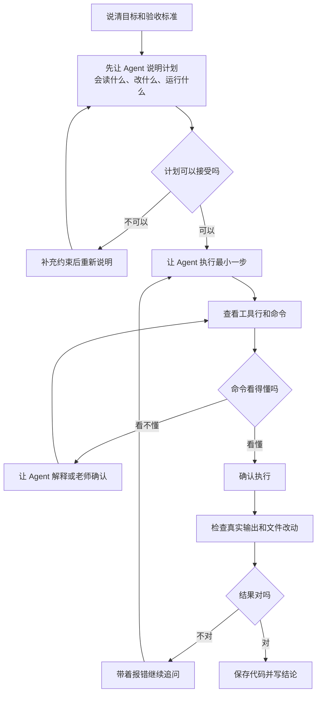
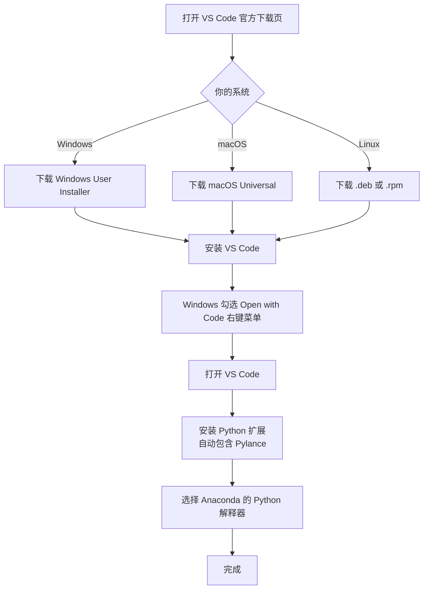

# Week 1：先安全使用 Agent，再做第一个数据问题

> **本章导读**
> 时长：3 节课，每节 60 分钟
> 数据：`data/成绩单.xlsx`
> 你将学到：认识 Agent 和 DSH 界面、遵守安全使用规则，然后用自然语言让 DSH 读 Excel、写第一版 Python、发现数据格式问题，并自己验证结果
> 本周产出：`projects/<姓名>/first_analysis.py`

## 1. 第 1 节课：认识 Agent 与安全规则

第一节不急着安装软件，先把三件事讲明白：**Agent 是什么、DSH 界面长什么样、为什么不能盲目让它执行命令**。后面的所有操作都建立在这些规则之上。

### 1.1 什么是 AI Agent

AI Agent（智能体）不是普通的聊天机器人。聊天机器人只能“说”，Agent 还能“做”。DeepSeek Harness（DSH）就是一个能读写文件、运行命令、搜索网页、执行长任务的 Agent 工作环境。

一个 Agent 至少由四部分组成：

| 组成部分 | 通俗理解 | DSH 里的例子 |
|---|---|---|
| 大模型 | 大脑，负责理解任务和生成方案 | DeepSeek 大模型 |
| 工具 | 手脚，负责真正执行操作 | 读文件、写文件、运行命令、搜索网页 |
| 记忆 | 工作记录，负责记住上下文和目标 | 当前会话、长期目标 |
| 工作区 | 活动范围，Agent 主要只能动这里 | 本课程仓库目录 |

DSH 的工作方式是一个循环：**理解目标 → 制定计划 → 调用工具 → 看到结果 → 调整计划**。例如你让它“读成绩单”，它先找到文件，再运行 Python 读取，然后把结果贴给你。



**最重要的观念：Agent 是执行者，不是负责人；你是负责人。** Agent 会做的事，是它的工具允许它做的事；它能做到哪一步，取决于你在界面上确认了什么。

### 1.2 DSH 界面介绍

启动 DSH 后，浏览器打开 <http://127.0.0.1:3080>，界面主要分成几块：


| 区域 | 作用 | 常见操作 |
|---|---|---|
| 左侧会话栏 | 新建会话、切换历史会话、查看工作区 | 点“新会话”开始一个干净任务 |
| 中部消息区 | 你与 Agent 的对话记录 | 滚动查看 Agent 的每一步 |
| 底部输入框 | 输入自然语言任务 | 回车发送 |
| 工具行 | 显示 Agent 正在读取、编辑、运行什么 | 点击可查看工具执行详情 |
| 右上角状态 | 当前工作区、模型、安全模式 | 确认工作区是否正确 |
| 设置 | API Key、模型、工作区配置 | 只配置一次，之后不要随意修改 |

在设置里选择工作区时，必须选中本课程仓库根目录，例如 Windows 的 `D:\python-data-analysis`，macOS/Linux 的 `/home/<用户名>/Documents/python-data-analysis`。**Agent 主要只在这个目录里活动，选错目录等于把钥匙交给了不认识的人。**

### 1.3 为什么必须先讲安全

Agent 能做的事情和真人操作电脑一样有后果：删除文件、覆盖文件、安装软件、下载数据、执行命令。如果学生看不懂命令就点击“允许”，一个不小心就可能把课程项目、原数据甚至系统环境弄坏。

本课程的课堂红线，先背下来再动手：

1. **看不懂的命令不执行。** Agent 请求执行命令时，先读命令本身；看不懂就让它解释，解释完仍看不懂就问老师。
2. **只在自己的工作区里干活。** 课程任务只允许修改 `projects/<姓名>/` 和老师指定的目录；原始数据目录只读。
3. **不处理秘密。** 不把 API Key、密码、个人身份信息发给 Agent，也不让它写进文件。
4. **每步都有验证。** Agent 说“完成”不等于完成；必须运行、看输出、检查结果。
5. **发现异常立即喊停。** 看到删除、格式化、上传、安装系统级软件等命令，先停下来。

### 1.4 风险点与应对规则

| 风险 | 为什么会发生 | 课堂规则 |
|---|---|---|
| 误删文件 | 提示词没写清楚，或盲目同意删除命令 | 原始数据只读；删除前先让 Agent 列出“要删什么、为什么”；必要的话先备份 |
| 覆盖已有代码 | Agent 没读旧文件就重写 | 让 Agent 先 `read` 再修改；修改后用 `git diff` 检查 |
| 安装不必要或危险的软件 | Agent 为了“解决眼前问题”直接装包 | 依赖由课程统一清单决定；新增依赖必须老师确认 |
| API Key 泄露 | 为了“方便调试”让 Agent 写进代码或笔记 | Key 只在 DSH 设置里保存；任何文件里出现 Key 都要警惕 |
| 下载不可信数据 | Agent 联网搜索并保存结果 | 先检查来源；课程数据以 `data/` 和老师给的文件为准 |
| 长任务失控 | 让 Agent 连续跑很久，跑偏了还在继续 | 每个里程碑停下来审查；发现跑偏立即打断 |
| 环境污染 | 全局安装软件或修改系统配置 | 课程使用 Anaconda 环境和 `python-course` 目录，不直接动系统 |

### 1.5 安全使用流程

每次使用 DSH 完成任务，都按这个流程走：



本课程要求学生在第 1 节课结束前完成一次自测：写出 3 个“绝对不执行”的命令，以及 3 个“执行前必须确认”的操作。写不出来就不开始安装。

## 2. 环境安装（第 2 节课）

第二节课把环境装好。本课程需要四样东西：**Anaconda（Python 环境）**、**VS Code（编辑器）**、**Node.js（DSH 的运行环境）**、**DeepSeek Harness（DSH）**。

### 2.1 从 TUNA 镜像下载 Anaconda

Anaconda 不要从官网下载，国内网络直接使用清华 TUNA 镜像更快、更稳定。

TUNA 的 Anaconda 镜像帮助页：

<https://mirrors.tuna.tsinghua.edu.cn/help/anaconda/>


下载目录：

<https://mirrors.tuna.tsinghua.edu.cn/anaconda/archive/>

在目录里选择最新版本，按系统下载对应文件：

| 系统 | 文件名 |
|---|---|
| Windows 64 位 | `Anaconda3-版本号-1-Windows-x86_64.exe` |
| macOS Intel 芯片 | `Anaconda3-版本号-1-MacOSX-x86_64.pkg` |
| macOS Apple 芯片 | `Anaconda3-版本号-1-MacOSX-arm64.pkg` |
| Linux 64 位 | `Anaconda3-版本号-1-Linux-x86_64.sh` |

> 版本号会不断更新，选择目录里最新日期对应的文件即可，不要死记文件名。

### 2.2 安装 Anaconda 并配置 TUNA 镜像

#### Windows

1. 双击下载好的 `.exe` 安装包。
2. 一路 `Next`，到许可协议时点 `I Agree`。
3. 选择 `Just Me`，安装到默认路径。
4. 到 `Advanced Installation Options` 时，勾选 `Add Anaconda3 to my PATH environment variable`。
5. 等待安装完成，不要提前关闭窗口。
6. 打开 `cmd`、PowerShell 或 Anaconda Prompt，运行：

```bash
python --version
conda --version
```

#### macOS

1. 双击下载好的 `.pkg` 安装包，按提示安装。
2. 打开“终端”，运行 `conda init` 让 Anaconda 生效：

```bash
conda init zsh
```

如果默认 shell 是 bash，运行：

```bash
conda init bash
```

3. 关闭终端再重新打开。
4. 验证：

```bash
python --version
conda --version
```

#### Linux

1. 打开终端，进入下载目录：

```bash
cd ~/Downloads
```

2. 运行安装脚本：

```bash
bash Anaconda3-版本号-1-Linux-x86_64.sh
```

3. 按 `Enter` 阅读协议，输入 `yes` 同意。
4. 安装位置保持默认。
5. 提示是否初始化 conda 时输入 `yes`。
6. 让配置生效：

```bash
source ~/.bashrc
```

7. 验证：

```bash
python --version
conda --version
```

三个系统只要能输出版本号即可：

```text
Python 3.12.8
conda 24.11.3
```

版本号不一样也没关系，只要两个命令都能打印版本就行。

#### 配置 TUNA 镜像

先让 conda 生成配置文件：

```bash
conda config --set show_channel_urls yes
```

Windows 配置文件在：

```text
C:\Users\<你的用户名>\.condarc
```

macOS / Linux 配置文件在：

```text
~/.condarc
```

把 `.condarc` 改成 TUNA 镜像：

```yaml
channels:
  - defaults
show_channel_urls: true
default_channels:
  - https://mirrors.tuna.tsinghua.edu.cn/anaconda/pkgs/main
  - https://mirrors.tuna.tsinghua.edu.cn/anaconda/pkgs/r
  - https://mirrors.tuna.tsinghua.edu.cn/anaconda/pkgs/msys2
custom_channels:
  conda-forge: https://mirrors.tuna.tsinghua.edu.cn/anaconda/cloud
  pytorch: https://mirrors.tuna.tsinghua.edu.cn/anaconda/cloud
```

再把 pip 也改成 TUNA 镜像：

```bash
pip config set global.index-url https://mirrors.tuna.tsinghua.edu.cn/pypi/web/simple
```

以后 `conda install` 和 `pip install` 都会自动走 TUNA 镜像。

### 2.3 安装并配置 VS Code

本课程统一使用 **VS Code** 作为编辑器，所有 `.py` 文件都用它创建、编辑和运行。

#### 安装 VS Code

1. 打开 VS Code 官方下载页：

   <https://code.visualstudio.com/download>

   

2. 按自己的系统下载并安装：

   | 系统 | 下载项 |
   |---|---|
   | Windows | `Windows User Installer x64`（或 ARM64） |
   | macOS | `macOS Universal`（Apple 芯片和 Intel 都可用） |
   | Linux | `.deb` 或 `.rpm`，按发行版选择 |

3. Windows 安装时勾选：

   - `Add "Open with Code" action to Windows Explorer file context menu`
   - `Add "Open with Code" action to Windows Explorer directory context menu`

   其余选项保持默认，一路 `Next` 安装。

4. 打开 VS Code，第一次启动时点左侧“扩展”图标（或按 `Ctrl+Shift+X`），搜索并安装：

   | 扩展名 | 发布者 | 作用 |
   |---|---|---|
   | Python | Microsoft | Python 代码提示、运行和调试 |
   | Pylance | Microsoft | Python 代码补全与类型提示 |

5. 安装后确认 VS Code 左下角状态栏显示 Python 版本，例如 `Python 3.12.8`。如果没有显示，点状态栏中的 Python 版本号（或按 `Ctrl+Shift+P` 执行 `Python: Select Interpreter`），选择 Anaconda 安装的 Python 解释器。

安装与配置流程如下：



#### 用 VS Code 打开工作目录

VS Code 只能打开**已经存在**的文件夹，新建文件也是在已打开的文件夹里创建。先记住固定顺序：

1. 先在文件管理器或终端里创建目录，例如 `python-course`。
2. 再让 VS Code 打开这个目录。
3. 最后在打开的目录里新建 `hello.py` 等文件。

各系统的打开方式：

- Windows：在文件夹中右键，选择 `Open with Code`；也可以先打开 VS Code，再用 `文件 → 打开文件夹`。
- macOS：打开 VS Code，按 `Cmd+O` 或使用 `文件 → 打开文件夹`，选择目录。
- Linux：打开 VS Code，按 `Ctrl+O` 或使用 `文件 → 打开文件夹`，选择目录。

#### 打开 VS Code 内置终端

VS Code 打开目录后，在窗口顶部菜单栏点击：

```text
终端（Terminal） → 新建终端（New Terminal）
```

也可以直接按快捷键：

| 系统 | 快捷键 |
|---|---|
| Windows / Linux | `` Ctrl+` `` |
| macOS | `` Control+` `` |

终端会出现在 VS Code 窗口下方，显示为一行可输入命令的黑色（或深色）面板，并自动定位到当前打开的文件夹。以后命令行操作都在这个终端里进行，不需要另外打开 cmd 或“终端”。

如果窗口下方没有看到终端，就重新执行一次“顶部菜单 → 终端 → 新建终端”，或按上面的快捷键。

新建 `.py` 文件时，可以用“资源管理器”里的“新建文件”图标，也可以按 `Ctrl+N`（macOS 为 `Cmd+N`）新建文件，再按 `Ctrl+S` / `Cmd+S` 命名为 `hello.py`。只要 VS Code 打开了 `python-course`，文件就会保存到这个目录里。

### 2.4 创建专用目录并测试 Python（Windows）

安装完 Python 和 VS Code 后，不要急着写数据分析代码，先建一个自己的练习目录。

1. 打开“文件资源管理器”，进入 Documents：

```text
C:\Users\<你的用户名>\Documents
```

2. 新建目录 `python-course`。
3. 再用 VS Code 打开这个已创建的 `python-course` 文件夹，并打开内置终端：点顶部 `终端 → 新建终端`，或按 `` Ctrl+` ``。终端会自动定位到这个文件夹。
4. 在 VS Code 里新建 `hello.py`：点击左侧资源管理器中的“新建文件”图标，输入文件名 `hello.py`，然后写入：

```python
print("Hello, Python!")
print(1 + 2)
```

5. 按 `Ctrl+S` 保存后，在 VS Code 内置终端运行：

```bat
python hello.py
```

预期输出：

```text
Hello, Python!
3
```

### 2.5 创建专用目录并测试 Python（macOS）

1. 打开“访达”，进入 `~/Documents`。
2. 新建目录 `python-course`。
3. 再用 VS Code 打开这个已创建的 `python-course` 文件夹，并打开内置终端：点顶部 `终端 → 新建终端`，或按 `` Control+` ``。终端会自动定位到这个文件夹。
4. 在 VS Code 里新建 `hello.py`，写入：

```python
print("Hello, Python!")
print(1 + 2)
```

5. 按 `Command+S` 保存后，在 VS Code 内置终端运行：

```bash
python hello.py
```

预期输出：

```text
Hello, Python!
3
```

### 2.6 创建专用目录并测试 Python（Linux）

1. 先用文件管理器进入 `~/Documents`，新建目录 `python-course`；也可以用终端创建：

```bash
mkdir -p ~/Documents/python-course
```

2. 再打开 VS Code，按 `Ctrl+O` 选择 `~/Documents/python-course`，并打开内置终端：点顶部 `终端 → 新建终端`，或按 `` Ctrl+` ``。终端会自动定位到这个文件夹。
3. 在 VS Code 里新建 `hello.py`，写入：

```python
print("Hello, Python!")
print(1 + 2)
```

4. 按 `Ctrl+S` 保存后，在 VS Code 内置终端运行：

```bash
python hello.py
```

预期输出：

```text
Hello, Python!
3
```

三个系统都运行 `hello.py` 后，说明 Python 安装、目录创建、文件保存和命令行运行都正常。

### 2.7 安装课程依赖

安装依赖前，先确认 pip 已使用国内镜像，否则默认会从国外 PyPI 下载，速度会很慢，甚至卡住。

1. 查看当前 pip 源：

```bash
pip config list
```

2. 如果输出里没有 `global.index-url`，或网址不是 TUNA 镜像，先配置：

```bash
pip config set global.index-url https://mirrors.tuna.tsinghua.edu.cn/pypi/web/simple
```

3. 配置完成后，进入本仓库根目录，运行：

```bash
pip install -r requirements.txt
```

这里会安装 pandas、numpy、matplotlib、seaborn、scikit-learn、openpyxl、pytest。安装过程中出现黄色提示通常是升级提示，不一定是错误。

### 2.8 安装 Node.js

DeepSeek Harness 是一个 npm 工具，先安装 Node.js：

1. 打开 <https://nodejs.org/en/download>。
2. 下载 `LTS` 版本的 Windows/macOS 安装包。
3. 一路 `Next` 安装，保持默认选项。
4. 打开命令行，验证：

```bash
node --version
npm --version
```

能输出版本号即可，例如：

```text
v20.18.0
10.8.2
```

### 2.9 安装并启动 DeepSeek Harness

DSH 的官方仓库在：

<https://github.com/deepseek-ai/deepseek-harness>


> 截图来自官方 GitHub 仓库；安装命令以官方 README 为准。

最稳妥的启动方式是使用 `npx`，第一次会自动下载，不需要手动配置路径：

```bash
npx @deepseek-ai/dsh web
```

也可以全局安装一次，之后直接使用 `dsh`：

```bash
npm install -g @deepseek-ai/dsh
dsh web
```

看到下面这些信息，说明 DSH 已经启动：


```text
URL: http://127.0.0.1:3080
```

然后浏览器打开：

<http://127.0.0.1:3080>

### 2.10 配置 DSH

DSH 需要两样配置才能开始工作：**模型 API Key** 和 **工作区**。

先到 DeepSeek 开放平台申请 API Key：

<https://platform.deepseek.com/>

申请后打开 DSH 的 `Settings → Models`，粘贴 API Key 并保存。然后在主界面点击 `Choose workspace`，选择本仓库根目录，例如：

```text
/home/zhong/Documents/python-data-analysis
```

Windows 上类似：

```text
D:\python-data-analysis
```


保存 API Key、选中工作区后，会话输入框才可以使用。注意：**API Key 只保存在本地设置里，不要写进教程、代码、聊天内容或 GitHub。**

配置完成后，先做一个安全检查：在 DSH 里发送一句话，例如“请告诉我当前工作区路径”，确认它看到的路径是本课程仓库。如果显示的是其他目录，先改回本仓库再继续。本课程的课堂规则是：**DSH 只能修改 `projects/` 和老师明确指定的文件，原始 `data/` 目录只读。**

## 3. 第 3 节课：跟着老师做第一个数据问题

### 3.1 先确定要回答的问题

我们拿到一份 3 人成绩单，先不急着背 pandas，先问一句：

```text
这份成绩单里，哪个科目最需要补课？
```

“需要补课”可以先定义为：**科目平均分最低，或者存在明显低于及格线的成绩**。

### 3.2 把这个任务发给 DSH

发送任务前，先按第 1 节课的流程确认三件事：**当前工作区是课程仓库、只读不修改 `data/`、代码只写入 `projects/<姓名>/`**。在 DSH 里输入：

```text
请先告诉我当前工作区路径，确认后开始。
请读取 data/成绩单.xlsx，不要修改原文件。
任务：先输出 shape、dtypes、缺失值、完整表格；
然后计算语文、数学、英语的平均分；
最后用一句话回答“哪个科目最需要补课”。
代码保存为 projects/<姓名>/first_analysis.py。
```

### 3.3 老师的第一版代码

DSH 通常会生成类似代码：

```python
import pandas as pd

df = pd.read_excel('data/成绩单.xlsx')

print('shape:', df.shape)
print()
print(df.dtypes)
print()
print('缺失值:')
print(df.isna().sum())
print()
print(df)
```

预期输出：

```text
shape: (3, 5)
学号      int64
姓名     object
语文      int64
数学     object
英语    float64
缺失值:
 学号    0
姓名    0
语文    0
数学    0
英语    0
  学号  姓名  语文     数学    英语
0  2401  张三  59  59..5  60.5
1  2402  李四  90     95  100.0
2  2403  王五  95    100   90.0
```

### 3.4 发现第一个数据问题

`数学` 列是 `object`，因为 `张三` 的分数写成了 `59..5`。直接求平均会报错：

```text
TypeError: can only concatenate str (not "int") to str
```

这不是代码写错了，而是数据格式有问题。让 DSH 修复这一列：

```text
数学列里有一个值是 59..5，导致它被读成文本。
请把 59..5 修复成 59.5，再转成 float。
不要修改原 Excel，只修复读入后的 DataFrame。
```

### 3.5 修复并完成第一个结论

```python
df['数学'] = df['数学'].astype(str).str.replace('..', '.', regex=False)
df['数学'] = pd.to_numeric(df['数学'], errors='coerce')

print(df)
print()
print('平均分:')
print(df[['语文', '数学', '英语']].mean().round(2))
```

预期输出：

```text
  学号  姓名  语文    数学    英语
0  2401  张三  59  59.5  60.5
1  2402  李四  90  95.0 100.0
2  2403  王五  95 100.0  90.0

平均分:
语文    81.33
数学    84.83
英语    83.50
```

对“哪个科目最需要补课”这个问题，可以这样回答：

```text
按平均分看，语文 81.33 最低，最需要优先关注；
同时张三的数学、英语都低于 70，还需要看单科不合格情况。
```

## 4. 你自己动手做

1. 新建 `projects/<姓名>/first_analysis.py`，把上面的完整流程整理成可运行脚本。
2. 增加一列 `total = 语文 + 数学 + 英语`，排出总分名次。
3. 把结论改成“谁的哪一科最需要补课”。
4. 让 DSH 审查你的脚本，并给出 2 个你没发现的风险。

自己动手时建议用这个提示词：

```text
请审查 projects/<姓名>/first_analysis.py：
1. 是否按“读取 → 清洗 → 计算 → 结论”组织；
2. 数学列修复是否安全；
3. 平均分结论是否支持“哪个科目最需要补课”；
4. 列出 2 个可能的坑。
```

## 5. 验证清单

- [ ] 能用一句话说明 Agent 和聊天机器人的区别
- [ ] 能指出 DSH 界面里的会话栏、输入框、工具行、工作区状态
- [ ] 能背出 5 条课堂红线
- [ ] 已按自己的系统从 TUNA 镜像下载 Anaconda，并完成安装
- [ ] `.condarc` 已改成 TUNA 镜像，`pip` 也已指向 TUNA 镜像
- [ ] `python --version` 和 `conda --version` 能输出版本
- [ ] 已安装 VS Code，并安装 Python、Pylance 两个扩展
- [ ] VS Code 左下角已选择 Anaconda 的 Python 解释器
- [ ] 已在 Documents 里创建 `python-course` 专用目录，并用 VS Code 打开
- [ ] `python hello.py` 能输出 `Hello, Python!` 和 `3`
- [ ] `node --version` 和 `npm --version` 能输出版本
- [ ] `npx @deepseek-ai/dsh web` 能启动，浏览器打开 `http://127.0.0.1:3080`
- [ ] 已保存 DeepSeek API Key，且 Key 没有出现在任何文档或代码里
- [ ] 已选择本仓库作为工作区，会话输入框可输入
- [ ] 每次允许 DSH 执行命令前，都能说出“这条命令在做什么”
- [ ] 脚本能从仓库根目录用 `python scripts/week01_practice.py` 或你的项目脚本运行
- [ ] 表格能打印出来
- [ ] `59..5` 被修复成 `59.5`
- [ ] 平均分、总分、排名都有输出
- [ ] 每个结论都能指出“用了哪一列、怎么算的”

## 6. 常见错误与坑

| 现象 | 原因 | 处理 |
|---|---|---|
| 官网下载太慢 | 没用国内镜像 | 从 `mirrors.tuna.tsinghua.edu.cn/anaconda/archive/` 下载 |
| Windows 找不到 `.condarc` | 文件还没生成 | 先运行 `conda config --set show_channel_urls yes` |
| `pip install` 仍然很慢 | pip 没有配置 TUNA | 运行 `pip config set global.index-url https://mirrors.tuna.tsinghua.edu.cn/pypi/web/simple` |
| macOS 提示 `conda: command not found` | 终端没有初始化 conda | 运行 `conda init zsh`，关闭终端再重开 |
| Linux 提示 `python: command not found` | conda 环境没生效 | 运行 `source ~/.bashrc`，或使用 `python3` |
| `python` 不是内部或外部命令 | Anaconda 没加入 PATH | 重装时勾选 `Add Anaconda3 to my PATH`，或使用 Anaconda Prompt |
| VS Code 没有代码提示 | 还没安装 Python/Pylance 扩展 | 在扩展面板搜索 `Python` 和 `Pylance`，安装后重启 VS Code |
| VS Code 内置终端找不到 conda 环境 | 终端没初始化或没选解释器 | 在 VS Code 终端运行 `conda init`，重开窗口，再点状态栏 Python 版本号选择解释器 |
| `python hello.py` 提示找不到文件 | 命令行不在文件所在目录 | 先确认 VS Code 已打开 `python-course`，再在终端运行 `python hello.py` |
| `npx` 不是内部或外部命令 | Node.js 没安装或没生效 | 重装 Node.js LTS，重新打开命令行 |
| DSH 页面打不开 | 启动命令还在下载，或端口被占用 | 等命令显示 `URL: http://127.0.0.1:3080` 后再刷新浏览器 |
| 页面能开但不能输入对话 | 没保存 API Key 或没选工作区 | 完成 `Settings → Models` 和 `Choose workspace` |
| Agent 改错了文件 | 没有先读原文件就重写 | 让 Agent 先 `read`，再修改；执行后用 `git diff` 检查 |
| Agent 请求执行看不懂的命令 | 学生直接点了“允许” | 让 Agent 逐字解释命令；解释后仍不懂就找老师 |
| Agent 想删除或覆盖文件 | 提示词没说清楚边界 | 明确写“不要修改原文件”，必要时先复制备份 |
| Agent 把 API Key 写进文件 | 为了“调试方便”或没意识到风险 | 删除该文件内容，不要提交；以后 Key 只在设置里保存 |
| 数据列是 object | 数据里有 `59..5` | 先观察，再清洗，不直接强转 |
| 平均分报字符串拼接错误 | 数值列被读成文本 | `to_numeric` 前先看异常值 |
| AI 删掉原始数据 | 提示词没说明 | 明确写“不要修改原文件” |
| 第一版结论太宽泛 | 问题没定义 | 先定义“需要补课”的口径 |

## 7. 作业

1. 用自己的话写 300 字以内的“Agent 使用安全说明”，至少包含：Agent 是什么、5 条课堂红线、3 个绝对不执行的操作、为什么每条结论都要自己验证。保存到 `projects/<姓名>/agent-safety.md`。
2. 按自己系统对应的小节完成 Anaconda、VS Code、Node.js 和 DSH 安装，把 `hello.py` 运行结果和验证命令截图保存到 `projects/<姓名>/environment.png`。
3. 让 DSH 生成代码，统计这份成绩单，然后写出 3 个“第一版提示词没有回答”的问题。

示例：

- 哪门课最需要补课？
- 单科不及格的人有几科不及格？
- 总分前两名是否说明所有科目都更强？

## 评分要点

| 项目 | 要求 |
|---|---|
| 安全 | 能背出红线；看不懂的命令会停下来解释；`agent-safety.md` 完成 |
| 环境 | `python`、`node`、VS Code、DSH 都能启动，工作区已选择 |
| 运行 | 每个代码块都能运行 |
| 清洗 | 能发现 `59..5` 并修复 |
| 结果 | 平均分、总分、排名都有输出 |
| AI 协作 | 保留 DSH 修改代码的记录，并说明每处修改为什么安全 |
